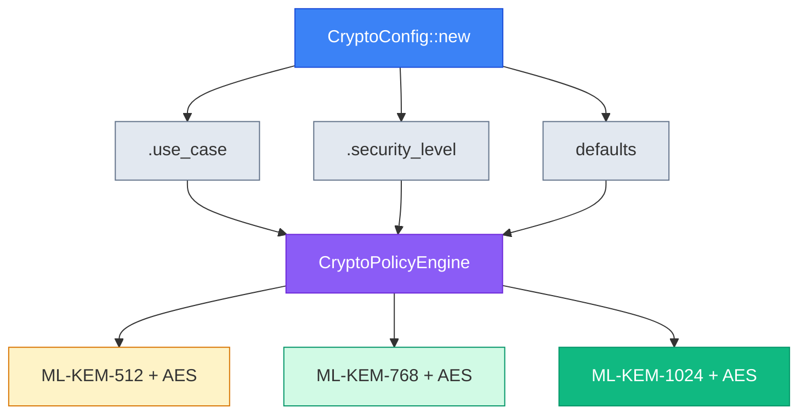

# LatticeArc

[](https://crates.io/crates/latticearc)
[](https://docs.rs/latticearc)
[](https://github.com/LatticeArc/latticearc/actions/workflows/ci.yml)
[](https://github.com/LatticeArc/latticearc/actions/workflows/fips-validation.yml)
[](docs/NIST_COMPLIANCE.md)
[](https://codecov.io/gh/LatticeArc/latticearc)
[](https://github.com/LatticeArc/latticearc/actions/workflows/codeql.yml)
[](LICENSE)

LatticeArc is a post-quantum cryptography library for Rust that implements all four NIST FIPS 203-206 standards. It defaults to hybrid mode (PQ + classical) so your data stays protected even if a flaw is found in any single algorithm, and ships as a single crate with a minimal, use-case-driven API.

## Why Post-Quantum Cryptography?

Today's public-key cryptography (RSA, ECC) will be broken by quantum computers running Shor's algorithm. While large-scale quantum computers don't exist yet, **data captured today can be decrypted in the future** — a threat known as "harvest now, decrypt later." NIST has standardized four quantum-resistant algorithm families (FIPS 203-206) to address this, with a [2035 migration deadline](https://csrc.nist.gov/projects/post-quantum-cryptography).

### Why Hybrid?

ML-KEM and ML-DSA were standardized in 2024 — they're mathematically sound but young. [NIST SP 800-227](https://csrc.nist.gov/pubs/sp/800/227/final) recommends hybrid schemes that combine PQ + classical algorithms:

- **If a flaw is found in ML-KEM** → X25519 still protects your key exchange
- **If ECC is broken by a quantum computer** → ML-KEM still protects your key exchange
- **Both must fail** for an attacker to succeed

LatticeArc defaults to hybrid everywhere — encryption, signatures, and TLS key exchange.

## Highlights

- **All four NIST standards** — ML-KEM (FIPS 203), ML-DSA (FIPS 204), SLH-DSA (FIPS 205), FN-DSA (FIPS 206)
- **Hybrid by default** — PQ + classical, per [NIST SP 800-227](https://csrc.nist.gov/pubs/sp/800/227/final). If *either* algorithm holds, your data is safe
- **22 use cases** with automatic algorithm selection — from IoT to government classified
- **Zero-trust sessions** — per-operation authentication before any crypto operation
- **Formal verification** — 29 Kani proofs, 40+ Proptest property tests, SAW-verified primitives (via aws-lc-rs)
- **FIPS 140-3 ready** — `--features fips` enables the validated aws-lc-rs backend
- **Single crate, minimal API** — `cargo add latticearc` and go

## Quick Start

```toml
[dependencies]
latticearc = "0.3"
```

### Encryption

```rust
use latticearc::{encrypt, decrypt, CryptoConfig, EncryptKey, DecryptKey};

// Hybrid encryption: ML-KEM-768 + X25519 + HKDF + AES-256-GCM
let (pk, sk) = latticearc::generate_hybrid_keypair()?;
let encrypted = encrypt(b"secret data", EncryptKey::Hybrid(&pk), CryptoConfig::new())?;
let decrypted = decrypt(&encrypted, DecryptKey::Hybrid(&sk), CryptoConfig::new())?;
```

### Digital Signatures

```rust
use latticearc::{generate_signing_keypair, sign_with_key, verify, CryptoConfig};

let config = CryptoConfig::new();
let (pk, sk, _scheme) = generate_signing_keypair(config.clone())?;
let signed = sign_with_key(b"document", &sk, &pk, config.clone())?;
let is_valid = verify(&signed, config)?;
```

### Hybrid Signatures

```rust
use latticearc::{generate_hybrid_signing_keypair, sign_hybrid, verify_hybrid_signature, SecurityMode};

// Generate hybrid signing keypair (ML-DSA-65 + Ed25519)
let (pk, sk) = generate_hybrid_signing_keypair(SecurityMode::Unverified)?;

// Sign (both ML-DSA and Ed25519 signatures generated)
let signature = sign_hybrid(b"document", &sk, SecurityMode::Unverified)?;

// Verify (both must pass for signature to be valid)
let valid = verify_hybrid_signature(b"document", &signature, &pk, SecurityMode::Unverified)?;
```

## Build Prerequisites

Requires Rust 1.93+ and a C/C++ compiler. For FIPS builds, also CMake and Go.

### Default Build

```bash
rustc --version && cc --version
cargo build
```

### FIPS Build (`--features fips`)

```bash
# macOS
brew install cmake go

# Ubuntu/Debian
sudo apt install cmake golang-go build-essential

# Build with FIPS-validated backend
cargo build --features fips
```

| Error | Fix |
|-------|-----|
| `CMake not found` | Install CMake and ensure it's on your `PATH` (FIPS builds only) |
| `Go not found` | Install Go 1.18+ and ensure `go` is on your `PATH` (FIPS builds only) |
| `cc not found` (Linux) | `sudo apt install build-essential` or `sudo dnf install gcc-c++` |
| Linker errors on macOS | `xcode-select --install` for Command Line Tools |
| Long initial build | First build compiles AWS-LC from source (~2-3 min). Subsequent builds use cached artifacts. |

## Algorithm Selection

LatticeArc automatically selects algorithms based on your configuration:



### By Use Case (Recommended)

```rust
use latticearc::{encrypt, CryptoConfig, UseCase, EncryptKey};

let (pk, _sk) = latticearc::generate_hybrid_keypair()?;
let encrypted = encrypt(b"data", EncryptKey::Hybrid(&pk), CryptoConfig::new()
    .use_case(UseCase::FileStorage))?;
```

| Use Case | Encryption | Signatures |
|----------|------------|------------|
| `SecureMessaging` | Hybrid (ML-KEM-768 + AES-256-GCM) | Hybrid (ML-DSA-65 + Ed25519) |
| `FileStorage` | Hybrid (ML-KEM-1024 + AES-256-GCM) | Hybrid (ML-DSA-87 + Ed25519) |
| `FinancialTransactions` | *Signature-primary* | Hybrid (ML-DSA-65 + Ed25519) |
| `Authentication` | *Signature-primary* | Hybrid (ML-DSA-87 + Ed25519) |
| `HealthcareRecords` | Hybrid (ML-KEM-1024 + AES-256-GCM) | *Encryption-primary* |
| `GovernmentClassified` | Hybrid (ML-KEM-1024 + AES-256-GCM) | *Encryption-primary* |
| `IoTDevice` | Hybrid (ML-KEM-512 + AES-256-GCM) | Hybrid (ML-DSA-44 + Ed25519) |

> **22 use cases supported.** See [Unified API Guide](docs/UNIFIED_API_GUIDE.md) for the complete list including cloud storage, VPN, blockchain, firmware signing, and more.

### By Security Level

| Level | Mode | Encryption | Signatures | NIST Level |
|-------|------|------------|------------|------------|
| `Quantum` | PQ-only | ML-KEM-1024 + AES-256-GCM | ML-DSA-87 | 5 |
| `Maximum` | Hybrid | ML-KEM-1024 + AES-256-GCM | ML-DSA-87 + Ed25519 | 5 |
| `High` (default) | Hybrid | ML-KEM-768 + AES-256-GCM | ML-DSA-65 + Ed25519 | 3 |
| `Standard` | Hybrid | ML-KEM-512 + AES-256-GCM | ML-DSA-44 + Ed25519 | 1 |

### Compliance Modes

| Mode | FIPS Required | Hybrid Allowed | Use Case |
|------|---------------|----------------|----------|
| `ComplianceMode::Default` | No | Yes | Development, general use |
| `ComplianceMode::Fips140_3` | Yes | Yes | Healthcare, financial, government |
| `ComplianceMode::Cnsa2_0` | Yes | No | NSA CNSA 2.0 (PQ-only mandated) |

```rust
use latticearc::{encrypt, CryptoConfig, ComplianceMode, UseCase, EncryptKey};

// FIPS 140-3 compliant encryption for healthcare
let (pk, _sk) = latticearc::generate_hybrid_keypair()?;
let config = CryptoConfig::new()
    .use_case(UseCase::HealthcareRecords)
    .compliance(ComplianceMode::Fips140_3);
let encrypted = encrypt(b"patient data", EncryptKey::Hybrid(&pk), config)?;
```

> **Compile-time vs runtime:** The `fips` feature flag enables the FIPS 140-3 validated aws-lc-rs backend. `ComplianceMode` provides runtime algorithm constraints on top of that. See [NIST Compliance](docs/NIST_COMPLIANCE.md) for details.

## Zero Trust Sessions

Use verified sessions to enforce authentication before each crypto operation:

```rust
use latticearc::{encrypt, generate_keypair, CryptoConfig, VerifiedSession, EncryptKey};

let (pk, sk) = generate_keypair()?;
let session = VerifiedSession::establish(&pk, sk.as_ref())?;

// Session is verified before each operation
let (enc_pk, _enc_sk) = latticearc::generate_hybrid_keypair()?;
let encrypted = encrypt(b"data", EncryptKey::Hybrid(&enc_pk),
    CryptoConfig::new().session(&session))?;
```

## Post-Quantum TLS

```rust
use latticearc::tls::{TlsConfig, TlsUseCase};

let config = TlsConfig::new()
    .use_case(TlsUseCase::WebServer);
```

| Use Case | TLS Mode | Key Exchange |
|----------|----------|--------------|
| `WebServer` | Hybrid | X25519 + ML-KEM-768 |
| `FinancialServices` | Hybrid | X25519 + ML-KEM-768 |
| `Healthcare` | Hybrid | X25519 + ML-KEM-768 |
| `Government` | PQ-only | ML-KEM-1024 |
| `IoT` | Classic | X25519 |

> See [Unified API Guide](docs/UNIFIED_API_GUIDE.md) for the full 10-case TLS table.

## Algorithms & Backends

| Category | Algorithms | Backend |
|----------|-----------|---------|
| **PQ Key Encapsulation** | ML-KEM-512/768/1024 (FIPS 203) | aws-lc-rs (FIPS 140-3 validated) |
| **PQ Signatures** | ML-DSA-44/65/87 (FIPS 204) | fips204 |
| **PQ Hash Signatures** | SLH-DSA (FIPS 205) | fips205 |
| **PQ Lattice Signatures** | FN-DSA-512/1024 (FIPS 206) | fn-dsa |
| **Classical Signatures** | Ed25519 | ed25519-dalek (audited) |
| **Classical Key Exchange** | X25519 | aws-lc-rs |
| **Symmetric Encryption** | AES-256-GCM, ChaCha20-Poly1305 | aws-lc-rs, chacha20poly1305 |

> With `--features fips`, aws-lc-rs operations run through the FIPS 140-3 validated module. For detailed rationale and ecosystem positioning, see [Algorithm Selection Guide](docs/ALGORITHM_SELECTION.md).

## Verification

Correctness is verified at three layers:

| Layer | Tool | What it proves |
|-------|------|----------------|
| **Primitives** | [SAW](https://github.com/awslabs/aws-lc-verification) (via aws-lc-rs) | Mathematical correctness of C implementations |
| **API crypto** | [Proptest](https://proptest-rs.github.io/proptest/) (40+ tests) | Roundtrip, non-malleability, key independence |
| **Type invariants** | [Kani](https://github.com/model-checking/kani) (29 proofs) | State machine rules, config validation, domain separation |

See [Formal Verification](docs/FORMAL_VERIFICATION.md) for the complete proof inventory.

## Security

| Component | Backend | Status |
|-----------|---------|--------|
| ML-KEM, AES-GCM, HKDF | `aws-lc-rs` | FIPS 140-3 validated (with `--features fips`) |
| ML-DSA | `fips204` | NIST compliant (not FIPS-validated) |
| SLH-DSA | `fips205` | NIST compliant (not FIPS-validated) |
| FN-DSA | `fn-dsa` | NIST compliant (not FIPS-validated) |
| Ed25519 | `ed25519-dalek` | Audited |
| TLS | `rustls` | Audited by Cure53 |

### Limitations

- **Not FIPS 140-3 certified** — aws-lc-rs provides a validated backend; LatticeArc itself has not undergone CMVP validation (FIPS-ready: module integrity test implemented, KAT suite complete)
- **Not independently audited** — We welcome security researchers to review our code
- **Pre-1.0 software** — API may change between versions

### Upstream Contributions

- **[aws-lc-rs#1029](https://github.com/aws/aws-lc-rs/pull/1029)** — ML-KEM `DecapsulationKey` serialization (shipped in v1.16.0)
- **[aws-lc-rs#1034](https://github.com/aws/aws-lc-rs/pull/1034)** — ML-DSA seed-based deterministic keygen (shipped in v1.16.0)

Report security issues to: Security@LatticeArc.com — see [SECURITY.md](SECURITY.md).

## Runnable Examples

```bash
cargo run --example basic_encryption
cargo run --example hybrid_encryption
cargo run --example unified_api
cargo run --example zero_knowledge_proofs
```

> See `latticearc/examples/` for the full list: `digital_signatures`, `true_hybrid_encryption`, `post_quantum_signatures`, `tls_policy`, `complete_secure_workflow`, `comprehensive_benchmark`.

## Crate Structure

| Crate / Module | Description |
|----------------|-------------|
| [`latticearc`](latticearc/) | Single publishable crate — all modules below |
| `latticearc::types` | Pure-Rust domain types, traits, config, policy engine (zero FFI, Kani-verifiable) |
| `latticearc::unified_api` | Unified API layer with crypto operations and zero-trust |
| `latticearc::primitives` | Cryptographic primitives (KEM, signatures, AEAD, hash, KDF) |
| `latticearc::hybrid` | Hybrid encryption combining PQC and classical |
| `latticearc::tls` | Post-quantum TLS integration |
| `latticearc::zkp` | Zero-knowledge proofs (Schnorr, Sigma, Pedersen) |
| `latticearc::prelude` | Error types and testing infrastructure |
| `latticearc::perf` | Performance benchmarking utilities |
| [`latticearc-tests`](tests/) | CAVP, KAT, integration tests (dev-only, not published) |

## Documentation

- [API Reference](https://docs.rs/latticearc)
- [Unified API Guide](docs/UNIFIED_API_GUIDE.md) — algorithm selection, use cases, builder API
- [Architecture](docs/DESIGN.md) — crate structure, design decisions
- [Security Guide](docs/SECURITY_GUIDE.md) — threat model, secure usage patterns
- [NIST Compliance](docs/NIST_COMPLIANCE.md) — FIPS 203-206 conformance details
- [Formal Verification](docs/FORMAL_VERIFICATION.md) — SAW, Proptest, Kani proof inventory
- [FAQ](docs/FAQ.md)

## License

Apache License 2.0. See [LICENSE](LICENSE).

## Contributing

See [CONTRIBUTING.md](CONTRIBUTING.md).
