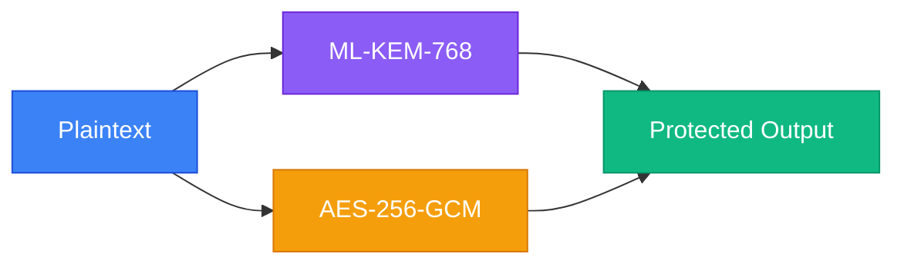
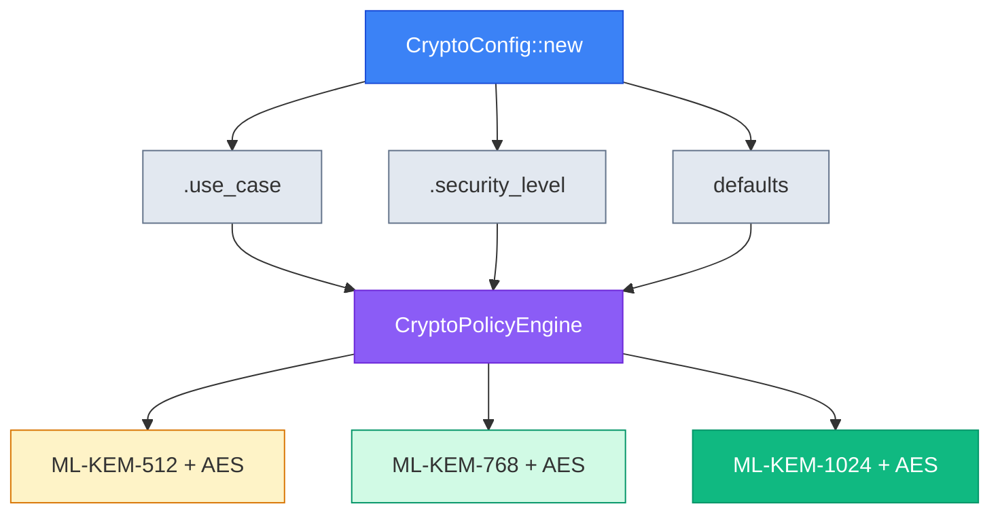
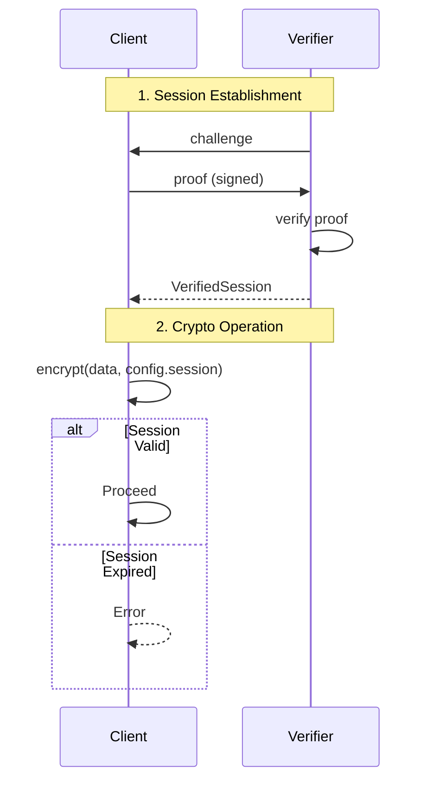

# LatticeArc

[](https://github.com/LatticeArc/latticearc/actions/workflows/ci.yml)
[](https://github.com/LatticeArc/latticearc/actions/workflows/fips-validation.yml)
[](docs/NIST_COMPLIANCE.md)
[](https://codecov.io/gh/LatticeArc/latticearc)
[](https://github.com/LatticeArc/latticearc/actions/workflows/codeql.yml)
[](LICENSE)

LatticeArc is a post-quantum cryptography library for Rust that implements all four NIST FIPS 203-206 standards. It defaults to hybrid mode (PQ + classical) so your data stays protected even if a flaw is found in any single algorithm, and ships as a single crate with a minimal, use-case-driven API.

## Highlights

- **All four NIST standards** — ML-KEM (FIPS 203), ML-DSA (FIPS 204), SLH-DSA (FIPS 205), FN-DSA (FIPS 206)
- **Hybrid by default** — PQ + classical, per [NIST SP 800-227](https://csrc.nist.gov/pubs/sp/800/227/final). If *either* algorithm holds, your data is safe
- **22 use cases** with automatic algorithm selection — from IoT to government classified
- **Zero-trust sessions** — per-operation authentication before any crypto operation
- **Formal verification** — 29 Kani proofs, 40+ Proptest property tests, SAW-verified primitives (via aws-lc-rs)
- **FIPS 140-3 ready** — `--features fips` enables the validated aws-lc-rs backend
- **Single crate, minimal API** — `cargo add latticearc` and go

## Quick Start

Requires Rust 1.93+ and a C compiler. See [Build Prerequisites](#build-prerequisites) for details.

```toml
[dependencies]
latticearc = "0.2"
```

### Encryption

```rust
use latticearc::{encrypt, decrypt, CryptoConfig};

let key = [0u8; 32];
let encrypted = encrypt(b"secret data", &key, CryptoConfig::new())?;
let decrypted = decrypt(&encrypted, &key, CryptoConfig::new())?;
```

### Digital Signatures

```rust
use latticearc::{generate_signing_keypair, sign_with_key, verify, CryptoConfig};

let config = CryptoConfig::new();
let (pk, sk, _scheme) = generate_signing_keypair(config.clone())?;
let signed = sign_with_key(b"document", &sk, &pk, config.clone())?;
let is_valid = verify(&signed, config)?;
```

## Hybrid Encryption & Signatures

LatticeArc defaults to **hybrid cryptography** (PQ + classical) as recommended by [NIST SP 800-227](https://csrc.nist.gov/pubs/sp/800/227/final):

> "Organizations may choose to implement hybrid solutions... to provide additional assurance during the transition period."



> **Defense in depth**: If *either* algorithm remains secure, your data is protected.

**Why not PQ-only?** ML-KEM/ML-DSA are new (standardized 2024). Hybrid provides defense-in-depth: if a flaw is discovered in the PQ algorithm, classical crypto still protects your data.

### Hybrid Encryption

```rust
use latticearc::{generate_hybrid_keypair, encrypt_hybrid, decrypt_hybrid, SecurityMode};

// Generate hybrid keypair (ML-KEM-768 + X25519)
let (pk, sk) = generate_hybrid_keypair()?;

// Encrypt using hybrid KEM (ML-KEM + X25519 + HKDF + AES-256-GCM)
let encrypted = encrypt_hybrid(b"sensitive data", &pk, SecurityMode::Unverified)?;

// Decrypt
let plaintext = decrypt_hybrid(&encrypted, &sk, SecurityMode::Unverified)?;
```

### Hybrid Signatures

```rust
use latticearc::{generate_hybrid_signing_keypair, sign_hybrid, verify_hybrid_signature, SecurityMode};

// Generate hybrid signing keypair (ML-DSA-65 + Ed25519)
let (pk, sk) = generate_hybrid_signing_keypair(SecurityMode::Unverified)?;

// Sign (both ML-DSA and Ed25519 signatures generated)
let signature = sign_hybrid(b"document", &sk, SecurityMode::Unverified)?;

// Verify (both must pass for signature to be valid)
let valid = verify_hybrid_signature(b"document", &signature, &pk, SecurityMode::Unverified)?;
```

## Algorithm Selection

LatticeArc automatically selects algorithms based on your configuration:



### By Use Case (Recommended)

```rust
use latticearc::{encrypt, CryptoConfig, UseCase};

let encrypted = encrypt(data, &key, CryptoConfig::new()
    .use_case(UseCase::FileStorage))?;
```

| Use Case | Encryption | Signatures |
|----------|------------|------------|
| `SecureMessaging` | Hybrid (ML-KEM-768 + AES-256-GCM) | Hybrid (ML-DSA-65 + Ed25519) |
| `FileStorage` | Hybrid (ML-KEM-1024 + AES-256-GCM) | Hybrid (ML-DSA-87 + Ed25519) |
| `FinancialTransactions` | — | Hybrid (ML-DSA-65 + Ed25519) |
| `Authentication` | — | Hybrid (ML-DSA-87 + Ed25519) |
| `HealthcareRecords` | Hybrid (ML-KEM-1024 + AES-256-GCM) | — |
| `GovernmentClassified` | Hybrid (ML-KEM-1024 + AES-256-GCM) | — |
| `IoTDevice` | Hybrid (ML-KEM-512 + AES-256-GCM) | Hybrid (ML-DSA-44 + Ed25519) |

> **22 use cases supported.** See [Unified API Guide](docs/UNIFIED_API_GUIDE.md) for the complete list including cloud storage, VPN, blockchain, firmware signing, and more.

### By Security Level

```rust
use latticearc::{encrypt, CryptoConfig, SecurityLevel};

let encrypted = encrypt(data, &key, CryptoConfig::new()
    .security_level(SecurityLevel::Maximum))?;
```

| Level | Mode | Encryption | Signatures | NIST Level |
|-------|------|------------|------------|------------|
| `Quantum` | PQ-only | ML-KEM-1024 + AES-256-GCM | ML-DSA-87 | 5 |
| `Maximum` | Hybrid | ML-KEM-1024 + AES-256-GCM | ML-DSA-87 + Ed25519 | 5 |
| `High` (default) | Hybrid | ML-KEM-768 + AES-256-GCM | ML-DSA-65 + Ed25519 | 3 |
| `Standard` | Hybrid | ML-KEM-512 + AES-256-GCM | ML-DSA-44 + Ed25519 | 1 |

> **Note:** `Quantum` mode uses PQ-only algorithms (no classical fallback) for CNSA 2.0 compliance. For complete security level documentation, see [docs/UNIFIED_API_GUIDE.md](docs/UNIFIED_API_GUIDE.md).

### Compliance Modes

LatticeArc provides compile-time and runtime compliance controls for regulated environments:

| Mode | FIPS Required | Hybrid Allowed | Use Case |
|------|---------------|----------------|----------|
| `ComplianceMode::Default` | No | Yes | Development, general use |
| `ComplianceMode::Fips140_3` | Yes | Yes | Healthcare, financial, government |
| `ComplianceMode::Cnsa2_0` | Yes | No | NSA CNSA 2.0 (PQ-only mandated) |

```rust
use latticearc::{encrypt, CryptoConfig, ComplianceMode, UseCase};

// FIPS 140-3 compliant encryption for healthcare
let config = CryptoConfig::new()
    .use_case(UseCase::HealthcareRecords)
    .compliance(ComplianceMode::Fips140_3);
let encrypted = encrypt(data, &key, config)?;

// CNSA 2.0 mode (PQ-only, no hybrid)
let config = CryptoConfig::new()
    .compliance(ComplianceMode::Cnsa2_0);
```

```bash
# Build with FIPS-validated backend (requires CMake + Go)
cargo build --features fips
```

> **Compile-time vs runtime:** The `fips` feature flag enables the FIPS 140-3 validated aws-lc-rs backend. `ComplianceMode` provides runtime algorithm constraints on top of that. Setting `Fips140_3` or `Cnsa2_0` without the `fips` feature returns a validation error with a helpful rebuild message.

For detailed compliance documentation, see [FIPS Security Policy](docs/FIPS_SECURITY_POLICY.md) and [Algorithm Selection Guide](docs/ALGORITHM_SELECTION.md#compliance-modes).

## Zero Trust Sessions

Use verified sessions to enforce authentication before each crypto operation:



```rust
use latticearc::{encrypt, generate_keypair, CryptoConfig, VerifiedSession};

let (pk, sk) = generate_keypair()?;
let session = VerifiedSession::establish(&pk, &sk)?;

// Session is verified before each operation
let encrypted = encrypt(data, &key, CryptoConfig::new().session(&session))?;
```

## Post-Quantum TLS

```rust
use latticearc::tls::{TlsConfig, TlsUseCase};

let config = TlsConfig::new()
    .use_case(TlsUseCase::WebServer);
```

| Use Case | TLS Mode | Key Exchange |
|----------|----------|--------------|
| `WebServer` | Hybrid | X25519 + ML-KEM-768 |
| `InternalService` | Hybrid | X25519 + ML-KEM-768 |
| `ApiGateway` | Hybrid | X25519 + ML-KEM-768 |
| `FinancialServices` | Hybrid | X25519 + ML-KEM-768 |
| `Healthcare` | Hybrid | X25519 + ML-KEM-768 |
| `DatabaseConnection` | Hybrid | X25519 + ML-KEM-768 |
| `Government` | PQ-only | ML-KEM-1024 |
| `IoT` | Classic | X25519 |
| `LegacyIntegration` | Classic | X25519 |
| `RealTimeStreaming` | Classic | X25519 |

## Algorithms & Backends

LatticeArc uses NIST-standardized post-quantum algorithms (FIPS 203-206) with carefully chosen classical algorithms for hybrid mode.

### Post-Quantum

- ML-KEM-512/768/1024 (FIPS 203) - Key encapsulation
- ML-DSA-44/65/87 (FIPS 204) - Digital signatures
- SLH-DSA (FIPS 205) - Stateless hash-based signatures
- FN-DSA-512/1024 (FIPS 206) - Fast lattice signatures

### Classical (Hybrid Mode)

- **Ed25519** for signatures - 5x faster than P-256 ECDSA, FIPS 186-5 approved (2023)
- **X25519** for key exchange - TLS 1.3 standard
- **AES-256-GCM** - Hardware-accelerated via aws-lc-rs
- **ChaCha20-Poly1305** - Software-friendly alternative

### Why Ed25519 Instead of P-256 ECDSA?

| Metric | Ed25519 | P-256 ECDSA |
|--------|---------|-------------|
| Signing speed | 16,000 ops/sec | 3,000 ops/sec |
| Side-channel resistance | Built-in | Requires careful implementation |
| FIPS 186-5 approved | Yes | Yes |
| Implementation safety | Deterministic nonces | Random nonces (RNG failure = key leak) |

### What We Skip

**Pre-standard algorithms:** CRYSTALS-Kyber, CRYSTALS-Dilithium (superseded by ML-KEM/ML-DSA)

**Broken algorithms:** SIKE, Rainbow (cryptanalyzed)

**Legacy algorithms:** RSA (50x slower), DSA (deprecated)

**Why?** We follow NIST's 2026 migration timeline and focus on standardized, production-ready algorithms.

### Backend Selection

- **ML-KEM, AES-GCM, HKDF, X25519:** aws-lc-rs
- **ML-DSA:** fips204 (awaiting aws-lc-rs stabilization)
- **SLH-DSA:** fips205 (NIST-compliant)
- **FN-DSA:** fn-dsa (FIPS 206)
- **Ed25519:** ed25519-dalek (audited, constant-time)

> With `--features fips`, aws-lc-rs operations (ML-KEM, AES-GCM, HKDF, X25519) run through the FIPS 140-3 validated module. Without this flag, the same algorithms run through aws-lc-rs's default (non-FIPS) backend. See [Compliance Modes](#compliance-modes).

For detailed rationale, performance comparisons, and ecosystem positioning, see [Algorithm Selection Guide](docs/ALGORITHM_SELECTION.md).

## Verification Strategy

Correctness is verified at three layers, each with the right tool for the job:

| Layer | Tool | Scope | What it proves |
|-------|------|-------|----------------|
| **Primitives** | [SAW](https://github.com/awslabs/aws-lc-verification) (via aws-lc-rs) | AES-GCM, ML-KEM, X25519, SHA-2 | Mathematical correctness of C implementations |
| **API crypto** | [Proptest](https://proptest-rs.github.io/proptest/) (40+ tests) | Hybrid KEM/encrypt/sign, unified API, ML-KEM | Roundtrip, non-malleability, key independence, wrong-key rejection |
| **Type invariants** | [Kani](https://github.com/model-checking/kani) (29 proofs) | `latticearc::types` (pure Rust) | State machine rules, config validation, domain separation, enum exhaustiveness, ordering, defaults |

**SAW (inherited):** We don't run SAW ourselves — aws-lc-rs provides [verified implementations](https://github.com/awslabs/aws-lc-verification) of the underlying primitives.

**Proptest (API-level crypto):** 40+ property-based tests in `tests/tests/proptest_*.rs`, each running 256 random cases in release mode. These verify that our Rust wrappers correctly compose the verified primitives — encrypt/decrypt roundtrip, KEM encapsulate/decapsulate consistency, signature sign/verify, FIPS 203 key sizes, and scheme selector determinism.

**Kani (type invariants):** 29 bounded model checking proofs in `latticearc::types`, run on every push to `main`. These do **not** verify cryptographic operations (which require FFI). They verify the pure-Rust policy and state management layer:

- **Key lifecycle** (5 proofs): SP 800-57 state machine — destroyed keys can't transition, no backward transitions, retired keys can only be destroyed
- **Configuration validation** (6 proofs): CoreConfig bi-conditional validation over all 96 combinations, factory presets, encryption compression/integrity, signature chain/timestamp
- **Policy engine** (5 proofs): every `CryptoScheme` and `SecurityLevel` variant maps to a valid algorithm, hybrid/general encryption and signature selection completeness
- **Compliance** (3 proofs): ComplianceMode `requires_fips()` and `allows_hybrid()` exhaustive, PerformancePreference default is Balanced
- **Trust levels** (4 proofs): total ordering, `is_trusted()` iff level >= Partial, `is_fully_trusted()` correctness
- **Domain separation** (1 proof): all 4 HKDF domain constants are pairwise distinct (collision = key reuse)
- **Verification status** (1 proof): `is_verified()` returns true iff Verified variant
- **Defaults** (4 proofs): `SecurityLevel::default()` is `High`, ComplianceMode default is Unrestricted, CNSA 2.0 requires FIPS, CNSA 2.0 disallows hybrid

## Security

LatticeArc builds on audited cryptographic libraries:

| Component | Backend | Status |
|-----------|---------|--------|
| ML-KEM, AES-GCM, HKDF | `aws-lc-rs` | FIPS 140-3 validated (with `--features fips`) |
| ML-DSA | `fips204` | NIST compliant (not FIPS-validated) |
| SLH-DSA | `fips205` | NIST compliant (not FIPS-validated) |
| FN-DSA | `fn-dsa` | NIST compliant (not FIPS-validated) |
| Ed25519 | `ed25519-dalek` | Audited |
| TLS | `rustls` | Audited by Cure53 |

### Upstream Contributions

We actively contribute to the cryptographic ecosystem:

- **[aws-lc-rs#1029](https://github.com/aws/aws-lc-rs/pull/1029)** — ML-KEM `DecapsulationKey` serialization (shipped in v1.16.0)
- **[aws-lc-rs#1034](https://github.com/aws/aws-lc-rs/pull/1034)** — ML-DSA seed-based deterministic keygen (shipped in v1.16.0)

These contributions, now shipping in aws-lc-rs v1.16.0, enable FIPS-validated serialization and deterministic key generation for post-quantum algorithms, benefiting the entire Rust cryptography community.

### Limitations

- **Not FIPS 140-3 certified** — With `--features fips`, aws-lc-rs provides a FIPS-validated backend for ML-KEM/AES-GCM/HKDF/X25519. LatticeArc itself has not undergone CMVP validation
  - **FIPS-ready**: Module integrity test (Section 9.2.2) implemented, KAT suite complete, ready for certification when needed
- **Not independently audited** — We welcome security researchers to review our code
- **Pre-1.0 software** — API may change between versions

### Reporting Vulnerabilities

Report security issues to: Security@LatticeArc.com

See [SECURITY.md](SECURITY.md) for our security policy.

## Crate Structure

| Crate / Module | Description |
|----------------|-------------|
| [`latticearc`](latticearc/) | Single publishable crate — all modules below |
| `latticearc::types` | Pure-Rust domain types, traits, config, policy engine (zero FFI, Kani-verifiable) |
| `latticearc::unified_api` | Unified API layer with crypto operations and zero-trust |
| `latticearc::primitives` | Cryptographic primitives (KEM, signatures, AEAD, hash, KDF) |
| `latticearc::hybrid` | Hybrid encryption combining PQC and classical |
| `latticearc::tls` | Post-quantum TLS integration |
| `latticearc::zkp` | Zero-knowledge proofs (Schnorr, Sigma, Pedersen) |
| `latticearc::prelude` | Error types and testing infrastructure |
| `latticearc::perf` | Performance benchmarking utilities |
| [`latticearc-tests`](tests/) | CAVP, KAT, integration tests (dev-only, not published) |

## Runnable Examples

The `latticearc` crate includes comprehensive examples demonstrating the API:

- `basic_encryption.rs` - Simple symmetric encryption with AES-256-GCM
- `digital_signatures.rs` - Digital signatures with ML-DSA and hybrid modes
- `hybrid_encryption.rs` - Hybrid encryption (ML-KEM + X25519 + HKDF)
- `true_hybrid_encryption.rs` - True hybrid KEM encryption with dual key exchange
- `post_quantum_signatures.rs` - Post-quantum signature schemes
- `unified_api.rs` - Unified API with use cases and security levels
- `tls_policy.rs` - TLS policy engine and use case configuration
- `complete_secure_workflow.rs` - End-to-end secure workflow with Zero Trust
- `zero_knowledge_proofs.rs` - Zero-knowledge proof demonstrations

Run an example with:
```bash
cargo run --example basic_encryption
cargo run --example digital_signatures
```

## Build Prerequisites

LatticeArc uses [aws-lc-rs](https://github.com/aws/aws-lc-rs) for core cryptographic operations (ML-KEM, AES-256-GCM, HKDF, X25519). Post-quantum signatures use dedicated NIST-compliant crates (`fips204`, `fips205`, `fn-dsa`) and classical signatures use `ed25519-dalek` (audited). See [Backend Selection](#backend-selection) for the full mapping.

### Default Build

Requires only Rust and a C/C++ compiler:

```bash
# Verify tools
rustc --version && cc --version
```

| Tool | Version | Why |
|------|---------|-----|
| **Rust** | 1.93+ (latest stable) | 2024 edition features |
| **C/C++ compiler** | gcc/clang/MSVC | aws-lc-rs compiles AWS-LC from C source |

### FIPS Build (`--features fips`)

For FIPS 140-3 compliance, enable the `fips` feature. This uses the FIPS-validated aws-lc-rs backend, which additionally requires CMake and Go:

```bash
# Install FIPS build dependencies (one-time setup)

# macOS
brew install cmake go

# Ubuntu/Debian
sudo apt install cmake golang-go build-essential

# Fedora/RHEL
sudo dnf install cmake golang gcc-c++

# Arch Linux
sudo pacman -S cmake go gcc

# Windows (with Chocolatey)
choco install cmake golang visualstudio2022-workload-vctools

# Build with FIPS-validated backend
cargo build --features fips
```

| Tool | Version | Why |
|------|---------|-----|
| **CMake** | 3.x | FIPS module build system |
| **Go** | 1.18+ | FIPS module `delocate` tool (strips relocations for integrity check) |

**Troubleshooting:**

| Error | Fix |
|-------|-----|
| `CMake not found` | Install CMake and ensure it's on your `PATH` (FIPS builds only) |
| `Go not found` | Install Go 1.18+ and ensure `go` is on your `PATH` (FIPS builds only) |
| `cc not found` (Linux) | `sudo apt install build-essential` or `sudo dnf install gcc-c++` |
| Linker errors on macOS | `xcode-select --install` for Command Line Tools |
| Long initial build | First build compiles AWS-LC from source (~2-3 min). Subsequent builds use cached artifacts. |

## Why Post-Quantum Cryptography?

Current public-key cryptography (RSA, ECC) will be broken by quantum computers running Shor's algorithm. While large-scale quantum computers don't exist yet, encrypted data captured today can be decrypted in the future — a threat known as "harvest now, decrypt later." NIST has standardized four quantum-resistant algorithm families (FIPS 203-206) to address this threat, and LatticeArc implements all of them.

## Documentation

- [API Reference](https://docs.rs/latticearc)
- [Unified API Guide](docs/UNIFIED_API_GUIDE.md) — algorithm selection, use cases, builder API
- [Architecture](docs/DESIGN.md) — crate structure, design decisions
- [Security Guide](docs/SECURITY_GUIDE.md) — threat model, secure usage patterns
- [NIST Compliance](docs/NIST_COMPLIANCE.md) — FIPS 203-206 conformance details
- [FAQ](docs/FAQ.md)

## License

Apache License 2.0. See [LICENSE](LICENSE).

## Contributing

See [CONTRIBUTING.md](CONTRIBUTING.md).
