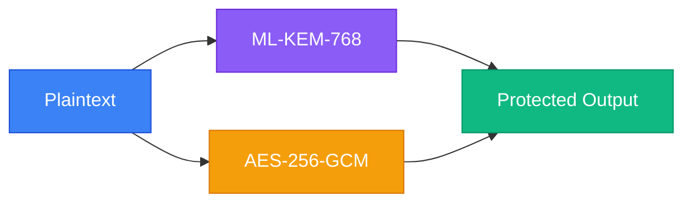
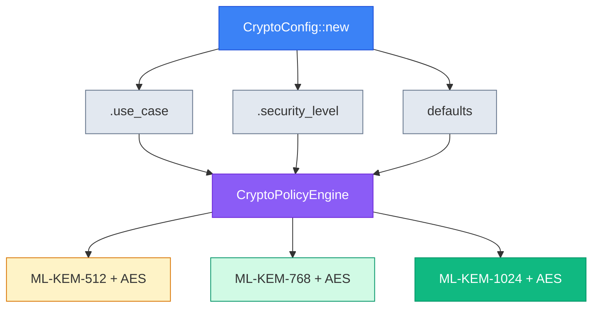
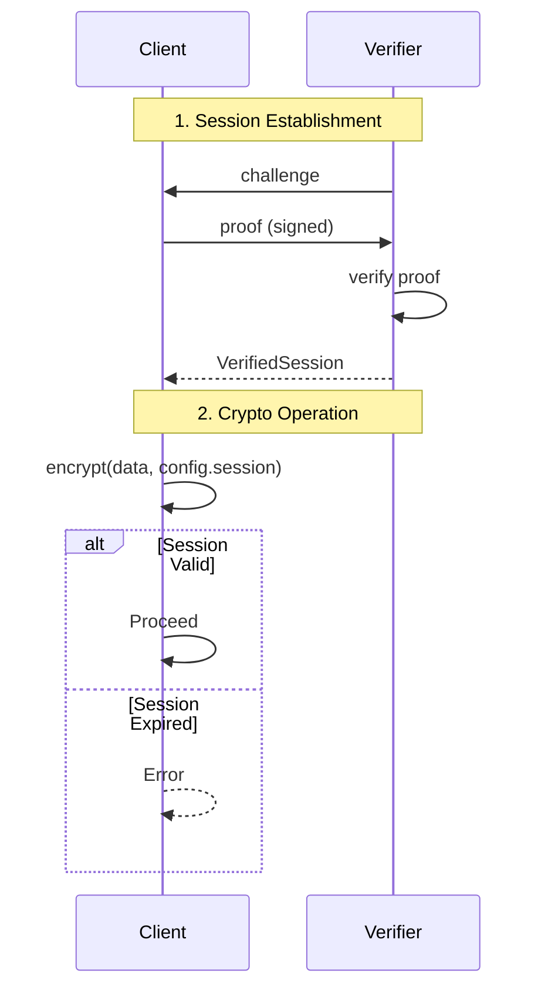

# LatticeArc

> **Evaluation Phase**: This project is currently in active development and evaluation. APIs may change without notice. Not recommended for production use yet.

[](https://github.com/LatticeArc/latticearc/actions/workflows/ci.yml)
[](https://github.com/LatticeArc/latticearc/actions/workflows/fips-validation.yml)
[](docs/NIST_COMPLIANCE.md)
[](https://codecov.io/gh/LatticeArc/latticearc)
[](https://github.com/LatticeArc/latticearc/actions/workflows/codeql.yml)
[](LICENSE)

LatticeArc is a post-quantum cryptography library for Rust, implementing the NIST FIPS 203-206 standards for quantum-resistant encryption and digital signatures.

## Why Post-Quantum Cryptography?

Current public-key cryptography (RSA, ECC) will be broken by quantum computers running Shor's algorithm. While large-scale quantum computers don't exist yet, encrypted data captured today can be decrypted in the future—a threat known as "harvest now, decrypt later."

NIST has standardized new quantum-resistant algorithms:
- **ML-KEM** (FIPS 203) - Key encapsulation based on lattice problems
- **ML-DSA** (FIPS 204) - Digital signatures based on lattice problems
- **SLH-DSA** (FIPS 205) - Hash-based digital signatures
- **FN-DSA** (FIPS 206) - Lattice-based signatures with smaller keys

## Why Hybrid Mode?

LatticeArc defaults to **hybrid cryptography** (PQ + classical) as recommended by [NIST SP 800-227](https://csrc.nist.gov/pubs/sp/800/227/final):

> "Organizations may choose to implement hybrid solutions... to provide additional assurance during the transition period."



> **Defense in depth**: If *either* algorithm remains secure, your data is protected.

**Why not PQ-only?** ML-KEM/ML-DSA are new (standardized 2024). Hybrid provides defense-in-depth: if a flaw is discovered in the PQ algorithm, classical crypto still protects your data.

## Quick Start

```toml
[dependencies]
latticearc = "0.1"
```

### Encryption

```rust
use latticearc::{encrypt, decrypt, CryptoConfig};

let key = [0u8; 32];
let encrypted = encrypt(b"secret data", &key, CryptoConfig::new())?;
let decrypted = decrypt(&encrypted, &key, CryptoConfig::new())?;
```

### Digital Signatures

```rust
use latticearc::{generate_signing_keypair, sign_with_key, verify, CryptoConfig};

let config = CryptoConfig::new();
let (pk, sk, _scheme) = generate_signing_keypair(config.clone())?;
let signed = sign_with_key(b"document", &sk, &pk, config.clone())?;
let is_valid = verify(&signed, config)?;
```

## Algorithm Selection

LatticeArc automatically selects algorithms based on your configuration:



### By Use Case (Recommended)

```rust
use latticearc::{encrypt, CryptoConfig, UseCase};

let encrypted = encrypt(data, &key, CryptoConfig::new()
    .use_case(UseCase::FileStorage))?;
```

### Hybrid Encryption

```rust
use latticearc::{generate_hybrid_keypair, encrypt_hybrid, decrypt_hybrid, SecurityMode};

// Generate hybrid keypair (ML-KEM-768 + X25519)
let (pk, sk) = generate_hybrid_keypair()?;

// Encrypt using hybrid KEM (ML-KEM + X25519 + HKDF + AES-256-GCM)
let encrypted = encrypt_hybrid(b"sensitive data", &pk, SecurityMode::Unverified)?;

// Decrypt
let plaintext = decrypt_hybrid(&encrypted, &sk, SecurityMode::Unverified)?;
```

### Hybrid Signatures

```rust
use latticearc::{generate_hybrid_signing_keypair, sign_hybrid, verify_hybrid_signature, SecurityMode};

// Generate hybrid signing keypair (ML-DSA-65 + Ed25519)
let (pk, sk) = generate_hybrid_signing_keypair(SecurityMode::Unverified)?;

// Sign (both ML-DSA and Ed25519 signatures generated)
let signature = sign_hybrid(b"document", &sk, SecurityMode::Unverified)?;

// Verify (both must pass for signature to be valid)
let valid = verify_hybrid_signature(b"document", &signature, &pk, SecurityMode::Unverified)?;
```

| Use Case | Encryption | Signatures |
|----------|------------|------------|
| `SecureMessaging` | Hybrid (ML-KEM-768 + AES-256-GCM) | Hybrid (ML-DSA-65 + Ed25519) |
| `FileStorage` | Hybrid (ML-KEM-1024 + AES-256-GCM) | Hybrid (ML-DSA-87 + Ed25519) |
| `FinancialTransactions` | — | Hybrid (ML-DSA-65 + Ed25519) |
| `Authentication` | — | Hybrid (ML-DSA-87 + Ed25519) |
| `HealthcareRecords` | Hybrid (ML-KEM-1024 + AES-256-GCM) | — |
| `GovernmentClassified` | Hybrid (ML-KEM-1024 + AES-256-GCM) | — |
| `IoTDevice` | Hybrid (ML-KEM-512 + AES-256-GCM) | Hybrid (ML-DSA-44 + Ed25519) |

> **24 use cases supported.** See [Unified API Guide](docs/UNIFIED_API_GUIDE.md) for the complete list including cloud storage, VPN, blockchain, firmware signing, and more.

### By Security Level

```rust
use latticearc::{encrypt, CryptoConfig, SecurityLevel};

let encrypted = encrypt(data, &key, CryptoConfig::new()
    .security_level(SecurityLevel::Maximum))?;
```

| Level | Mode | Encryption | Signatures | NIST Level |
|-------|------|------------|------------|------------|
| `Quantum` | PQ-only | ML-KEM-1024 + AES-256-GCM | ML-DSA-87 | 5 |
| `Maximum` | Hybrid | ML-KEM-1024 + AES-256-GCM | ML-DSA-87 + Ed25519 | 5 |
| `High` (default) | Hybrid | ML-KEM-768 + AES-256-GCM | ML-DSA-65 + Ed25519 | 3 |
| `Standard` | Hybrid | ML-KEM-512 + AES-256-GCM | ML-DSA-44 + Ed25519 | 1 |

> **Note:** `Quantum` mode uses PQ-only algorithms (no classical fallback) for CNSA 2.0 compliance. For complete security level documentation, see [docs/UNIFIED_API_GUIDE.md](docs/UNIFIED_API_GUIDE.md).

## Algorithm Selection

LatticeArc uses NIST-standardized post-quantum algorithms (FIPS 203-206) with carefully chosen classical algorithms for hybrid mode.

### What We Use

**Post-Quantum:**
- ML-KEM-512/768/1024 (FIPS 203) - Key encapsulation
- ML-DSA-44/65/87 (FIPS 204) - Digital signatures
- SLH-DSA (FIPS 205) - Stateless hash-based signatures
- FN-DSA-512/1024 (FIPS 206) - Fast lattice signatures

**Classical (Hybrid Mode):**
- **Ed25519** for signatures - 5x faster than P-256 ECDSA, FIPS 186-5 approved (2023)
- **X25519** for key exchange - TLS 1.3 standard
- **AES-256-GCM** - Hardware-accelerated, FIPS 140-3 validated
- **ChaCha20-Poly1305** - Software-friendly alternative

### Why Ed25519 Instead of P-256 ECDSA?

| Metric | Ed25519 | P-256 ECDSA |
|--------|---------|-------------|
| Signing speed | 16,000 ops/sec | 3,000 ops/sec |
| Side-channel resistance | Built-in | Requires careful implementation |
| FIPS 186-5 approved | ✅ Yes (since 2023) | ✅ Yes |
| Implementation safety | Deterministic nonces | Random nonces (RNG failure = key leak) |

**We chose Ed25519** for better performance and security.

### What We Skip

**Pre-standard algorithms:** CRYSTALS-Kyber, CRYSTALS-Dilithium (superseded by ML-KEM/ML-DSA)

**Broken algorithms:** SIKE, Rainbow (cryptanalyzed)

**Legacy algorithms:** RSA (50x slower), DSA (deprecated)

**Why?** We follow NIST's 2026 migration timeline and focus on standardized, production-ready algorithms.

### Backend Selection

- **ML-KEM, AES-GCM, X25519:** aws-lc-rs (FIPS 140-3 validated)
- **ML-DSA:** fips204 (awaiting aws-lc-rs stabilization)
- **SLH-DSA:** fips205 (NIST-compliant)
- **FN-DSA:** fn-dsa (FIPS 206)
- **Ed25519:** ed25519-dalek (audited, constant-time)

For detailed rationale, performance comparisons, and ecosystem positioning, see [Algorithm Selection Guide](docs/ALGORITHM_SELECTION.md).

## Zero Trust Sessions

For enterprise security, use verified sessions that enforce authentication before each operation:



```rust
use latticearc::{encrypt, generate_keypair, CryptoConfig, VerifiedSession};

let (pk, sk) = generate_keypair()?;
let session = VerifiedSession::establish(&pk, &sk)?;

// Session is verified before each operation
let encrypted = encrypt(data, &key, CryptoConfig::new().session(&session))?;
```

## Post-Quantum TLS

```rust
use arc_tls::{TlsConfig, TlsUseCase};

let config = TlsConfig::new()
    .use_case(TlsUseCase::WebServer);
```

| Use Case | TLS Mode | Key Exchange |
|----------|----------|--------------|
| `WebServer` | Hybrid | X25519 + ML-KEM-768 |
| `InternalService` | Hybrid | X25519 + ML-KEM-768 |
| `ApiGateway` | Hybrid | X25519 + ML-KEM-768 |
| `FinancialServices` | Hybrid | X25519 + ML-KEM-768 |
| `Healthcare` | Hybrid | X25519 + ML-KEM-768 |
| `DatabaseConnection` | Hybrid | X25519 + ML-KEM-768 |
| `Government` | PQ-only | ML-KEM-1024 |
| `IoT` | Classic | X25519 |
| `LegacyIntegration` | Classic | X25519 |
| `RealTimeStreaming` | Classic | X25519 |

## Runnable Examples

The `latticearc` crate includes comprehensive examples demonstrating the API:

- `basic_encryption.rs` - Simple symmetric encryption with AES-256-GCM
- `digital_signatures.rs` - Digital signatures with ML-DSA and hybrid modes
- `hybrid_encryption.rs` - Hybrid encryption (ML-KEM + X25519 + HKDF)
- `true_hybrid_encryption.rs` - True hybrid KEM encryption with dual key exchange
- `post_quantum_signatures.rs` - Post-quantum signature schemes
- `unified_api.rs` - Unified API with use cases and security levels
- `tls_policy.rs` - TLS policy engine and use case configuration
- `complete_secure_workflow.rs` - End-to-end secure workflow with Zero Trust
- `zero_knowledge_proofs.rs` - Zero-knowledge proof demonstrations

Run an example with:
```bash
cargo run --example basic_encryption
cargo run --example digital_signatures
```

## Crate Structure

| Crate | Description |
|-------|-------------|
| [`latticearc`](latticearc/) | Main API - start here |
| [`arc-types`](arc-types/) | Pure-Rust domain types, traits, config, policy engine (zero FFI, Kani-verifiable) |
| [`arc-core`](arc-core/) | Unified API layer (re-exports arc-types, adds crypto operations) |
| [`arc-primitives`](arc-primitives/) | Cryptographic primitives (KEM, signatures, AEAD) |
| [`arc-hybrid`](arc-hybrid/) | Hybrid encryption combining PQC and classical |
| [`arc-tls`](arc-tls/) | Post-quantum TLS integration |
| [`arc-zkp`](arc-zkp/) | Zero-knowledge proofs |
| [`arc-prelude`](arc-prelude/) | Error types, testing infrastructure, re-exports domains from arc-types |
| [`arc-validation`](arc-validation/) | CAVP test vectors and compliance testing (dev-dep only) |
| [`arc-perf`](arc-perf/) | Performance benchmarking |
| [`arc-tests`](arc-tests/) | Consolidated integration test suite (37 test files from all crates) |

## Security

LatticeArc builds on audited cryptographic libraries:

| Component | Backend | Status |
|-----------|---------|--------|
| ML-KEM, AES-GCM | `aws-lc-rs` | FIPS 140-3 validated |
| ML-DSA | `fips204` | NIST compliant |
| SLH-DSA | `fips205` | NIST compliant |
| FN-DSA | `fn-dsa` | NIST compliant |
| Ed25519 | `ed25519-dalek` | Audited |
| TLS | `rustls` | Audited by Cure53 |

### Upstream Contributions

We actively contribute to the cryptographic ecosystem:

- **[aws-lc-rs#1029](https://github.com/aws/aws-lc-rs/pull/1029)** — ML-KEM `DecapsulationKey` serialization (merged Feb 10, 2026)
- **[aws-lc-rs#1034](https://github.com/aws/aws-lc-rs/pull/1034)** — ML-DSA seed-based deterministic keygen (merged Feb 13, 2026)

These contributions enable FIPS-validated serialization and deterministic key generation for post-quantum algorithms, benefiting the entire Rust cryptography community.

### Limitations

- **Not FIPS 140-3 certified** — We use FIPS-validated backends, but LatticeArc itself has not undergone CMVP validation
  - **FIPS-ready**: Module integrity test (Section 9.2.2) implemented, KAT suite complete, ready for certification when needed
- **Not independently audited** — We welcome security researchers to review our code
- **Pre-1.0 software** — API may change between versions

### Reporting Vulnerabilities

Report security issues to: Security@LatticeArc.com

See [SECURITY.md](SECURITY.md) for our security policy.

## Verification Strategy

Correctness is verified at three layers, each with the right tool for the job:

| Layer | Tool | Scope | What it proves |
|-------|------|-------|----------------|
| **Primitives** | [SAW](https://github.com/awslabs/aws-lc-verification) (via aws-lc-rs) | AES-GCM, ML-KEM, X25519, SHA-2 | Mathematical correctness of C implementations |
| **API crypto** | [Proptest](https://proptest-rs.github.io/proptest/) (40+ tests) | Hybrid KEM/encrypt/sign, unified API, ML-KEM | Roundtrip, non-malleability, key independence, wrong-key rejection |
| **Type invariants** | [Kani](https://github.com/model-checking/kani) (12 proofs) | `arc-types` (pure Rust) | State machine rules, enum exhaustiveness, ordering, defaults |

**SAW (inherited):** We don't run SAW ourselves — aws-lc-rs provides [verified implementations](https://github.com/awslabs/aws-lc-verification) of the underlying primitives.

**Proptest (API-level crypto):** 40+ property-based tests in `arc-tests/tests/proptest_*.rs`, each running 256 random cases in release mode. These verify that our Rust wrappers correctly compose the verified primitives — encrypt/decrypt roundtrip, KEM encapsulate/decapsulate consistency, signature sign/verify, FIPS 203 key sizes, and scheme selector determinism.

**Kani (type invariants):** 12 bounded model checking proofs in `arc-types`, run on every push to `main`. These do **not** verify cryptographic operations (which require FFI). They verify the pure-Rust policy and state management layer:

- **Key lifecycle** (5 proofs): SP 800-57 state machine — destroyed keys can't transition, no backward transitions, retired keys can only be destroyed
- **Policy engine** (3 proofs): every `CryptoScheme` and `SecurityLevel` variant maps to a valid algorithm (catches missing match arms when enums grow)
- **Trust levels** (3 proofs): total ordering, `is_trusted()` iff level >= Partial
- **Defaults** (1 proof): `SecurityLevel::default()` is `High` (NIST Level 3), not a weaker option

## Documentation

- [API Reference](https://docs.rs/latticearc)
- [Unified API Guide](docs/UNIFIED_API_GUIDE.md) — algorithm selection, use cases, builder API
- [Architecture](docs/DESIGN.md) — crate structure, design decisions, enterprise features
- [Security Guide](docs/SECURITY_GUIDE.md) — threat model, secure usage patterns
- [NIST Compliance](docs/NIST_COMPLIANCE.md) — FIPS 203-206 conformance details
- [FAQ](docs/FAQ.md)

## License

Apache License 2.0. See [LICENSE](LICENSE).

## Contributing

See [CONTRIBUTING.md](CONTRIBUTING.md).
