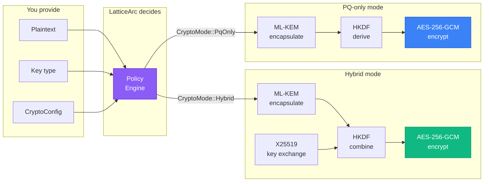
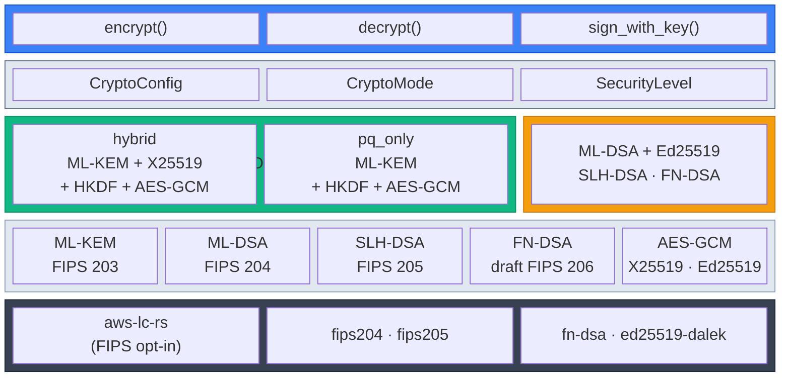

# LatticeArc

[](https://crates.io/crates/latticearc)
[](https://docs.rs/latticearc)
[](https://github.com/LatticeArc/latticearc/actions/workflows/ci.yml)
[](docs/NIST_COMPLIANCE.md)
[](https://codecov.io/gh/LatticeArc/latticearc)
[](LICENSE)

Post-quantum cryptography for Rust. You describe what you're protecting — LatticeArc selects the algorithm, security level, and compliance mode. Hybrid (PQ + classical) by default. Single crate.

| What you'd normally wire up yourself | What can go wrong |
|--------------------------------------|-------------------|
| Pick from 4 NIST standards, 11 parameter sets | Wrong security level, wrong algorithm type |
| Combine ML-KEM + X25519 + HKDF + AES-GCM | Broken key combiner, missing domain separation |
| Zeroize secrets, constant-time comparisons | Leaks via Debug, timing side-channels |
| FIPS 140-3, CNSA 2.0 mode restrictions | Non-compliant algorithm silently selected |

```rust
use latticearc::{encrypt, decrypt, CryptoConfig, UseCase, EncryptKey, DecryptKey};

let (pk, sk) = latticearc::generate_hybrid_keypair()?;
let encrypted = encrypt(b"patient records",
    EncryptKey::Hybrid(&pk),
    CryptoConfig::new().use_case(UseCase::HealthcareRecords))?;
let decrypted = decrypt(&encrypted, DecryptKey::Hybrid(&sk), CryptoConfig::new())?;
// ML-KEM-1024 + X25519 + HKDF-SHA256 + AES-256-GCM — selected automatically
```

## Quick Start

### Library

```toml
[dependencies]
latticearc = "0.8"
```

**Hybrid encryption** (default — PQ + classical, both must fail for an attacker to succeed):

```rust
use latticearc::{encrypt, decrypt, CryptoConfig, EncryptKey, DecryptKey};

let (pk, sk) = latticearc::generate_hybrid_keypair()?;
let encrypted = encrypt(b"secret data", EncryptKey::Hybrid(&pk), CryptoConfig::new())?;
let decrypted = decrypt(&encrypted, DecryptKey::Hybrid(&sk), CryptoConfig::new())?;
```

**Digital signatures** (ML-DSA-65 + Ed25519 hybrid):

```rust
use latticearc::{generate_signing_keypair, sign_with_key, verify, CryptoConfig};

let config = CryptoConfig::new();
let (pk, sk, _scheme) = generate_signing_keypair(config.clone())?;
let signed = sign_with_key(b"document", &sk, &pk, config.clone())?;
assert!(verify(&signed, config)?);
```

### CLI

```bash
cargo install --path latticearc-cli
```

```bash
# Sign a legal document
latticearc-cli keygen --use-case legal-documents --output ./keys
latticearc-cli sign --input contract.pdf \
  --key keys/hybrid-ml-dsa-87-ed25519.sec.json \
  --public-key keys/hybrid-ml-dsa-87-ed25519.pub.json
latticearc-cli verify --input contract.pdf \
  --signature contract.pdf.sig.json \
  --key keys/hybrid-ml-dsa-87-ed25519.pub.json

# Encrypt healthcare records
latticearc-cli keygen --algorithm aes256 --output ./keys
latticearc-cli encrypt --use-case healthcare-records \
  --input patient.json --output patient.enc.json \
  --key keys/aes256.key.json
```

> 22 use cases, 12 algorithms, hybrid + PQ-only modes. See [`latticearc-cli/README.md`](latticearc-cli/README.md).

## Highlights

- **All 4 NIST PQC standards** — ML-KEM (FIPS 203), ML-DSA (FIPS 204), SLH-DSA (FIPS 205), FN-DSA (draft FIPS 206)
- **Hybrid by default** — PQ + classical for defense-in-depth ([NIST](https://csrc.nist.gov/projects/post-quantum-cryptography/faqs), [NSA CNSA 2.0](https://media.defense.gov/2022/Sep/07/2003071834/-1/-1/0/CSA_CNSA_2.0_ALGORITHMS_.PDF), [ENISA](https://www.enisa.europa.eu/publications/post-quantum-cryptography-current-state-and-quantum-mitigation)); PQ-only mode available
- **22 use cases** with automatic algorithm selection — `UseCase::HealthcareRecords` → ML-KEM-1024, `UseCase::IoTDevice` → ML-KEM-512
- **Two orthogonal axes** — `SecurityLevel` (NIST 1/3/5) × `CryptoMode` (Hybrid/PqOnly)
- **Multi-layered verification** — formal proofs (Kani + SAW), 3-way constant-time gates, cross-impl differential testing, 31 fuzz targets, mutation testing at 80% floor. See [Verification](#verification).
- **Opt-in FIPS backend** — `--features fips` routes AES-GCM, ML-KEM, HKDF, SHA-2 through a CMVP-validated aws-lc-rs build. PQ signatures use NIST-conformant but non-validated crates. See [Algorithms & Backends](#algorithms--backends).
- **Single crate** — `cargo add latticearc` and go

## When to Use / When Not To

**Use LatticeArc when you want:**

- Hybrid PQ+classical encrypt/decrypt without wiring ML-KEM + X25519 + HKDF + AES-GCM yourself
- Use-case-driven algorithm selection (22 workloads, 3 compliance modes)
- A CLI that ops teams can use without writing Rust
- Opt-in FIPS routing with no code changes

**Reach for something else when you need:**

- A single low-level primitive — use `aws-lc-rs`, `fips204`, `fips205`, or `fn-dsa` directly
- End-to-end CMVP-certified module — no CMVP backend exists for PQ signatures yet
- Cross-language bindings — `liboqs` covers C, Python, Go, Java
- `no_std` / embedded — `wolfCrypt` leads for embedded PQ
- A TLS stack — use `rustls`, OpenSSL 3.5, or wolfSSL

> Detailed comparison: [Ecosystem Map](docs/ECOSYSTEM.md)

## How It Works


```mermaid
flowchart LR
    subgraph "You provide"
        DATA["Plaintext"]
        KEY["Key type"]
        CFG["CryptoConfig"]
    end

    subgraph "LatticeArc decides"
        ENGINE["Policy\nEngine"]
    end

    subgraph "Hybrid mode"
        H_KEM["ML-KEM\nencapsulate"]
        H_ECDH["X25519\nkey exchange"]
        H_HKDF["HKDF\ncombine"]
        H_AES["AES-256-GCM\nencrypt"]
        H_KEM --> H_HKDF
        H_ECDH --> H_HKDF
        H_HKDF --> H_AES
    end

    subgraph "PQ-only mode"
        P_KEM["ML-KEM\nencapsulate"]
        P_HKDF["HKDF\nderive"]
        P_AES["AES-256-GCM\nencrypt"]
        P_KEM --> P_HKDF
        P_HKDF --> P_AES
    end

    DATA --> ENGINE
    KEY --> ENGINE
    CFG --> ENGINE
    ENGINE -->|"CryptoMode::Hybrid"| H_KEM
    ENGINE -->|"CryptoMode::PqOnly"| P_KEM

    style ENGINE fill:#8b5cf6,stroke:#6d28d9,color:#fff
    style H_AES fill:#10b981,stroke:#059669,color:#fff
    style P_AES fill:#3b82f6,stroke:#1d4ed8,color:#fff
```

## Algorithms & Backends

Algorithm conformance ≠ module validation. `--features fips` switches aws-lc-rs to its CMVP-validated build for the algorithms it covers. PQ signatures always use non-validated crates. LatticeArc itself is **not** a CMVP-certified module.

| Category | Algorithms | Backend |
|----------|-----------|---------|
| **PQ Key Encapsulation** | ML-KEM-512/768/1024 (FIPS 203) | aws-lc-rs — FIPS 140-3 validated with `--features fips` |
| **PQ Signatures** | ML-DSA-44/65/87 (FIPS 204) | fips204 — NIST-conformant, not CMVP-validated |
| **PQ Hash Signatures** | SLH-DSA (FIPS 205) | fips205 — NIST-conformant, not CMVP-validated |
| **PQ Lattice Signatures** | FN-DSA-512/1024 (draft FIPS 206) | fn-dsa — NIST-conformant, not CMVP-validated |
| **Classical Signatures** | Ed25519 | ed25519-dalek — audited |
| **Classical Key Exchange** | X25519 | aws-lc-rs — FIPS 140-3 validated with `--features fips` |
| **Symmetric Encryption** | AES-256-GCM | aws-lc-rs — FIPS 140-3 validated with `--features fips` |
| **Symmetric Encryption** | ChaCha20-Poly1305 | chacha20poly1305 — non-FIPS |
| **Hash** | SHA-2 (256/384/512) | aws-lc-rs — FIPS 140-3 validated with `--features fips` |
| **Hash** | SHA-3, BLAKE2 | sha3 / blake2 crates — non-FIPS |
| **KDF** | HKDF-SHA256 | aws-lc-rs — FIPS 140-3 validated with `--features fips` |

> Details: [Algorithm Selection Guide](docs/ALGORITHM_SELECTION.md) · [NIST Compliance](docs/NIST_COMPLIANCE.md)

## Verification

Multi-layered — each tier catches what the tier below cannot.

### Proof-level

| Tool | What it proves | Scope |
|------|----------------|-------|
| [SAW](https://github.com/awslabs/aws-lc-verification) (inherited via aws-lc-rs) | Machine-checked correctness of C primitives | AES-GCM, HMAC-SHA2, SHA-256/384/512, ECDSA P-256/P-384 |
| [Kani](https://github.com/model-checking/kani) | Bounded model checking of Rust code | 30 proofs; 18 PR-blocking, full suite scheduled nightly |

### Property-based + differential

| Tool | What it catches |
|------|-----------------|
| [Proptest](https://proptest-rs.github.io/proptest/) | Roundtrip, non-malleability, single-bit rejection invariants (40+ properties × 256+ cases) |
| Cross-impl differential | ML-KEM (fips203 vs aws-lc-rs, 600 round-trips/run), ML-DSA (fips204 vs pqcrypto-mldsa), SLH-DSA (fips205 vs pqcrypto-sphincsplus) — 21 tests across all three |
| [Wycheproof](https://github.com/nicholasblaskey/wycheproof-rs) | 555 attacker-chosen vectors through our AES-GCM, ChaCha20-Poly1305, HMAC, and HKDF wrappers |

### Constant-time validation (3-way gate)

| Tool | Methodology | Schedule |
|------|-------------|----------|
| Criterion | Qualitative wall-clock divergence between input classes | Weekly (Sun) |
| [DudeCT](https://eprint.iacr.org/2016/1123) | Statistical Welch's t-test; `|max t| < 10` gate | Weekly (Mon) |
| ctgrind (Valgrind memcheck) | Marks secret bytes as uninit; fails on any branch or index that depends on them | Weekly (Tue) |

### DoS resistance

| Tool | What it gates |
|------|---------------|
| `stats_alloc` allocation budgets | Per-API-call allocation ceiling on every crypto op; regression-gated |
| DoS fuzz target | Allocation-bounded adversarial inputs; panics fuzzer above 1 MiB/call |
| Resource-limits coverage script | CI fails if any public `&[u8]`-taking function lacks a declared size cap |

### Continuous fuzz + mutation

- **31 libfuzzer targets** covering AEAD, KEM, signatures, KDF, serialization, and DoS; weekly scheduled matrix. OSS-Fuzz scaffold vendored in [`fuzz/oss-fuzz/`](fuzz/oss-fuzz/).
- **`cargo-mutants --in-diff`** with 80% score floor, PR-blocking on changed crypto files.

### Runtime sanitizers

ASan, TSan, and LSan are blocking. MSan is staged — aws-lc-rs 1.16.3 added `AWS_LC_SYS_SANITIZER=msan` to instrument C code through the FFI boundary; FIPS path awaits [aws/aws-lc#3167](https://github.com/aws/aws-lc/pull/3167).

`#![forbid(unsafe_code)]` is enforced at workspace level.

> Full proof inventory: [Formal Verification](docs/FORMAL_VERIFICATION.md)

## Architecture


```mermaid
block-beta
    columns 3

    block:API["Unified API"]:3
        columns 3
        encrypt["encrypt()"] decrypt["decrypt()"] sign["sign_with_key()"]
    end

    block:CONFIG["Configuration"]:3
        columns 3
        cc["CryptoConfig"] mode["CryptoMode"] level["SecurityLevel"]
    end

    block:HYBRID["Hybrid & PQ-Only Encryption"]:2
        columns 2
        henc["hybrid\nML-KEM + X25519\n+ HKDF + AES-GCM"]
        pqenc["pq_only\nML-KEM\n+ HKDF + AES-GCM"]
    end

    block:SIG["Signatures"]:1
        columns 1
        hsig["ML-DSA + Ed25519\nSLH-DSA · FN-DSA"]
    end

    block:PRIM["Primitives"]:3
        columns 5
        kem["ML-KEM\nFIPS 203"] dsa["ML-DSA\nFIPS 204"] slh["SLH-DSA\nFIPS 205"] fn["FN-DSA\ndraft FIPS 206"] sym["AES-GCM\nX25519 · Ed25519"]
    end

    block:BACK["Backends"]:3
        columns 3
        awslc["aws-lc-rs\n(FIPS opt-in)"] fips204["fips204 · fips205"] fndsa["fn-dsa · ed25519-dalek"]
    end

    style API fill:#3b82f6,stroke:#1d4ed8,color:#fff
    style CONFIG fill:#e2e8f0,stroke:#64748b
    style HYBRID fill:#10b981,stroke:#059669,color:#fff
    style SIG fill:#f59e0b,stroke:#d97706,color:#fff
    style PRIM fill:#e2e8f0,stroke:#94a3b8
    style BACK fill:#374151,stroke:#1f2937,color:#fff
```

## Security

Designed with the assumption that any single algorithm may be broken — hybrid mode ensures an attacker must defeat both components. Key material is zeroized on drop, tag comparisons run in constant time, secret types have manual `Debug` impls that redact contents.

### Limitations

- **Not a CMVP-certified cryptographic module.** No CMVP backend exists for PQ signatures. Use `--features fips` for the subset that routes through aws-lc-rs.
- **Not independently audited.** We welcome security researchers to review our code.
- **Pre-1.0 software.** API may change between versions.

### Upstream Contributions

- **[aws-lc-rs#1029](https://github.com/aws/aws-lc-rs/pull/1029)** — ML-KEM `DecapsulationKey` serialization (shipped in v1.16.0)
- **[aws-lc-rs#1034](https://github.com/aws/aws-lc-rs/pull/1034)** — ML-DSA seed-based deterministic keygen (shipped in v1.16.0)

Report security issues to: Security@LatticeArc.com — see [SECURITY.md](SECURITY.md).

## Build Prerequisites

Requires Rust 1.93+ and a C/C++ compiler. For FIPS builds, also CMake and Go.

```bash
# Default
cargo build

# FIPS-validated backend
brew install cmake go    # macOS
# sudo apt install cmake golang-go build-essential  # Ubuntu
cargo build --features fips
```

### Cargo features

| Feature | Default | What it enables |
|---|:---:|---|
| `fips` | off | Routes AES-GCM, ML-KEM, HKDF, and SHA-2 through the CMVP-validated `aws-lc-rs` build. Required for `ComplianceMode::Fips140_3` and `Cnsa2_0`. **Transitively enables `fips-self-test`** so power-on KATs run as required by FIPS 140-3 §10.3.1. If you specifically want the validated backend without the self-test wiring, set `default-features = false` and enable `aws-lc-rs/fips` directly. |
| `fips-self-test` | off | Power-up KAT self-tests for FIPS-boundary algorithms (ML-KEM, AES-GCM, SHA-2, ML-DSA, SLH-DSA). Pulled in transitively by `fips`; can be enabled standalone for non-FIPS builds that still want the self-test KAT coverage. |
| `tracing-init` | off | Exposes `init_tracing` / `init_tracing_with_file` helpers and the `tracing-subscriber` + `tracing-appender` deps that back them. **Library code should NOT enable this** — subscriber wiring is the binary's responsibility, and a transitive library that calls `init_tracing` will `panic!` the first downstream consumer that calls their own subscriber init. `latticearc-cli` enables this. |
| `secret-mlock` | off | Locks heap-backed `SecretVec` buffers into RAM via `mlock(2)` / `VirtualLock`, preventing them from appearing in swap or core dumps. |
| `kat-test-vectors` | off | Exposes `AeadCipher::new_allow_weak_key`, an opt-in constructor that bypasses the `AeadError::WeakKey` rejection of all-zero keys. **Test-only** — needed to reproduce NIST AES-GCM Test Cases 1 and 2 (McGrew & Viega) which use the all-zero key. Production builds must leave this off so an uninitialised-memory key fails closed. |

| Error | Fix |
|-------|-----|
| `CMake not found` | Install CMake (FIPS only) |
| `Go not found` | Install Go 1.18+ (FIPS only) |
| `cc not found` (Linux) | `sudo apt install build-essential` |
| Long initial build | First build compiles AWS-LC from source (~2-3 min) |

## Documentation

| Document | Description |
|----------|-------------|
| [Algorithm Selection Guide](docs/ALGORITHM_SELECTION.md) | Use-case tables, security-level mapping, compliance modes |
| [Unified API Guide](docs/UNIFIED_API_GUIDE.md) | Zero-trust sessions, all 22 use cases, PQ-only mode |
| [Key Format Specification](docs/KEY_FORMAT.md) | LatticeArc Portable Key (LPK) schema, JSON + CBOR |
| [Ecosystem Map](docs/ECOSYSTEM.md) | Comparison with OpenSSL, aws-lc-rs, liboqs, RustCrypto, age, Sequoia |
| [NIST Compliance](docs/NIST_COMPLIANCE.md) | Per-algorithm FIPS conformance status |
| [Formal Verification](docs/FORMAL_VERIFICATION.md) | Complete Kani proof inventory |
| [Design & Architecture](docs/DESIGN.md) | Crate structure, module boundaries, design decisions |
| [Design Patterns](docs/DESIGN_PATTERNS.md) | Config, crypto safety, and testing patterns |
| [CLI Reference](latticearc-cli/README.md) | Full command reference for latticearc-cli |

## License

Apache 2.0. See [LICENSE](LICENSE).

## Contributing

See [CONTRIBUTING.md](CONTRIBUTING.md).
