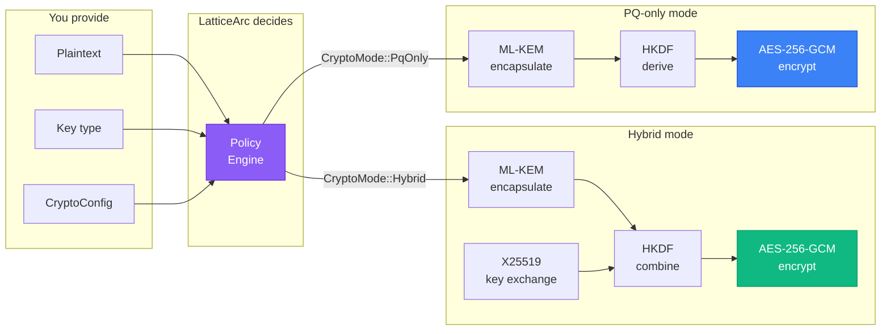
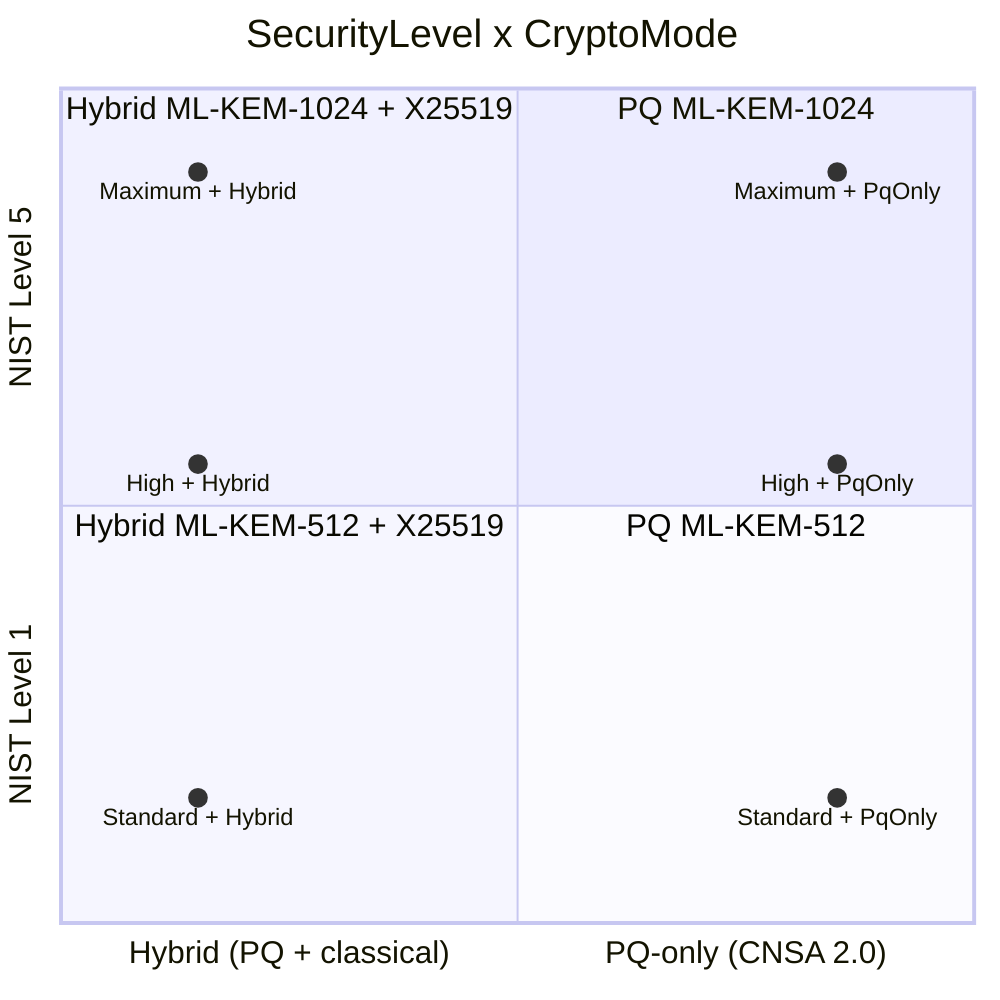
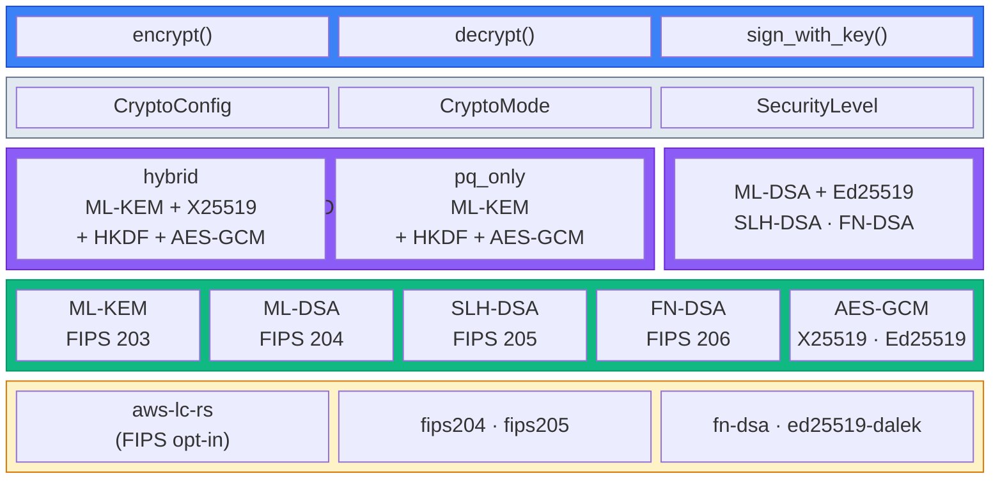

# LatticeArc

[](https://crates.io/crates/latticearc)
[](https://docs.rs/latticearc)
[](https://github.com/LatticeArc/latticearc/actions/workflows/ci.yml)
[](https://github.com/LatticeArc/latticearc/actions/workflows/fips-validation.yml)
[](docs/NIST_COMPLIANCE.md)
[](https://codecov.io/gh/LatticeArc/latticearc)
[](https://github.com/LatticeArc/latticearc/actions/workflows/codeql.yml)
[](LICENSE)

LatticeArc is a post-quantum cryptography library for Rust. It implements all four NIST PQC algorithm standards (FIPS 203–206) and ships as a single crate with a use-case-driven API — you describe what you're protecting, the library selects the right algorithm, security level, and compliance mode automatically. Hybrid (PQ + classical) by default for defense-in-depth, with PQ-only mode available for CNSA 2.0.

Opt-in FIPS routing (`--features fips`) sends AES-GCM, ML-KEM, HKDF, and SHA-2 through a CMVP-validated aws-lc-rs build; the PQ signature algorithms use NIST-conformant but non-validated crates. LatticeArc itself is not a CMVP-certified cryptographic module — see [Algorithms & Backends](#algorithms--backends) for the exact per-algorithm scope.

## The Problem

Quantum computers break RSA and ECC. That matters more than it first sounds: **AES-256
itself is already quantum-safe** (Grover's algorithm only halves effective key strength,
leaving ~128 bits), but the RSA and ECDH keys that *wrap* those AES keys are not. That
classical key-protection layer lives inside every KMS, every encrypted database, every
secret manager, every signed artifact, and every encrypted backup — the things the
industry labels "encrypted at rest."

NIST published new standards (FIPS 203–206) in 2024 to replace that classical layer,
but using them correctly is hard:

| What you have to do today | Lines of code | What can go wrong |
|--------------------------|---------------|-------------------|
| Pick the right algorithm for your use case | Research 4 standards, 11 parameter sets | Wrong security level, wrong algorithm type |
| Combine PQ + classical for defense-in-depth | Wire up ML-KEM + X25519 + HKDF + AES-GCM | Broken key combiner, missing domain separation |
| Handle key material safely | Manual zeroization, constant-time comparisons | Secret leaks via Debug, timing side-channels |
| Meet compliance requirements | FIPS 140-3, CNSA 2.0 mode restrictions | Accidentally using non-compliant algorithms |

LatticeArc solves all of this. You say **what** you're protecting, the library handles **how**:

```rust
use latticearc::{encrypt, decrypt, CryptoConfig, UseCase, EncryptKey, DecryptKey};

let (pk, sk) = latticearc::generate_hybrid_keypair()?;
let encrypted = encrypt(b"patient records",
    EncryptKey::Hybrid(&pk),
    CryptoConfig::new().use_case(UseCase::HealthcareRecords))?;
let decrypted = decrypt(&encrypted, DecryptKey::Hybrid(&sk), CryptoConfig::new())?;
// ML-KEM-1024 + X25519 + HKDF-SHA256 + AES-256-GCM — selected automatically
```

Three lines. NIST-conformant hybrid encryption. Automatic secret zeroization. No algorithm research required.

## Why Hybrid by Default?

The PQ algorithms (ML-KEM, ML-DSA) were standardized in August 2024. They're mathematically sound but young. LatticeArc defaults to **hybrid mode** — combining PQ + classical algorithms — so both must fail for an attacker to succeed:

- **If a flaw is found in ML-KEM** → X25519 still protects your key exchange
- **If ECC is broken by a quantum computer** → ML-KEM still protects your key exchange

This is supported by [NIST](https://csrc.nist.gov/projects/post-quantum-cryptography/faqs) (permits hybrid), [NSA CNSA 2.0](https://media.defense.gov/2022/Sep/07/2003071834/-1/-1/0/CSA_CNSA_2.0_ALGORITHMS_.PDF) (hybrid during transition), and [ENISA](https://www.enisa.europa.eu/publications/post-quantum-cryptography-current-state-and-quantum-mitigation) (recommends hybrid now). PQ-only mode (`CryptoMode::PqOnly`) is available when you need it — e.g., CNSA 2.0 final state.

## Highlights

- **All 4 NIST PQC standards** — ML-KEM (FIPS 203), ML-DSA (FIPS 204), SLH-DSA (FIPS 205), FN-DSA (draft FIPS 206)
- **Hybrid by default** — PQ + classical for defense in depth; PQ-only mode for CNSA 2.0
- **22 use cases** with automatic algorithm selection — from IoT to government classified
- **Two orthogonal axes** — `SecurityLevel` (NIST 1/3/5) x `CryptoMode` (Hybrid/PqOnly)
- **Zero-trust sessions** — per-operation authentication before any crypto operation
- **Formal verification** — 27 Kani proofs, Proptest property suites, SAW-verified primitives (via aws-lc-rs)
- **Opt-in FIPS backend** — `--features fips` routes AES-GCM, ML-KEM, HKDF, and SHA-2 through a CMVP-validated aws-lc-rs build. PQ signatures use NIST-conformant but non-validated crates. See [Algorithms & Backends](#algorithms--backends).
- **Single crate, minimal API** — `cargo add latticearc` and go

## When to Use LatticeArc

Most PQ *rollout activity* today is TLS hybrid key exchange — Chrome, Firefox, Go, and
OpenSSL all ship X25519MLKEM768 by default. That's because TLS has central distribution
(a Chrome update reaches millions) and a crystallizing threat (harvest-now-decrypt-later).

But the larger migration is just beginning: **key wrapping, key encapsulation, and
signatures for data at rest.** AES-256 already resists quantum attacks — Grover's
algorithm only halves effective key strength, leaving AES-256 at ~128 bits post-quantum.
What's *not* quantum-safe is the RSA/ECDH layer that protects the AES keys. Every KMS,
every encrypted database, every secret manager, every signed document, every backup
system relies on classical key-protection crypto that a quantum computer breaks.

LatticeArc targets that layer: hybrid ML-KEM + X25519 + HKDF + AES-GCM as a complete
pipeline for protecting the keys that protect your data, plus ML-DSA / SLH-DSA / FN-DSA
for signatures. It's the quantum-vulnerable layer sitting under most of the industry's
"encryption at rest" claims.

**Use it when you want:**

- **Hybrid composition without the wiring.** age 1.3 ships a hybrid file-encryption format via HPKE, Sequoia PGP is adding hybrid OpenPGP in H1 2026 — both are format-specific (age keys, OpenPGP packets). For *library-level* hybrid encrypt/decrypt that works with arbitrary data and your own key storage, wiring up ML-KEM + X25519 + HKDF + AES-GCM is still DIY in most crypto libraries. LatticeArc ships the full pipeline as the default mode, format-agnostic.
- **Use-case-driven algorithm selection.** Say `UseCase::HealthcareRecords` — the library selects algorithm, security level, and compliance mode. 22 workload types, three compliance modes, two crypto modes. No other library or CLI in any language offers this.
- **A CLI backed by the same library code.** The CLI isn't a separate tool with its own trust boundary — it's a thin frontend over the `latticearc` crate. Ops teams get keygen, encrypt, decrypt, sign, verify, and hash without writing Rust. Non-Rust teams (Python, Go, Node) can evaluate PQC end-to-end through the CLI before committing to the SDK.
- **Opt-in FIPS routing.** `--features fips` routes AES-GCM, ML-KEM, HKDF, and SHA-2 through a CMVP-validated aws-lc-rs build. No code changes. `ComplianceMode` adds runtime algorithm constraints on top.

**Reach for something else when:**

- **You need a single low-level primitive.** If you only want ML-KEM-768, the underlying crates we wrap (`aws-lc-rs`, `fips204`, `fips205`, `fn-dsa`) are smaller dependencies. LatticeArc's value is the composition, not the primitive.
- **You need a CMVP-certified cryptographic module end-to-end.** LatticeArc is not a CMVP-certified module. No CMVP-validated backend exists for PQ signatures today. See [Algorithms & Backends](#algorithms--backends).
- **You need cross-language bindings.** LatticeArc is Rust-only (no C API, no Python bindings). liboqs provides C, Python, Go, Java, and Rust from one project.
- **You target `no_std` or embedded.** LatticeArc is `std`-only. wolfCrypt is the leader for embedded PQ.
- **You need a TLS stack.** Use rustls (with `prefer-post-quantum`), OpenSSL 3.5, or wolfSSL.

> For a detailed comparison with other PQC libraries, CLIs, and managed services across languages, see the [Ecosystem Map](docs/ECOSYSTEM.md).

## How It Works


```mermaid
flowchart LR
    subgraph "You provide"
        DATA["Plaintext"]
        KEY["Key type"]
        CFG["CryptoConfig"]
    end

    subgraph "LatticeArc decides"
        ENGINE["Policy\nEngine"]
    end

    subgraph "Hybrid mode"
        H_KEM["ML-KEM\nencapsulate"]
        H_ECDH["X25519\nkey exchange"]
        H_HKDF["HKDF\ncombine"]
        H_AES["AES-256-GCM\nencrypt"]
        H_KEM --> H_HKDF
        H_ECDH --> H_HKDF
        H_HKDF --> H_AES
    end

    subgraph "PQ-only mode"
        P_KEM["ML-KEM\nencapsulate"]
        P_HKDF["HKDF\nderive"]
        P_AES["AES-256-GCM\nencrypt"]
        P_KEM --> P_HKDF
        P_HKDF --> P_AES
    end

    DATA --> ENGINE
    KEY --> ENGINE
    CFG --> ENGINE
    ENGINE -->|"CryptoMode::Hybrid"| H_KEM
    ENGINE -->|"CryptoMode::PqOnly"| P_KEM

    style ENGINE fill:#8b5cf6,stroke:#6d28d9,color:#fff
    style H_AES fill:#10b981,stroke:#059669,color:#fff
    style P_AES fill:#3b82f6,stroke:#1d4ed8,color:#fff
```

> **Hybrid** = secure if *either* algorithm holds. **PQ-only** = pure post-quantum for CNSA 2.0.

## Quick Start

### Library

```toml
[dependencies]
latticearc = "0.6"
```

```rust
use latticearc::{encrypt, decrypt, CryptoConfig, EncryptKey, DecryptKey};

// Hybrid encryption (default): ML-KEM-768 + X25519 + HKDF + AES-256-GCM
let (pk, sk) = latticearc::generate_hybrid_keypair()?;
let encrypted = encrypt(b"secret data", EncryptKey::Hybrid(&pk), CryptoConfig::new())?;
let decrypted = decrypt(&encrypted, DecryptKey::Hybrid(&sk), CryptoConfig::new())?;
```

```rust
use latticearc::{encrypt, decrypt, CryptoConfig, CryptoMode, EncryptKey, DecryptKey};

// PQ-only encryption: ML-KEM-768 + HKDF + AES-256-GCM (no classical component)
let (pk, sk) = latticearc::generate_pq_keypair()
    .map_err(|e| Box::new(e) as Box<dyn std::error::Error>)?;
let config = CryptoConfig::new().crypto_mode(CryptoMode::PqOnly);
let encrypted = encrypt(b"classified", EncryptKey::PqOnly(&pk), config.clone())?;
let decrypted = decrypt(&encrypted, DecryptKey::PqOnly(&sk), config)?;
```

```rust
use latticearc::{generate_signing_keypair, sign_with_key, verify, CryptoConfig};

// Digital signatures: ML-DSA-65 + Ed25519 hybrid
let config = CryptoConfig::new();
let (pk, sk, _scheme) = generate_signing_keypair(config.clone())?;
let signed = sign_with_key(b"document", &sk, &pk, config.clone())?;
assert!(verify(&signed, config)?);
```

### CLI

No code required. Tell the CLI **what** you're protecting — it selects the algorithm.

```bash
cargo install --path latticearc-cli
```

**Sign a legal document:**

```bash
latticearc-cli keygen --use-case legal-documents --output ./keys
latticearc-cli sign --input contract.pdf \
  --key keys/hybrid-ml-dsa-87-ed25519.sec.json \
  --public-key keys/hybrid-ml-dsa-87-ed25519.pub.json
latticearc-cli verify --input contract.pdf \
  --signature contract.pdf.sig.json \
  --key keys/hybrid-ml-dsa-87-ed25519.pub.json
```

**Encrypt healthcare records (symmetric):**

```bash
latticearc-cli keygen --algorithm aes256 --output ./keys
latticearc-cli encrypt --use-case healthcare-records \
  --input patient.json --output patient.enc.json \
  --key keys/aes256.key.json
latticearc-cli decrypt --input patient.enc.json \
  --output patient.json --key keys/aes256.key.json
```

**PQ-only encryption (CNSA 2.0):**

```bash
latticearc-cli keygen --algorithm ml-kem768 --output ./keys
latticearc-cli encrypt --mode pq-only \
  --input classified.pdf --output classified.enc.json \
  --key keys/ml-kem-768.pub.json
latticearc-cli decrypt --input classified.enc.json \
  --output classified.pdf --key keys/ml-kem-768.sec.json
```

**Hash a file:**

```bash
latticearc-cli hash --algorithm sha-256 --input firmware.bin
```

> The CLI supports 22 use cases, 12 algorithms, hybrid + PQ-only modes, and the [LatticeArc Portable Key](docs/KEY_FORMAT.md) format. See [`latticearc-cli/README.md`](latticearc-cli/README.md) for the full reference.

## Build Prerequisites

Requires Rust 1.93+ and a C/C++ compiler. For FIPS builds, also CMake and Go.

### Default Build

```bash
rustc --version && cc --version
cargo build
```

### FIPS Build (`--features fips`)

```bash
# macOS
brew install cmake go

# Ubuntu/Debian
sudo apt install cmake golang-go build-essential

# Build with FIPS-validated backend
cargo build --features fips
```

| Error | Fix |
|-------|-----|
| `CMake not found` | Install CMake and ensure it's on your `PATH` (FIPS builds only) |
| `Go not found` | Install Go 1.18+ and ensure `go` is on your `PATH` (FIPS builds only) |
| `cc not found` (Linux) | `sudo apt install build-essential` or `sudo dnf install gcc-c++` |
| Linker errors on macOS | `xcode-select --install` for Command Line Tools |
| Long initial build | First build compiles AWS-LC from source (~2-3 min). Subsequent builds use cached artifacts. |

## Algorithm Selection

Two orthogonal axes control what LatticeArc selects:


```mermaid
quadrantChart
    title SecurityLevel x CryptoMode
    x-axis "Hybrid (PQ + classical)" --> "PQ-only (CNSA 2.0)"
    y-axis "NIST Level 1" --> "NIST Level 5"
    quadrant-1 PQ ML-KEM-1024
    quadrant-2 Hybrid ML-KEM-1024 + X25519
    quadrant-3 Hybrid ML-KEM-512 + X25519
    quadrant-4 PQ ML-KEM-512
    Maximum + PqOnly: [0.85, 0.90]
    Maximum + Hybrid: [0.15, 0.90]
    High + PqOnly: [0.85, 0.55]
    High + Hybrid: [0.15, 0.55]
    Standard + PqOnly: [0.85, 0.15]
    Standard + Hybrid: [0.15, 0.15]
```

### By Use Case (Recommended)

```rust
use latticearc::{encrypt, CryptoConfig, UseCase, EncryptKey};

let (pk, _sk) = latticearc::generate_hybrid_keypair()?;
let encrypted = encrypt(b"data", EncryptKey::Hybrid(&pk), CryptoConfig::new()
    .use_case(UseCase::FileStorage))?;
```

| Use Case | Encryption | Signatures |
|----------|------------|------------|
| `SecureMessaging` | Hybrid (ML-KEM-768 + AES-256-GCM) | Hybrid (ML-DSA-65 + Ed25519) |
| `FileStorage` | Hybrid (ML-KEM-1024 + AES-256-GCM) | Hybrid (ML-DSA-87 + Ed25519) |
| `FinancialTransactions` | *Signature-primary* | Hybrid (ML-DSA-65 + Ed25519) |
| `Authentication` | *Signature-primary* | Hybrid (ML-DSA-87 + Ed25519) |
| `HealthcareRecords` | Hybrid (ML-KEM-1024 + AES-256-GCM) | *Encryption-primary* |
| `GovernmentClassified` | Hybrid (ML-KEM-1024 + AES-256-GCM) | *Encryption-primary* |
| `IoTDevice` | Hybrid (ML-KEM-512 + AES-256-GCM) | Hybrid (ML-DSA-44 + Ed25519) |

> **22 use cases supported.** See [Unified API Guide](docs/UNIFIED_API_GUIDE.md) for the complete list including cloud storage, VPN, blockchain, firmware signing, and more.

### By Security Level

| Level | NIST Level | Encryption (Hybrid) | Encryption (PQ-only) | Signatures |
|-------|------------|---------------------|----------------------|------------|
| `Maximum` | 5 | ML-KEM-1024 + X25519 + AES-256-GCM | ML-KEM-1024 + AES-256-GCM | ML-DSA-87 + Ed25519 |
| `High` (default) | 3 | ML-KEM-768 + X25519 + AES-256-GCM | ML-KEM-768 + AES-256-GCM | ML-DSA-65 + Ed25519 |
| `Standard` | 1 | ML-KEM-512 + X25519 + AES-256-GCM | ML-KEM-512 + AES-256-GCM | ML-DSA-44 + Ed25519 |

> `SecurityLevel` selects the NIST level. `CryptoMode` selects hybrid vs PQ-only (default: `Hybrid`).

### Compliance Modes

| Mode | FIPS Required | Hybrid Allowed | Use Case |
|------|---------------|----------------|----------|
| `ComplianceMode::Default` | No | Yes | Development, general use |
| `ComplianceMode::Fips140_3` | Yes | Yes | Healthcare, financial, government |
| `ComplianceMode::Cnsa2_0` | Yes | No | NSA CNSA 2.0 — requires `CryptoMode::PqOnly` |

```rust
use latticearc::{encrypt, CryptoConfig, ComplianceMode, UseCase, EncryptKey};

// FIPS 140-3 compliant encryption for healthcare
let (pk, _sk) = latticearc::generate_hybrid_keypair()?;
let config = CryptoConfig::new()
    .use_case(UseCase::HealthcareRecords)
    .compliance(ComplianceMode::Fips140_3);
let encrypted = encrypt(b"patient data", EncryptKey::Hybrid(&pk), config)?;
```

> **Compile-time vs runtime:** The `fips` feature flag switches aws-lc-rs to its CMVP-validated build. `ComplianceMode` layers runtime algorithm constraints on top. See [Algorithms & Backends](#algorithms--backends) for the per-algorithm validation status and [NIST Compliance](docs/NIST_COMPLIANCE.md) for the full scope.

## Zero Trust Sessions

Use verified sessions to enforce authentication before each crypto operation:

```rust
use latticearc::{encrypt, generate_keypair, CryptoConfig, VerifiedSession, EncryptKey};

let (pk, sk) = generate_keypair()?;
let session = VerifiedSession::establish(&pk, sk.as_ref())?;

// Session is verified before each operation
let (enc_pk, _enc_sk) = latticearc::generate_hybrid_keypair()?;
let encrypted = encrypt(b"data", EncryptKey::Hybrid(&enc_pk),
    CryptoConfig::new().session(&session))?;
```

## Key Format

Keys are stored in the **LatticeArc Portable Key (LPK)** format — a schema-first dual-format system supporting both JSON (human-readable) and CBOR (compact binary). Keys are identified by **use case** or **security level**, not algorithm — the algorithm is auto-derived and stored for version stability.

```json
{
  "version": 1,
  "use_case": "healthcare-records",
  "algorithm": "hybrid-ml-kem-1024-x25519",
  "key_type": "public",
  "key_data": { "pq": "Base64...", "classical": "Base64..." },
  "created": "2026-04-09T..."
}
```

- **Composite keys**: Hybrid keys store PQ and classical components separately (`pq` + `classical` fields)
- **PQ-only keys**: Single-component (`raw` field) — no classical component
- **Secret key permissions**: Automatically set to `0600` (owner-only) by the CLI
- **Enterprise extensible**: Open `metadata` map for expiry, hardware binding, etc.

> See [Key Format Specification](docs/KEY_FORMAT.md) for the full schema, algorithm resolution tables, and CBOR encoding details.

## Algorithms & Backends

**Algorithm conformance ≠ module validation.** LatticeArc implements the NIST
algorithm specs (FIPS 203 / 204 / 205 / 206) by delegating to audited third-party
crates. Separately, `--features fips` switches the aws-lc-rs dependency to its
CMVP-validated FIPS build; at that point AES-GCM, ML-KEM, HKDF, and SHA-2 run
through a validated module. PQ signatures (ML-DSA, SLH-DSA, FN-DSA) always use
non-validated crates — there is no CMVP-certified backend for them yet. The
LatticeArc library as a whole is **not** a CMVP-certified cryptographic module.

The table below is the source of truth for which algorithms go through a
validated module:

| Category | Algorithms | Backend |
|----------|-----------|---------|
| **PQ Key Encapsulation** | ML-KEM-512/768/1024 (FIPS 203) | aws-lc-rs — routed through FIPS 140-3 validated module with `--features fips` |
| **PQ Signatures** | ML-DSA-44/65/87 (FIPS 204) | fips204 — NIST-conformant, not CMVP-validated |
| **PQ Hash Signatures** | SLH-DSA (FIPS 205) | fips205 — NIST-conformant, not CMVP-validated |
| **PQ Lattice Signatures** | FN-DSA-512/1024 (draft FIPS 206) | fn-dsa — NIST-conformant, not CMVP-validated |
| **Classical Signatures** | Ed25519 | ed25519-dalek — audited |
| **Classical Key Exchange** | X25519 | aws-lc-rs — routed through FIPS 140-3 validated module with `--features fips` |
| **Symmetric Encryption** | AES-256-GCM | aws-lc-rs — routed through FIPS 140-3 validated module with `--features fips` |
| **Symmetric Encryption** | ChaCha20-Poly1305 | chacha20poly1305 crate — non-FIPS |
| **Hash** | SHA-2 (256/384/512) | aws-lc-rs — routed through FIPS 140-3 validated module with `--features fips` |
| **Hash** | SHA-3, BLAKE2 | sha3 / blake2 crates — non-FIPS |
| **KDF** | HKDF-SHA256 | aws-lc-rs — routed through FIPS 140-3 validated module with `--features fips` |

> For rationale and ecosystem positioning, see [Algorithm Selection Guide](docs/ALGORITHM_SELECTION.md)
> and [NIST Compliance](docs/NIST_COMPLIANCE.md).

## Verification

Correctness is verified at three layers:

| Layer | Tool | What it proves |
|-------|------|----------------|
| **Primitives** | [SAW](https://github.com/awslabs/aws-lc-verification) (via aws-lc-rs) | Mathematical correctness of C implementations |
| **API crypto** | [Proptest](https://proptest-rs.github.io/proptest/) (76 tests) | Roundtrip, non-malleability, key independence |
| **Type invariants** | [Kani](https://github.com/model-checking/kani) (27 proofs) | State machine rules, config validation, domain separation |

See [Formal Verification](docs/FORMAL_VERIFICATION.md) for the complete proof inventory.

## Security

LatticeArc is designed with the assumption that any single algorithm may be
broken — hybrid mode ensures an attacker must defeat both the PQ and classical
component to win. Key material is zeroized on drop, tag comparisons run in
constant time, and secret types have manual `Debug` impls that redact their
contents to prevent accidental logging.

For the per-algorithm validation status (what's CMVP-validated, what's only
NIST-conformant), see [Algorithms & Backends](#algorithms--backends) above.

### Limitations

- **Not a CMVP-certified cryptographic module.** LatticeArc itself has not
  undergone CMVP certification, and no CMVP-certified backend exists for the
  PQ signature algorithms (ML-DSA, SLH-DSA, FN-DSA). Workloads that strictly
  require module validation should use `--features fips` for the subset that
  routes through aws-lc-rs and a separately-certified module for the rest.
- **Not independently audited.** We welcome security researchers to review our code.
- **Pre-1.0 software.** API may change between versions.

### Upstream Contributions

- **[aws-lc-rs#1029](https://github.com/aws/aws-lc-rs/pull/1029)** — ML-KEM `DecapsulationKey` serialization (shipped in v1.16.0)
- **[aws-lc-rs#1034](https://github.com/aws/aws-lc-rs/pull/1034)** — ML-DSA seed-based deterministic keygen (shipped in v1.16.0)

Report security issues to: Security@LatticeArc.com — see [SECURITY.md](SECURITY.md).

## Architecture


```mermaid
block-beta
    columns 3

    block:API["Unified API"]:3
        columns 3
        encrypt["encrypt()"] decrypt["decrypt()"] sign["sign_with_key()"]
    end

    block:CONFIG["Configuration"]:3
        columns 3
        cc["CryptoConfig"] mode["CryptoMode"] level["SecurityLevel"]
    end

    block:HYBRID["Hybrid & PQ-Only Encryption"]:2
        columns 2
        henc["hybrid\nML-KEM + X25519\n+ HKDF + AES-GCM"]
        pqenc["pq_only\nML-KEM\n+ HKDF + AES-GCM"]
    end

    block:SIG["Signatures"]:1
        columns 1
        hsig["ML-DSA + Ed25519\nSLH-DSA · FN-DSA"]
    end

    block:PRIM["Primitives"]:3
        columns 5
        kem["ML-KEM\nFIPS 203"] dsa["ML-DSA\nFIPS 204"] slh["SLH-DSA\nFIPS 205"] fn["FN-DSA\nFIPS 206"] sym["AES-GCM\nX25519 · Ed25519"]
    end

    block:BACK["Backends"]:3
        columns 3
        awslc["aws-lc-rs\n(FIPS opt-in)"] fips204["fips204 · fips205"] fndsa["fn-dsa · ed25519-dalek"]
    end

    style API fill:#3b82f6,stroke:#1d4ed8,color:#fff
    style CONFIG fill:#e2e8f0,stroke:#64748b
    style HYBRID fill:#8b5cf6,stroke:#6d28d9,color:#fff
    style SIG fill:#8b5cf6,stroke:#6d28d9,color:#fff
    style PRIM fill:#10b981,stroke:#059669,color:#fff
    style BACK fill:#fef3c7,stroke:#d97706
```

| Crate / Module | Description |
|----------------|-------------|
| [`latticearc`](latticearc/) | Single publishable crate — all modules below |
| `latticearc::unified_api` | Top-level API: `encrypt()`, `decrypt()`, `sign_with_key()`, `verify()` |
| `latticearc::hybrid` | Hybrid (PQ + classical) and PQ-only encryption |
| `latticearc::primitives` | KEM, signatures, AEAD, hash, KDF |
| `latticearc::types` | Domain types, traits, config, policy engine (zero FFI, Kani-verifiable) |
| `latticearc::zkp` | Zero-knowledge proofs (Schnorr, Sigma, Pedersen) |
| [`latticearc-cli`](latticearc-cli/) | Command-line tool — 22 use cases, 12 algorithms |
| [`latticearc-tests`](tests/) | CAVP, KAT, integration tests (dev-only, not published) |

## Documentation

- [API Reference](https://docs.rs/latticearc) — full Rustdoc for all public types and functions
- [CLI Reference](latticearc-cli/README.md) — command-line tool: 8 commands, 22 use cases, 12 algorithms
- [Unified API Guide](docs/UNIFIED_API_GUIDE.md) — algorithm selection, use cases, builder API
- [Key Format Specification](docs/KEY_FORMAT.md) — LPK v1 schema, JSON + CBOR, algorithm resolution
- [Architecture](docs/DESIGN.md) — crate structure, design decisions
- [Security Guide](docs/SECURITY_GUIDE.md) — threat model, secure usage patterns
- [NIST Compliance](docs/NIST_COMPLIANCE.md) — FIPS 203–206 conformance details and CMVP scope
- [Formal Verification](docs/FORMAL_VERIFICATION.md) — SAW, Proptest, Kani proof inventory
- [FAQ](docs/FAQ.md)

## License

Apache License 2.0. See [LICENSE](LICENSE).

## Contributing

See [CONTRIBUTING.md](CONTRIBUTING.md).
