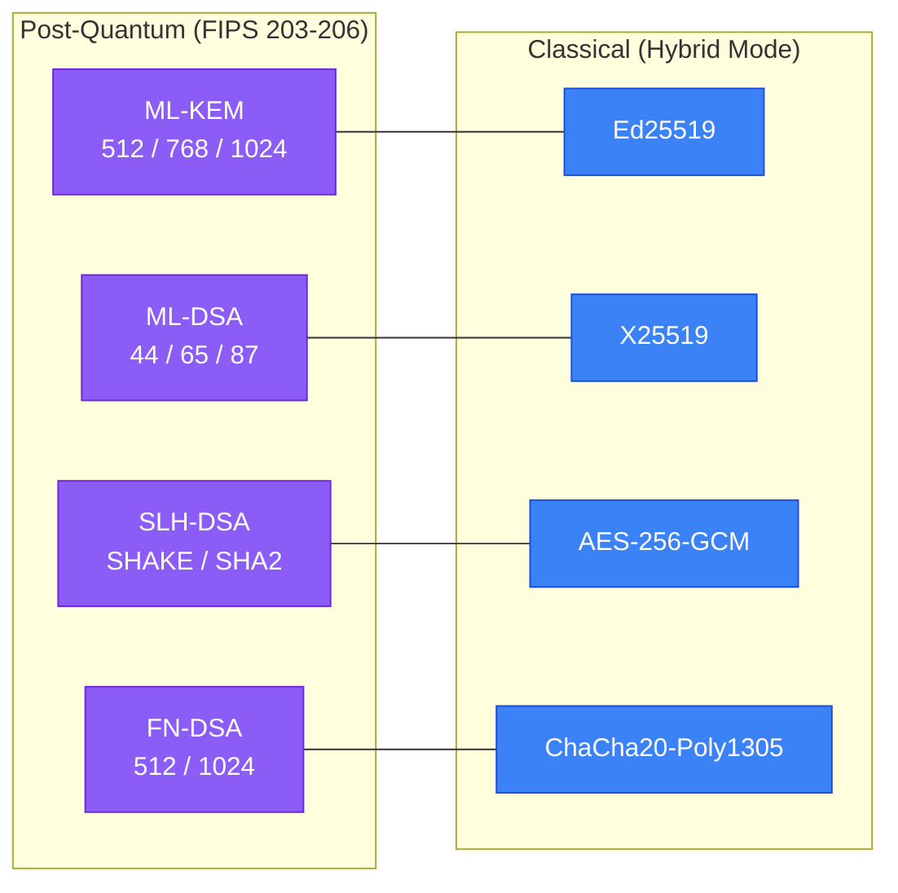
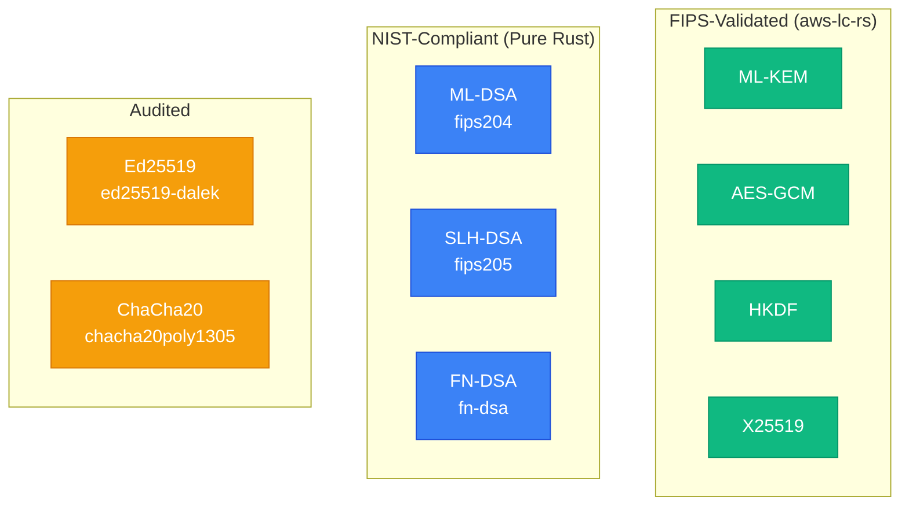
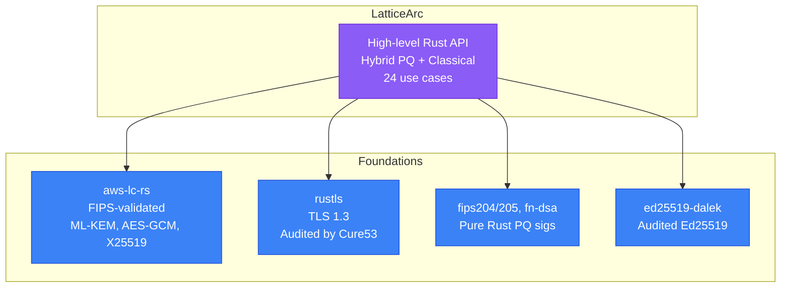

# Algorithm Selection Guide

LatticeArc's algorithm choices: what we include, what we skip, and why.

**Last Updated:** February 2026

---

## Design Principles

1. **Standards-First** - Only NIST-standardized algorithms (FIPS 203-206, 186-5)
2. **Performance Matters** - Choose faster algorithms when security is equivalent
3. **Safety by Default** - Prefer misuse-resistant designs
4. **FIPS-Ready** - Use validated backends for certification path
5. **Rust Memory Safety** - Minimize unsafe C code where practical
6. **No Broken Crypto** - Exclude algorithms broken by cryptanalysis
7. **Future-Proof** - Follow NIST migration timeline

---

## Included Algorithms



### Post-Quantum Algorithms

#### ML-KEM (FIPS 203) — Key Encapsulation

| Variant | NIST Level | Use Case | Perf (keygen / encap / decap) |
|---------|-----------|----------|-------------------------------|
| ML-KEM-512 | 1 | IoT, constrained | ~0.05 / 0.07 / 0.08 ms |
| ML-KEM-768 | 3 | Standard, TLS 1.3 default | ~0.05 / 0.07 / 0.08 ms |
| ML-KEM-1024 | 5 | Maximum security, long-term | ~0.05 / 0.07 / 0.08 ms |

- NIST-standardized (August 2024), FIPS 140-3 validated via aws-lc-rs
- Based on Module-LWE, production-deployed by AWS, Google, Cloudflare

#### ML-DSA (FIPS 204) — Digital Signatures

| Variant | NIST Level | Use Case | Sign / Verify |
|---------|-----------|----------|---------------|
| ML-DSA-44 | 2 | High-volume, IoT | ~0.5 / 0.4 ms |
| ML-DSA-65 | 3 | Standard applications | ~0.5 / 0.4 ms |
| ML-DSA-87 | 5 | Maximum security | ~0.5 / 0.4 ms |

- Smaller signatures than SLH-DSA, but structured assumption (lattice)

#### SLH-DSA (FIPS 205) — Hash-Based Signatures

| Feature | Value |
|---------|-------|
| Security basis | Hash-only (minimal assumptions) |
| Signing speed | ~50 ms (slower than ML-DSA) |
| Verify speed | ~1 ms |
| Best for | Firmware signing, root CAs, maximum conservatism |

- Stateless (no state management like XMSS)
- Most conservative PQ signature scheme

#### FN-DSA (FIPS 206) — Fast Lattice Signatures

| Feature | Value |
|---------|-------|
| Public key (512) | 897 bytes (vs 1952 for ML-DSA-65) |
| Signing speed | ~1.2 ms (FN-DSA-512) |
| Verify speed | ~0.3 ms (faster than ML-DSA) |
| Best for | Bandwidth-constrained, key distribution |

- Smaller keys than ML-DSA at same security level
- Newer standard (less deployment experience)

---

### Classical Algorithms (Hybrid Mode)

#### Ed25519 — Digital Signatures

**Why Ed25519 instead of P-256 ECDSA:**

| Criterion | Ed25519 | P-256 ECDSA |
|-----------|---------|-------------|
| **Signing speed** | 16,000 ops/sec | 3,000 ops/sec |
| **Verification** | 6,000 ops/sec | 1,200 ops/sec |
| **Side-channel resistance** | Built-in constant-time | Requires careful implementation |
| **Nonce generation** | Deterministic (safe) | Random (RNG failure = leak) |
| **Implementation** | Simple, hard to misuse | Complex, easy to mess up |
| **FIPS 186-5** | Yes (since 2023) | Yes |
| **Adoption** | SSH, Signal, WireGuard, Tor | TLS, legacy PKI |

**Real-world impact:**
```
Payment processing at 10,000 tx/sec:
- Ed25519: 62% of 1 CPU core
- P-256 ECDSA: 333% (requires 4 cores)
```

**Security:** Ed25519 uses deterministic nonces (Sony PS3 hack was bad P-256 nonce reuse). Constant-time by design — no timing leak history.

**Our decision:** Ed25519 is default. P-256 available on request for legacy needs.

#### X25519 — Key Exchange

- TLS 1.3 standard (RFC 8446), ~0.05 ms per operation
- Simple, hard to misuse, production-proven (billions of TLS connections)

#### AES-256-GCM — Authenticated Encryption

- FIPS 140-3 validated via aws-lc-rs, hardware-accelerated (AES-NI = 10x faster)
- ChaCha20-Poly1305 used as software-friendly alternative when AES-NI is unavailable

#### HKDF-SHA256 — Key Derivation

- RFC 5869, used to combine ML-KEM and X25519 shared secrets in hybrid schemes

---

## Backend Selection



| Algorithm | Backend | Version | Status |
|-----------|---------|---------|--------|
| **ML-KEM** | aws-lc-rs | 1.16.0 | FIPS 140-3 validated (with `--features fips`) |
| **ML-DSA** | fips204 | 0.4.6 | NIST-compliant, awaiting aws-lc-rs stabilization |
| **SLH-DSA** | fips205 | 0.4.1 | NIST-compliant (not FIPS-validated) |
| **FN-DSA** | fn-dsa | 0.3.0 | FIPS 206 compliant (not FIPS-validated) |
| **Ed25519** | ed25519-dalek | 2.1.1 | Audited, constant-time |
| **X25519** | aws-lc-rs | 1.16.0 | FIPS 140-3 validated (with `--features fips`) |
| **AES-GCM** | aws-lc-rs | 1.16.0 | FIPS 140-3 validated (with `--features fips`) |
| **ChaCha20-Poly1305** | chacha20poly1305 | 0.10.1 | RustCrypto audited |
| **HKDF** | aws-lc-rs (HMAC-based) | 1.16.0 | FIPS 140-3 validated (with `--features fips`) |

> With `--features fips`, aws-lc-rs operations run through the FIPS 140-3 validated module. Without the flag, the same algorithms run through the default (non-FIPS) backend. See [Compliance Modes](#compliance-modes).

### Why aws-lc-rs for ML-KEM?

| Criterion | aws-lc-rs | liboqs |
|-----------|-----------|--------|
| **FIPS 140-3 validated** | Yes (first with ML-KEM) | No |
| **Production status** | Powers AWS KMS | "Prototyping only" |
| **AWS backing** | Yes | No (Linux Foundation) |

### Why fips204 for ML-DSA?

ML-DSA in aws-lc-rs is `unstable::signature` — FIPS API not yet stabilized. Our PRs [#1029](https://github.com/aws/aws-lc-rs/pull/1029) and [#1034](https://github.com/aws/aws-lc-rs/pull/1034) shipped in v1.16.0, but the public ML-DSA Rust API remains unstable. Migration planned when stable. Tracking: Issue #17.

---

## Upstream Contributions to aws-lc-rs

We actively contribute features that benefit the entire Rust cryptography ecosystem:

| PR | What | Status | Impact |
|----|------|--------|--------|
| [#1029](https://github.com/aws/aws-lc-rs/pull/1029) | ML-KEM `DecapsulationKey` serialization | Merged (v1.16.0) | Enables key persistence for ML-KEM |
| [#1034](https://github.com/aws/aws-lc-rs/pull/1034) | ML-DSA seed-based deterministic keygen | Merged (v1.16.0) | Enables HD wallets, test vectors, deterministic keygen |

---

## Compliance Modes

Formally verified by Kani (exhaustive over all variants).

| Mode | FIPS Required | Hybrid Allowed | Algorithm Constraint |
|------|---------------|----------------|---------------------|
| `Unrestricted` (default) | No | Yes | All algorithms available |
| `Fips140_3` | Yes | Yes | Only FIPS-validated backends |
| `Cnsa2_0` | Yes | No | PQ-only mandated (no classical fallback) |

> **CNSA 2.0:** Hybrid schemes (ML-KEM + X25519, ML-DSA + Ed25519) are disallowed. Only pure PQ algorithms, matching NSA's CNSA 2.0 requirements.

---

## Performance Data

### Signature Performance

| Algorithm | Sign (ops/sec) | Verify (ops/sec) | Use Case |
|-----------|----------------|------------------|----------|
| **Ed25519** | 16,000 | 6,000 | Fast classical baseline |
| **ML-DSA-44** | 4,000 | 5,000 | IoT, high-volume |
| **ML-DSA-65** | 2,000 | 2,500 | Standard applications |
| **ML-DSA-87** | 1,000 | 1,500 | Maximum security |
| **SLH-DSA-128s** | 20 | 1,000 | Conservative (slow sign) |
| **P-256 ECDSA** | 3,000 | 1,200 | Legacy NIST curves |
| **RSA-2048** | 500 | 20,000 | Legacy (slow sign, fast verify) |

### Hybrid Signature Performance

| Combination | Sign (ops/sec) | Verify (ops/sec) | Notes |
|-------------|----------------|------------------|-------|
| **ML-DSA-65 + Ed25519** | 1,800 | 2,000 | Our default |
| **ML-DSA-65 + P-256 ECDSA** | 1,200 | 800 | OpenSSL oqs-provider |
| **ML-DSA-65 + RSA-3072** | 180 | 1,400 | Slowest signing |

**Ed25519 hybrids are 50% faster than P-256 hybrids.**

### Key and Signature Sizes

| Algorithm | Public Key | Signature |
|-----------|-----------|-----------|
| **Ed25519** | 32 bytes | 64 bytes |
| **ML-DSA-44** | 1312 bytes | 2420 bytes |
| **ML-DSA-65** | 1952 bytes | 3309 bytes |
| **ML-DSA-87** | 2592 bytes | 4627 bytes |
| **FN-DSA-512** | 897 bytes | 666 bytes |
| **SLH-DSA-128s** | 32 bytes | 7856 bytes |

**Hybrid ML-DSA-65 + Ed25519:** Public key 1984 bytes (1952 + 32), signature 3373 bytes (3309 + 64).

*Source: Benchmarks on Intel i7-1185G7 (Tiger Lake)*

---

## Excluded Algorithms

### Pre-Standard (Superseded)

| Algorithm | Replaced By | Status |
|-----------|------------|--------|
| CRYSTALS-Kyber | ML-KEM (FIPS 203) | AWS deprecating 2026 |
| CRYSTALS-Dilithium | ML-DSA (FIPS 204) | Pre-standard, all vendors migrating |
| SPHINCS+ | SLH-DSA (FIPS 205) | Parameter set changes in FIPS 205 |

### NIST Alternate Candidates (Not Yet Standardized)

| Algorithm | Type | Why Excluded | Future |
|-----------|------|-------------|--------|
| BIKE | Code-based KEM | Not standardized | Add if NIST Round 5+ |
| HQC | Code-based KEM | Not standardized | Add if NIST Round 5+ |
| Classic McEliece | Code-based KEM | 260 KB public key — impractical | May add as optional feature |

### Broken

| Algorithm | Status |
|-----------|--------|
| SIKE | Broken in 1 hour on single CPU (2022) |
| Rainbow | Broken by cryptanalysis (2022) |

### Legacy (Outperformed)

| Algorithm | Why Excluded |
|-----------|-------------|
| RSA-2048/3072/4096 | 50x slower than Ed25519, huge keys |
| P-256/P-384/P-521 ECDSA | 5x slower, timing vulnerability history, NSA curve concerns |
| DSA | Deprecated in FIPS 186-5 |
| secp256k1 | Bitcoin-specific, not FIPS-approved |
| Ed448 | Ed25519 covers 99% of EdDSA usage; ML-DSA covers Level 5 |

---

## Ecosystem Positioning

LatticeArc builds on and complements existing tools rather than competing.



| Library | Relationship | How We Differ |
|---------|-------------|---------------|
| **AWS-LC** | We **use** their FIPS-validated backend | We add hybrid sigs, high-level Rust API, multi-backend integration |
| **OpenSSL** | Complementary — different ecosystems | Ed25519 hybrids (5x faster), Rust memory safety, builder-pattern API |
| **liboqs** | Research partner — explicitly for prototyping | We focus on production readiness with FIPS path |
| **rustls** | Integration partner | Our `latticearc::tls` wraps rustls; we add standalone encrypt/sign/ZKP |
| **Bouncy Castle** | Parallel effort in Java/C# | Different language ecosystems entirely |

---

## Roadmap

### Actively Planned

| Feature | Status | Priority |
|---------|--------|----------|
| ML-DSA migration to aws-lc-rs | Waiting for FIPS API stabilization | High |
| BIKE/HQC | Monitoring NIST Round 5 | Medium — if standardized |

### Available on Request

**P-256/P-384/P-521 ECDSA Hybrids** — Not proactively building. Ed25519 is objectively better. [Open an issue](https://github.com/latticearc/latticearc/issues/new) with your specific legacy constraint if needed.

### Not Planned

- Pre-standard algorithms (use ML-KEM/ML-DSA/SLH-DSA instead)
- Broken algorithms (SIKE, Rainbow)
- Legacy algorithms (RSA, DSA — modern alternatives are faster and safer)
- Exotic algorithms (secp256k1, Ed448, Argon2/bcrypt)

---

## Questions or Requests

**Need an algorithm we don't support?** [Open an issue](https://github.com/latticearc/latticearc/issues/new) explaining your use case, why existing algorithms don't work, and any regulatory constraints.

**Security concerns?** See [Security Policy](../SECURITY.md) or email Security@LatticeArc.com

---

## References

### NIST Standards
- [FIPS 203](https://csrc.nist.gov/pubs/fips/203/final) - ML-KEM
- [FIPS 204](https://csrc.nist.gov/pubs/fips/204/final) - ML-DSA
- [FIPS 205](https://csrc.nist.gov/pubs/fips/205/final) - SLH-DSA
- [FIPS 206](https://csrc.nist.gov/pubs/fips/206/ipd) - FN-DSA
- [FIPS 186-5](https://csrc.nist.gov/pubs/fips/186-5/final) - Digital Signature Standard (includes EdDSA)

### Performance Sources
- [EdDSA benchmarks](https://billatnapier.medium.com/benchmarking-digital-signatures-ed25519-eddsa-wins-for-signing-rsa-wins-for-verifying-316944a1d43d)
- [ECDSA vs EdDSA security](https://soatok.blog/2022/05/19/guidance-for-choosing-an-elliptic-curve-signature-algorithm-in-2022/)

### AWS Migration
- [AWS PQC migration plan](https://aws.amazon.com/blogs/security/aws-post-quantum-cryptography-migration-plan/)
- [ML-KEM in AWS services](https://aws.amazon.com/blogs/security/ml-kem-post-quantum-tls-now-supported-in-aws-kms-acm-and-secrets-manager/)
