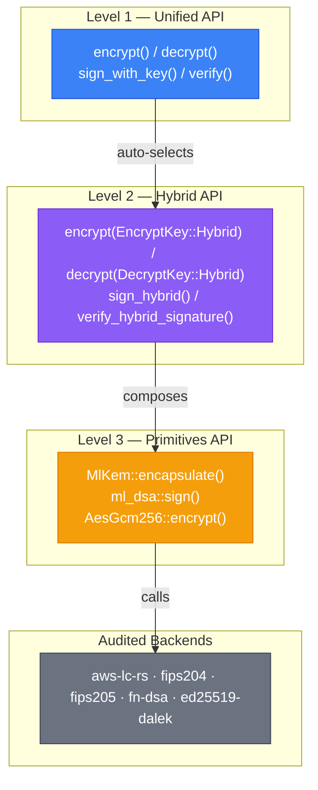
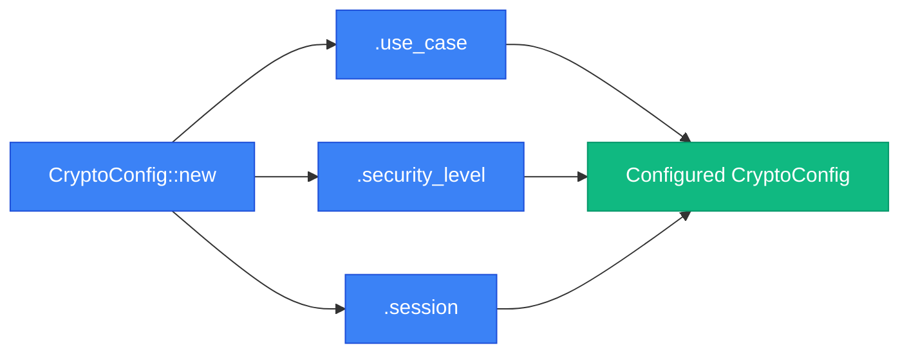

# LatticeArc API Documentation

**Version**: 0.3.2 | **License**: Apache 2.0

---

## Overview

LatticeArc provides three levels of API abstraction:



| API Level | Description | Use Case |
|-----------|-------------|----------|
| **Unified API** | Simple, high-level interface | Quick integration, developers new to crypto |
| **Hybrid API** | Mid-level, explicit PQ+classical | Production applications, custom configurations |
| **Primitives API** | Low-level, fine-grained control | Cryptographic experts, performance optimization |

---

## Migration Guide

### From OpenSSL

```c
// Before (OpenSSL — 8 lines, manual memory management)
EVP_PKEY *key = EVP_PKEY_new();
EVP_PKEY_assign_RSA(key, RSA_generate_key(2048, 65537, NULL, NULL));
unsigned char *encrypted = malloc(256);
int encrypted_len = RSA_public_encrypt(data_len, data, encrypted,
    EVP_PKEY_get0_RSA(key), RSA_PKCS1_OAEP_PADDING);
```

```rust
// After (LatticeArc — 2 lines, quantum-safe)
let key = [0u8; 32];
let encrypted = encrypt(data, EncryptKey::Symmetric(&key),
    CryptoConfig::new().force_scheme(CryptoScheme::Symmetric))?;
```

### From libsodium

```c
// Before (libsodium)
unsigned char pk[crypto_box_PUBLICKEYBYTES], sk[crypto_box_SECRETKEYBYTES];
crypto_box_keypair(pk, sk);
crypto_box_easy(encrypted, msg, msg_len, nonce, pk, sk);
```

```rust
// After (LatticeArc — hybrid PQ + classical)
let (pk, sk) = generate_hybrid_keypair()?;
let encrypted = encrypt(data, EncryptKey::Hybrid(&pk), CryptoConfig::new())?;
```

### From Bouncy Castle (Java)

```java
// Before (Bouncy Castle)
KeyPairGenerator keyGen = KeyPairGenerator.getInstance("EC");
keyGen.initialize(256);
Cipher cipher = Cipher.getInstance("AES/GCM/NoPadding");
cipher.init(Cipher.ENCRYPT_MODE, secretKey);
byte[] encrypted = cipher.doFinal(plaintext);
```

```rust
// After (LatticeArc)
let key = [0u8; 32];
let encrypted = encrypt(data, EncryptKey::Symmetric(&key),
    CryptoConfig::new().force_scheme(CryptoScheme::Symmetric))?;
```

---

## Unified API

### Encryption

```rust
use latticearc::{encrypt, decrypt, CryptoConfig, CryptoScheme, UseCase, SecurityLevel,
                 EncryptKey, DecryptKey};

// Simple symmetric encryption
let key = [0u8; 32];
let config = CryptoConfig::new().force_scheme(CryptoScheme::Symmetric);
let encrypted = encrypt(data, EncryptKey::Symmetric(&key), config)?;

// Hybrid encryption with use case selection (recommended)
let (pk, sk) = latticearc::generate_hybrid_keypair()?;
let encrypted = encrypt(data, EncryptKey::Hybrid(&pk), CryptoConfig::new()
    .use_case(UseCase::FileStorage))?;

// Hybrid encryption with security level
let encrypted = encrypt(data, EncryptKey::Hybrid(&pk), CryptoConfig::new()
    .security_level(SecurityLevel::Maximum))?;

// Decryption
let decrypted = decrypt(&encrypted, DecryptKey::Hybrid(&sk), CryptoConfig::new())?;
```

### Signatures

```rust
use latticearc::{generate_signing_keypair, sign_with_key, verify, CryptoConfig};

let config = CryptoConfig::new();
let (pk, sk, _scheme) = generate_signing_keypair(config.clone())?;
let signed_data = sign_with_key(data, &sk, &pk, config.clone())?;
let is_valid = verify(&signed_data, config)?;
```

### Key Generation

```rust
use latticearc::generate_keypair;

// Generate Ed25519 keypair
let (public_key, private_key) = generate_keypair()?;
```

### Zero-Trust Authentication

```rust
use latticearc::{VerifiedSession, generate_keypair, CryptoConfig};

let (pk, sk) = generate_keypair()?;
let session = VerifiedSession::establish(&pk, sk.as_ref())?;

// Use session for crypto operations
let config = CryptoConfig::new().session(&session);
```

### Auto-Selection Engine

```rust
use latticearc::unified_api::selector::CryptoPolicyEngine;
use latticearc::types::config::CoreConfig;
use latticearc::UseCase;

// Recommend scheme for use case
let config = CoreConfig::default();
let scheme = CryptoPolicyEngine::recommend_scheme(&UseCase::SecureMessaging, &config)?;

// Select encryption scheme
let selected = CryptoPolicyEngine::select_encryption_scheme(data, &config, None)?;
```

### Configuration



| Option | Type | Default | Description |
|--------|------|----------|-------------|
| `security_level` | `SecurityLevel` | `High` | Security strength level |
| `performance_preference` | `PerformancePreference` | `Balanced` | Performance vs security trade-off |
| `compliance_mode` | `ComplianceMode` | `Default` | `Default`, `Fips140_3`, or `Cnsa2_0` |
| `enable_zeroization` | `bool` | `true` | Auto-zeroize sensitive data |
| `audit_logging` | `bool` | `false` | Enable audit logging |

---

## Hybrid API

### Hybrid Encryption

```rust
use latticearc::{generate_hybrid_keypair, encrypt, decrypt, CryptoConfig, EncryptKey, DecryptKey};

// Generate hybrid keypair (ML-KEM-768 + X25519)
let (pk, sk) = generate_hybrid_keypair()?;

// Hybrid encryption (ML-KEM + X25519 + HKDF + AES-256-GCM) via unified API
let encrypted = encrypt(b"Sensitive data", EncryptKey::Hybrid(&pk), CryptoConfig::new())?;
let decrypted = decrypt(&encrypted, DecryptKey::Hybrid(&sk), CryptoConfig::new())?;
```

### Hybrid Signatures

**Via Unified API** (returns `SignedData`):

```rust
use latticearc::{generate_signing_keypair, sign_with_key, verify, CryptoConfig, SecurityLevel};

let config = CryptoConfig::new().security_level(SecurityLevel::High);
let (pk, sk, _scheme) = generate_signing_keypair(config.clone())?;
let signed_data = sign_with_key(data, &sk, &pk, config.clone())?;
let is_valid = verify(&signed_data, config)?;
```

**Direct Hybrid Signature API** (ML-DSA-65 + Ed25519 AND-composition):

```rust
use latticearc::{generate_hybrid_signing_keypair, sign_hybrid, verify_hybrid_signature, SecurityMode};

let (pk, sk) = generate_hybrid_signing_keypair(SecurityMode::Unverified)?;
let signature = sign_hybrid(b"important message", &sk, SecurityMode::Unverified)?;
let valid = verify_hybrid_signature(b"important message", &signature, &pk, SecurityMode::Unverified)?;
```

---

## Primitives API

### ML-KEM (Key Encapsulation)

```rust
use latticearc::primitives::kem::ml_kem::*;
use rand::rngs::OsRng;

let mut rng = OsRng;
let (pk, sk) = MlKem::generate_keypair(&mut rng, MlKemSecurityLevel::MlKem1024)?;
let (shared_secret, ciphertext) = MlKem::encapsulate(&mut rng, &pk)?;
let recovered = MlKem::decapsulate(&sk, &ciphertext)?;
assert_eq!(shared_secret, recovered);
```

### ML-DSA (Digital Signatures)

```rust
use latticearc::primitives::sig::ml_dsa::*;

let (pk, sk) = generate_keypair(MlDsaParameterSet::MLDSA65)?;
let signature = sign(&sk, b"Important message", b"")?;
let verified = verify(&pk, b"Important message", &signature, b"")?;
```

### SLH-DSA (Hash-Based Signatures)

```rust
use latticearc::primitives::sig::slh_dsa::*;

let (signing_key, verifying_key) = SigningKey::generate(SecurityLevel::Sha2128s)?;
let signature = signing_key.sign(message, None)?;
let verified = verifying_key.verify(message, &signature, None)?;
```

### AES-GCM (AEAD Encryption)

```rust
use latticearc::primitives::aead::aes_gcm::*;
use latticearc::primitives::aead::AeadCipher;

let key = AesGcm256::generate_key();
let cipher = AesGcm256::new(&key)?;
let nonce = AesGcm256::generate_nonce();
let (ciphertext, tag) = cipher.encrypt(&nonce, plaintext, Some(aad))?;
let decrypted = cipher.decrypt(&nonce, &ciphertext, &tag, Some(aad))?;
```

### AES-GCM with AAD

For binding context metadata (headers, session IDs) to ciphertext:

```rust
use latticearc::{encrypt_aes_gcm_with_aad, decrypt_aes_gcm_with_aad, SecurityMode};

let key = [0u8; 32];
let aad = b"session-id:abc123;timestamp:1700000000";
let encrypted = encrypt_aes_gcm_with_aad(b"payload", &key, aad, SecurityMode::Unverified)?;
let decrypted = decrypt_aes_gcm_with_aad(&encrypted, &key, aad, SecurityMode::Unverified)?;
```

### ChaCha20-Poly1305

```rust
use latticearc::primitives::aead::chacha20poly1305::*;
use latticearc::primitives::aead::AeadCipher;

let key = ChaCha20Poly1305Cipher::generate_key();
let cipher = ChaCha20Poly1305Cipher::new(&key)?;
let nonce = ChaCha20Poly1305Cipher::generate_nonce();
let (ciphertext, tag) = cipher.encrypt(&nonce, plaintext, Some(aad))?;
let decrypted = cipher.decrypt(&nonce, &ciphertext, &tag, Some(aad))?;
```

---

## Error Handling

```rust
use latticearc::CoreError;

match operation() {
    Ok(result) => println!("Success: {:?}", result),
    Err(CoreError::InvalidKeyLength { expected, actual }) => {
        eprintln!("Invalid key length: expected {}, got {}", expected, actual);
    }
    Err(CoreError::EncryptionFailed(msg)) => {
        eprintln!("Encryption failed: {}", msg);
    }
    Err(CoreError::DecryptionFailed(msg)) => {
        eprintln!("Decryption failed: {}", msg);
    }
    Err(CoreError::VerificationFailed) => {
        eprintln!("Signature verification failed");
    }
    Err(e) => {
        eprintln!("Unexpected error: {}", e);
    }
}
```

| Error | Description | Common Causes |
|--------|-------------|----------------|
| `InvalidKeyLength` | Key length mismatch | Wrong key size for algorithm |
| `EncryptionFailed` | Encryption operation failed | Invalid input, algorithm error |
| `DecryptionFailed` | Decryption operation failed | Wrong key, corrupted ciphertext |
| `VerificationFailed` | Signature verification failed | Wrong key, tampered data |
| `InvalidInput` | Input validation failed | Empty input, invalid format |
| `ConfigurationError` | Invalid configuration | Conflicting settings |

---

## Type Reference

### Security Levels

```rust
pub enum SecurityLevel {
    Standard, // NIST Level 1 (128-bit equivalent), hybrid mode
    High,     // NIST Level 3 (192-bit equivalent), hybrid mode (default)
    Maximum,  // NIST Level 5 (256-bit equivalent), hybrid mode
    Quantum,  // NIST Level 5, PQ-only (no classical fallback)
}
```

### Use Cases

```rust
pub enum UseCase {
    SecureMessaging, EmailEncryption, VpnTunnel, ApiSecurity,
    FileStorage, DatabaseEncryption, CloudStorage, BackupArchive, ConfigSecrets,
    Authentication, SessionToken, DigitalCertificate, KeyExchange,
    FinancialTransactions, LegalDocuments, BlockchainTransaction,
    HealthcareRecords, GovernmentClassified, PaymentCard,
    IoTDevice, FirmwareSigning,
    AuditLog,
}
```

---

## Further Reading

- [Unified API Guide](UNIFIED_API_GUIDE.md) — algorithm selection, use cases, builder API
- [Security Guide](SECURITY_GUIDE.md) — threat model, secure usage patterns
- [NIST Compliance](NIST_COMPLIANCE.md) — FIPS 203-206 conformance details
- [API Reference](https://docs.rs/latticearc) — generated docs on docs.rs

---

**Documentation**: https://docs.rs/latticearc | **Issues**: https://github.com/latticearc/latticearc/issues | **Security**: Security@LatticeArc.com
