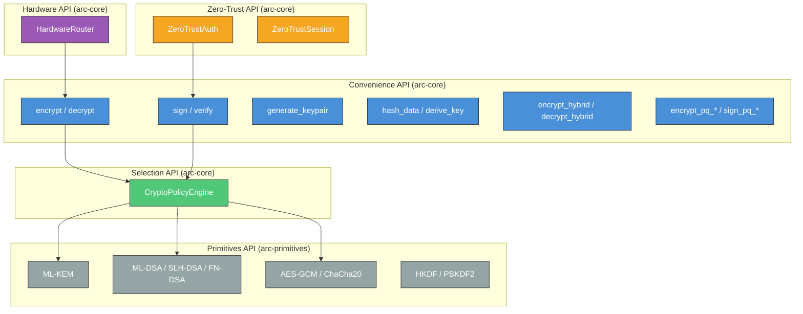
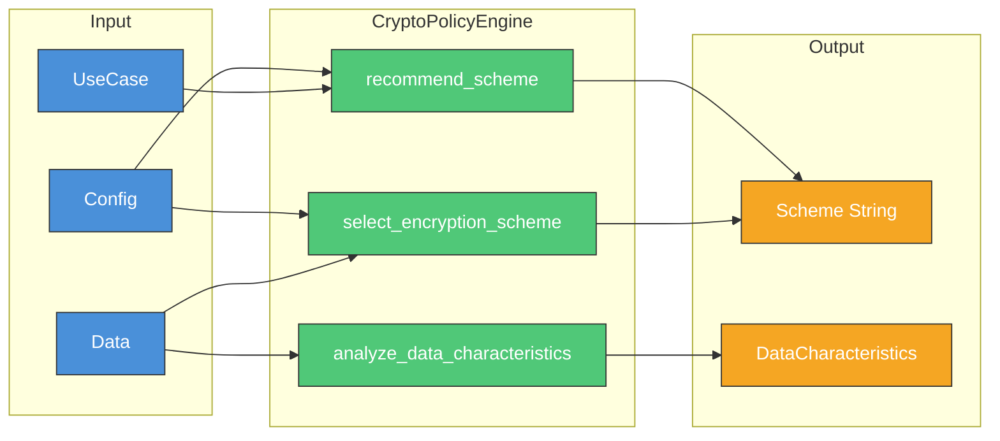
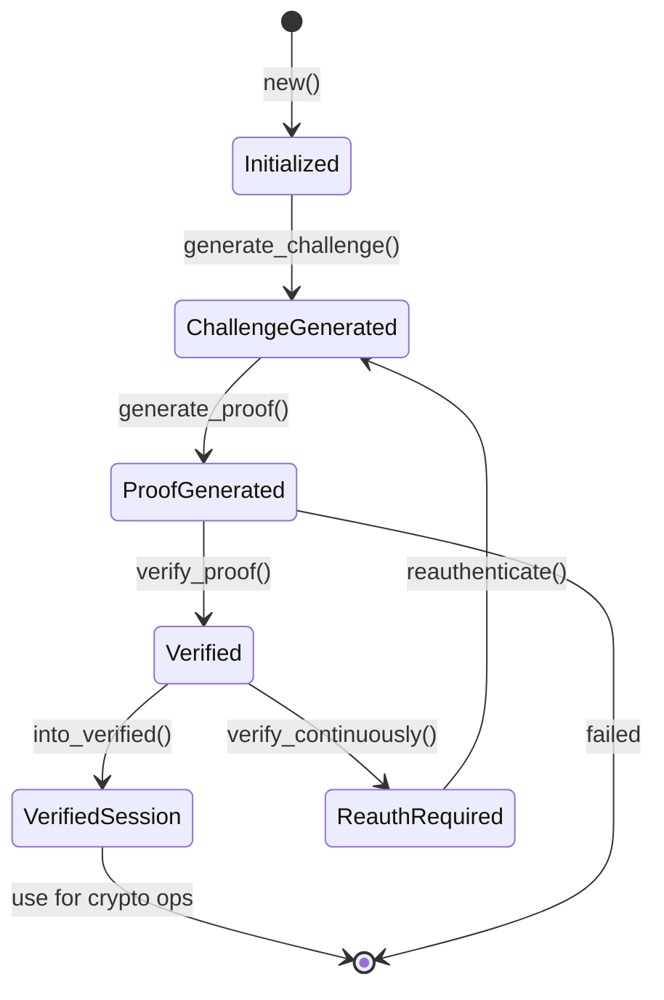

# LatticeArc API Documentation

Complete API reference for LatticeArc's post-quantum cryptography library.

## API Overview



## Quick Start

```rust
use arc_core::{VerifiedSession, encrypt, decrypt, sign, verify, generate_keypair};

// Establish a verified session (required for Zero Trust)
let (public_key, private_key) = generate_keypair()?;
let session = VerifiedSession::establish(&public_key, &private_key)?;

// Encrypt data with automatic hybrid scheme
let key = [0u8; 32];
let encrypted = encrypt(&session, b"secret message", &key)?;
let decrypted = decrypt(&session, &encrypted, &key)?;

// Sign with auto-generated keypair
let signed = sign(&session, b"document")?;
let is_valid = verify(&session, &signed)?;
```

## Zero Trust Enforcement

All cryptographic operations in arc-core require a `VerifiedSession` to enforce Zero Trust at the API level. This ensures authentication is performed before any sensitive operations.

### Verified API (Default)

```rust
use arc_core::{VerifiedSession, encrypt, decrypt};

// Create session (one-time, ~70µs)
let session = VerifiedSession::establish(&public_key, &private_key)?;

// All operations require the session
let encrypted = encrypt(&session, data, &key)?;
let decrypted = decrypt(&session, &encrypted, &key)?;
```

### Unverified API (Opt-Out)

For scenarios where Zero Trust is not needed, `_unverified` variants are available:

```rust
use arc_core::{encrypt_unverified, decrypt_unverified};

// Explicit opt-out (usage is logged in enterprise deployments)
let encrypted = encrypt_unverified(data, &key)?;
```

### Trust Levels

```rust
use arc_core::TrustLevel;

pub enum TrustLevel {
    Untrusted = 0,   // Initial state
    Partial = 1,     // First verification passed
    Trusted = 2,     // Multiple verifications passed
    FullyTrusted = 3 // Continuous verification active
}
```

### Simple API via latticearc

The `latticearc` crate provides a simpler API without session requirements:

```rust
use latticearc::{encrypt, decrypt, sign, verify};

// No session required - uses _unverified variants internally
let encrypted = encrypt(b"secret", &key)?;
let decrypted = decrypt(&encrypted, &key)?;
```

## Convenience Functions

All convenience functions require a `VerifiedSession` parameter for Zero Trust enforcement.
`_unverified` variants are available for opt-out scenarios where session management is not needed.

### Encryption

```rust
use arc_core::{VerifiedSession, encrypt, decrypt, EncryptedData, CoreError};

/// Encrypts data with AES-256-GCM (requires verified session)
fn encrypt(
    session: &VerifiedSession,
    data: &[u8],
    key: &[u8; 32]
) -> Result<EncryptedData, CoreError>;

/// Decrypts data encrypted with encrypt() (requires verified session)
fn decrypt(
    session: &VerifiedSession,
    encrypted: &EncryptedData,
    key: &[u8; 32]
) -> Result<Vec<u8>, CoreError>;

/// Encrypts with custom configuration (requires verified session)
fn encrypt_with_config(
    session: &VerifiedSession,
    data: &[u8],
    config: &EncryptionConfig,
    key: &[u8; 32]
) -> Result<EncryptedData, CoreError>;

/// Decrypts with custom configuration (requires verified session)
fn decrypt_with_config(
    session: &VerifiedSession,
    encrypted: &EncryptedData,
    config: &EncryptionConfig,
    key: &[u8; 32]
) -> Result<Vec<u8>, CoreError>;

// Unverified variants (no session required, for opt-out scenarios)
fn encrypt_unverified(data: &[u8], key: &[u8; 32]) -> Result<EncryptedData, CoreError>;
fn decrypt_unverified(encrypted: &EncryptedData, key: &[u8; 32]) -> Result<Vec<u8>, CoreError>;
```

### Signatures

```rust
use arc_core::{VerifiedSession, sign, verify, SignedData, CoreError};

/// Signs data with auto-generated Ed25519 keypair (requires verified session)
fn sign(session: &VerifiedSession, data: &[u8]) -> Result<SignedData, CoreError>;

/// Verifies signed data (requires verified session)
fn verify(session: &VerifiedSession, signed: &SignedData) -> Result<bool, CoreError>;

/// Signs with custom configuration (requires verified session)
fn sign_with_config(
    session: &VerifiedSession,
    data: &[u8],
    config: &SignatureConfig
) -> Result<SignedData, CoreError>;

/// Verifies with explicit message (requires verified session)
fn verify_with_config(
    session: &VerifiedSession,
    message: &[u8],
    signed: &SignedData,
    config: &SignatureConfig
) -> Result<bool, CoreError>;

/// Signs with Ed25519 using provided key (requires verified session)
fn sign_ed25519(
    session: &VerifiedSession,
    message: &[u8],
    private_key: &[u8]
) -> Result<Vec<u8>, CoreError>;

/// Verifies Ed25519 signature (requires verified session)
fn verify_ed25519(
    session: &VerifiedSession,
    message: &[u8],
    signature: &[u8],
    public_key: &[u8]
) -> Result<bool, CoreError>;

// Unverified variants available: sign_unverified, verify_unverified, etc.
```

### Key Generation

```rust
use arc_core::convenience::*;

/// Generates Ed25519 keypair (public, private)
fn generate_keypair() -> Result<(Vec<u8>, Vec<u8>), CoreError>;

/// Generates ML-KEM keypair
fn generate_ml_kem_keypair(
    level: MlKemSecurityLevel
) -> Result<(Vec<u8>, Vec<u8>), CoreError>;

/// Generates ML-DSA keypair
fn generate_ml_dsa_keypair(
    params: MlDsaParameterSet
) -> Result<(Vec<u8>, Vec<u8>), CoreError>;

/// Generates SLH-DSA keypair
fn generate_slh_dsa_keypair(
    level: SecurityLevel
) -> Result<(Vec<u8>, Vec<u8>), CoreError>;

/// Generates FN-DSA keypair
fn generate_fn_dsa_keypair() -> Result<(Vec<u8>, Vec<u8>), CoreError>;
```

### Hashing and KDF

```rust
use arc_core::{VerifiedSession, hash_data, derive_key, hmac, hmac_check, CoreError};

/// Computes SHA3-256 hash (no session required - stateless)
fn hash_data(data: &[u8]) -> [u8; 32];

/// Derives key using HKDF-SHA256 (requires verified session)
fn derive_key(
    session: &VerifiedSession,
    password: &[u8],
    salt: &[u8],
    length: usize
) -> Result<Vec<u8>, CoreError>;

/// Computes HMAC-SHA256 (requires verified session)
fn hmac(
    session: &VerifiedSession,
    key: &[u8],
    data: &[u8]
) -> Result<Vec<u8>, CoreError>;

/// Checks HMAC in constant time (requires verified session)
fn hmac_check(
    session: &VerifiedSession,
    key: &[u8],
    data: &[u8],
    expected_mac: &[u8]
) -> Result<bool, CoreError>;

// Unverified variants: derive_key_unverified, hmac_unverified, hmac_check_unverified
```

### Hybrid Encryption

```rust
use arc_core::convenience::*;
use arc_core::types::HybridEncryptionResult;

/// Encrypts using ML-KEM + AES-256-GCM
fn encrypt_hybrid(
    data: &[u8],
    public_key: &[u8]
) -> Result<HybridEncryptionResult, CoreError>;

/// Decrypts hybrid-encrypted data
fn decrypt_hybrid(
    ciphertext: &[u8],
    encapsulated_key: &[u8],
    secret_key: &[u8]
) -> Result<Vec<u8>, CoreError>;
```

### Post-Quantum Functions

```rust
use arc_core::convenience::*;
use arc_primitives::kem::ml_kem::MlKemSecurityLevel;
use arc_primitives::sig::ml_dsa::MlDsaParameterSet;
use arc_primitives::sig::slh_dsa::SecurityLevel;

// ML-KEM
fn encrypt_pq_ml_kem(
    data: &[u8],
    public_key: &[u8],
    level: MlKemSecurityLevel
) -> Result<Vec<u8>, CoreError>;

fn decrypt_pq_ml_kem(
    ciphertext: &[u8],
    secret_key: &[u8],
    level: MlKemSecurityLevel
) -> Result<Vec<u8>, CoreError>;

// ML-DSA
fn sign_pq_ml_dsa(
    message: &[u8],
    secret_key: &[u8],
    params: MlDsaParameterSet
) -> Result<Vec<u8>, CoreError>;

fn verify_pq_ml_dsa(
    message: &[u8],
    signature: &[u8],
    public_key: &[u8],
    params: MlDsaParameterSet
) -> Result<bool, CoreError>;

// SLH-DSA
fn sign_pq_slh_dsa(
    message: &[u8],
    secret_key: &[u8],
    level: SecurityLevel
) -> Result<Vec<u8>, CoreError>;

fn verify_pq_slh_dsa(
    message: &[u8],
    signature: &[u8],
    public_key: &[u8],
    level: SecurityLevel
) -> Result<bool, CoreError>;

// FN-DSA
fn sign_pq_fn_dsa(
    message: &[u8],
    secret_key: &[u8]
) -> Result<Vec<u8>, CoreError>;

fn verify_pq_fn_dsa(
    message: &[u8],
    signature: &[u8],
    public_key: &[u8]
) -> Result<bool, CoreError>;
```

## CryptoPolicyEngine

Intelligent scheme selection based on data and configuration:



### API

```rust
use arc_core::selector::CryptoPolicyEngine;
use arc_core::config::CoreConfig;
use arc_core::types::UseCase;
use arc_core::traits::DataCharacteristics;

impl CryptoPolicyEngine {
    /// Creates a new selector
    fn new() -> Self;

    /// Recommends scheme for a use case
    fn recommend_scheme(
        use_case: &UseCase,
        config: &CoreConfig
    ) -> Result<String, CoreError>;

    /// Selects scheme based on data analysis
    fn select_encryption_scheme(
        data: &[u8],
        config: &CoreConfig,
        use_case: Option<&UseCase>
    ) -> Result<String, CoreError>;

    /// Selects signature scheme
    fn select_signature_scheme(
        config: &CoreConfig
    ) -> Result<String, CoreError>;

    /// Analyzes data characteristics
    fn analyze_data_characteristics(
        data: &[u8]
    ) -> DataCharacteristics;

    /// Forces a specific scheme category
    fn force_scheme(scheme: &CryptoScheme) -> String;

    /// Selects PQ-only encryption scheme
    fn select_pq_encryption_scheme(
        config: &CoreConfig
    ) -> Result<String, CoreError>;

    /// Selects PQ-only signature scheme
    fn select_pq_signature_scheme(
        config: &CoreConfig
    ) -> Result<String, CoreError>;
}
```

### UseCase Mappings

```rust
pub enum UseCase {
    SecureMessaging,      // -> hybrid-ml-kem-768-aes-256-gcm
    DatabaseEncryption,   // -> hybrid-ml-kem-768-aes-256-gcm
    FileStorage,          // -> hybrid-ml-kem-1024-aes-256-gcm
    KeyExchange,          // -> hybrid-ml-kem-1024-x25519
    FinancialTransactions,// -> hybrid-ml-dsa-65-ed25519
    Authentication,       // -> hybrid-ml-dsa-87-ed25519
    SearchableEncryption, // -> hybrid-ml-kem-768-aes-256-gcm
    HomomorphicComputation,// -> hybrid-ml-kem-768-aes-256-gcm
}
```

### DataCharacteristics

```rust
pub struct DataCharacteristics {
    pub size: usize,
    pub entropy: f64,        // 0.0 - 8.0 bits per byte
    pub pattern_type: PatternType,
}

pub enum PatternType {
    Random,      // entropy > 7.5
    Text,        // ASCII printable, entropy > 4.0
    Repetitive,  // Repeating patterns
    Structured,  // Sequential or structured
    Binary,      // Other binary data
}
```

## Context-Aware Selection

Runtime-adaptive scheme selection (methods on CryptoPolicyEngine):

```rust
use arc_core::selector::{CryptoPolicyEngine, PerformanceMetrics};

impl CryptoPolicyEngine {
    /// Creates a new context-aware selector
    fn new() -> Self;

    /// Selects based on data and config
    fn select_for_context(
        &self,
        data: &[u8],
        config: &CoreConfig
    ) -> Result<String, CoreError>;

    /// Adaptive selection with runtime metrics
    fn adaptive_selection(
        &self,
        data: &[u8],
        performance_metrics: &PerformanceMetrics,
        config: &CoreConfig
    ) -> Result<String, CoreError>;

    /// Returns default scheme
    fn default_scheme() -> &'static str;
}

pub struct PerformanceMetrics {
    pub encryption_speed_ms: f64,
    pub decryption_speed_ms: f64,
    pub memory_usage_mb: f64,
    pub cpu_usage_percent: f64,
}
```

## ZeroTrustAuth and VerifiedSession

Challenge-response authentication with zero-knowledge proofs and verified sessions.

### VerifiedSession

The `VerifiedSession` type proves that Zero Trust authentication has been completed.
It is required for all cryptographic operations in arc-core.

```rust
use arc_core::{VerifiedSession, TrustLevel, generate_keypair};

// Quick session establishment (performs challenge-response automatically)
let (public_key, private_key) = generate_keypair()?;
let session = VerifiedSession::establish(&public_key, &private_key)?;

// Check session validity
if session.is_valid() {
    println!("Trust level: {:?}", session.trust_level());
    // Use session for crypto operations
    let encrypted = encrypt(&session, data, &key)?;
}

// Verify session is valid (returns error if expired)
session.verify_valid()?;
```

### Authentication Flow



### API

```rust
use arc_core::zero_trust::{
    ZeroTrustAuth, ZeroTrustSession,
    Challenge, ZeroKnowledgeProof,
    ProofOfPossessionData, ContinuousSession
};
use arc_core::config::ZeroTrustConfig;
use arc_core::types::{PublicKey, PrivateKey};

impl ZeroTrustAuth {
    /// Creates with default config
    fn new(
        public_key: PublicKey,
        private_key: PrivateKey
    ) -> Result<Self, CoreError>;

    /// Creates with custom config
    fn with_config(
        public_key: PublicKey,
        private_key: PrivateKey,
        config: ZeroTrustConfig
    ) -> Result<Self, CoreError>;

    /// Generates authentication challenge
    fn generate_challenge(&self) -> Result<Challenge, CoreError>;

    /// Verifies challenge age
    fn verify_challenge_age(
        &self,
        challenge: &Challenge
    ) -> Result<bool, CoreError>;

    /// Starts continuous verification session
    fn start_continuous_verification(&self) -> ContinuousSession;
}

// ZeroTrustAuthenticable trait implementation
impl ZeroTrustAuth {
    /// Generates zero-knowledge proof
    fn generate_proof(
        &self,
        challenge: &[u8]
    ) -> Result<ZeroKnowledgeProof, CoreError>;

    /// Verifies proof (public key only)
    fn verify_proof(
        &self,
        proof: &ZeroKnowledgeProof,
        challenge: &[u8]
    ) -> Result<bool, CoreError>;
}

// ProofOfPossession trait implementation
impl ZeroTrustAuth {
    /// Generates proof of key possession
    fn generate_pop(&self) -> Result<ProofOfPossessionData, CoreError>;

    /// Verifies proof of possession
    fn verify_pop(
        &self,
        pop: &ProofOfPossessionData
    ) -> Result<bool, CoreError>;
}

// ContinuousVerifiable trait implementation
impl ZeroTrustAuth {
    /// Checks verification status
    fn verify_continuously(&self) -> Result<VerificationStatus, CoreError>;

    /// Re-authenticates the session
    fn reauthenticate(&self) -> Result<(), CoreError>;
}
```

### ZeroTrustSession

```rust
impl ZeroTrustSession {
    /// Creates new session
    fn new(auth: ZeroTrustAuth) -> Self;

    /// Initiates authentication
    fn initiate_authentication(&mut self) -> Result<Challenge, CoreError>;

    /// Verifies proof response
    fn verify_response(
        &mut self,
        proof: &ZeroKnowledgeProof
    ) -> Result<bool, CoreError>;

    /// Returns authentication status
    fn is_authenticated(&self) -> bool;

    /// Returns session age in milliseconds
    fn session_age_ms(&self) -> Result<u64, CoreError>;
}
```

### Types

```rust
pub struct Challenge {
    pub data: Vec<u8>,
    pub timestamp: DateTime<Utc>,
    pub complexity: ProofComplexity,
    pub timeout_ms: u64,
}

pub struct ZeroKnowledgeProof {
    pub challenge: Vec<u8>,
    pub proof: Vec<u8>,
    pub timestamp: DateTime<Utc>,
    pub complexity: ProofComplexity,
}

pub struct ProofOfPossessionData {
    pub public_key: PublicKey,
    pub signature: Vec<u8>,
    pub timestamp: DateTime<Utc>,
}

pub enum ProofComplexity {
    Low,    // 32-byte challenge
    Medium, // 64-byte challenge + timestamp
    High,   // 128-byte challenge + timestamp + key binding
}

pub enum VerificationStatus {
    Verified,
    Pending,
    Expired,
}
```

## HardwareRouter

Hardware detection and operation routing:

```rust
use arc_core::hardware::HardwareRouter;
use arc_core::traits::{HardwareInfo, HardwareCapabilities, HardwareType};

impl HardwareRouter {
    /// Creates new router
    fn new() -> Self;

    /// Detects available hardware
    fn detect_hardware(&self) -> HardwareInfo;

    /// Routes operation to best hardware
    fn route_to_best_hardware<F, R>(
        &self,
        operation: F
    ) -> Result<R, CoreError>
    where
        F: FnOnce() -> Result<R, CoreError>;
}

pub struct HardwareInfo {
    pub available_accelerators: Vec<HardwareType>,
    pub preferred_accelerator: Option<HardwareType>,
    pub capabilities: HardwareCapabilities,
}

pub struct HardwareCapabilities {
    pub simd_support: bool,
    pub aes_ni: bool,
    pub threads: usize,
    pub memory: usize,
}

pub enum HardwareType {
    Cpu,
    Gpu,
    Fpga,
    Tpu,
    Sgx,
}
```

## Configuration Types

### CoreConfig

```rust
use arc_core::config::CoreConfig;
use arc_core::types::{SecurityLevel, PerformancePreference};

pub struct CoreConfig {
    pub security_level: SecurityLevel,
    pub performance_preference: PerformancePreference,
    pub hardware_acceleration: bool,
    pub fallback_enabled: bool,
    pub strict_validation: bool,
}

impl CoreConfig {
    fn default() -> Self;
    fn builder() -> CoreConfigBuilder;
    fn validate(&self) -> Result<(), CoreError>;
    fn build(self) -> Result<Self, CoreError>;
}
```

### ZeroTrustConfig

```rust
use arc_core::config::{ZeroTrustConfig, ProofComplexity};

pub struct ZeroTrustConfig {
    pub challenge_timeout_ms: u64,
    pub proof_complexity: ProofComplexity,
    pub continuous_verification: bool,
    pub verification_interval_ms: u64,
    // ... base config fields
}

impl ZeroTrustConfig {
    fn default() -> Self;
    fn validate(&self) -> Result<(), CoreError>;
}
```

### Enums

```rust
pub enum SecurityLevel {
    Low,     // 128-bit (ML-KEM-512, ML-DSA-44)
    Medium,  // 192-bit (ML-KEM-768, ML-DSA-65)
    High,    // 256-bit (ML-KEM-768, ML-DSA-65)
    Maximum, // 256+ bit (ML-KEM-1024, ML-DSA-87)
}

pub enum PerformancePreference {
    Speed,    // Minimize latency
    Memory,   // Minimize memory
    Balanced, // Balance all factors
}

pub enum CryptoScheme {
    Hybrid,
    Symmetric,
    Asymmetric,
    Homomorphic,
    PostQuantum,
}
```

## Data Types

### EncryptedData

```rust
pub struct EncryptedData {
    pub data: Vec<u8>,
    pub metadata: EncryptedMetadata,
    pub scheme: String,
    pub timestamp: u64,
}

pub struct EncryptedMetadata {
    pub nonce: Vec<u8>,
    pub tag: Option<Vec<u8>>,
    pub key_id: Option<String>,
}
```

### SignedData

```rust
pub struct SignedData {
    pub data: Vec<u8>,
    pub metadata: SignedMetadata,
    pub scheme: String,
    pub timestamp: u64,
}

pub struct SignedMetadata {
    pub signature: Vec<u8>,
    pub signature_algorithm: String,
    pub public_key: Vec<u8>,
    pub key_id: Option<String>,
}
```

### HybridEncryptionResult

```rust
pub struct HybridEncryptionResult {
    pub ciphertext: Vec<u8>,
    pub encapsulated_key: Vec<u8>,
}
```

## Error Types

```rust
use arc_core::error::CoreError;

pub enum CoreError {
    // Key errors
    InvalidKeyLength { expected: usize, actual: usize },
    InvalidKey(String),

    // Operation errors
    InvalidInput(String),
    EncryptionFailed(String),
    DecryptionFailed(String),
    SigningFailed(String),
    VerificationFailed(String),

    // Zero Trust errors
    AuthenticationFailed(String),
    AuthenticationRequired(String),  // NEW: Operation requires verified session
    SessionExpired,                   // NEW: Session has expired

    // Resource errors
    EntropyDepleted { message: String, action: String },
    ResourceExceeded(String),

    // Configuration errors
    ConfigurationError(String),
    UnsupportedAlgorithm(String),

    // Internal errors
    Internal(String),
    SelfTestFailed { component: String, status: String },
}
```

## Scheme Constants

```rust
use arc_core::selector::*;

// Hybrid (default)
pub const DEFAULT_ENCRYPTION_SCHEME: &str = "hybrid-ml-kem-768-aes-256-gcm";
pub const DEFAULT_SIGNATURE_SCHEME: &str = "hybrid-ml-dsa-65-ed25519";

pub const HYBRID_ENCRYPTION_512: &str = "hybrid-ml-kem-512-aes-256-gcm";
pub const HYBRID_ENCRYPTION_768: &str = "hybrid-ml-kem-768-aes-256-gcm";
pub const HYBRID_ENCRYPTION_1024: &str = "hybrid-ml-kem-1024-aes-256-gcm";

pub const HYBRID_SIGNATURE_44: &str = "hybrid-ml-dsa-44-ed25519";
pub const HYBRID_SIGNATURE_65: &str = "hybrid-ml-dsa-65-ed25519";
pub const HYBRID_SIGNATURE_87: &str = "hybrid-ml-dsa-87-ed25519";

// PQ-only
pub const DEFAULT_PQ_ENCRYPTION_SCHEME: &str = "pq-ml-kem-768-aes-256-gcm";
pub const DEFAULT_PQ_SIGNATURE_SCHEME: &str = "pq-ml-dsa-65";

pub const PQ_ENCRYPTION_512: &str = "pq-ml-kem-512-aes-256-gcm";
pub const PQ_ENCRYPTION_768: &str = "pq-ml-kem-768-aes-256-gcm";
pub const PQ_ENCRYPTION_1024: &str = "pq-ml-kem-1024-aes-256-gcm";

pub const PQ_SIGNATURE_44: &str = "pq-ml-dsa-44";
pub const PQ_SIGNATURE_65: &str = "pq-ml-dsa-65";
pub const PQ_SIGNATURE_87: &str = "pq-ml-dsa-87";

// Classical
pub const CLASSICAL_AES_GCM: &str = "aes-256-gcm";
pub const CLASSICAL_ED25519: &str = "ed25519";

// Thresholds
pub const CLASSICAL_FALLBACK_SIZE_THRESHOLD: usize = 4096;
```

## Algorithm Reference

### Key Sizes

| Algorithm | Public Key | Secret Key | Ciphertext/Signature |
|-----------|-----------|------------|---------------------|
| ML-KEM-512 | 800 B | 1,632 B | 768 B |
| ML-KEM-768 | 1,184 B | 2,400 B | 1,088 B |
| ML-KEM-1024 | 1,568 B | 3,168 B | 1,568 B |
| ML-DSA-44 | 1,312 B | 2,560 B | 2,420 B |
| ML-DSA-65 | 1,952 B | 4,032 B | 3,309 B |
| ML-DSA-87 | 2,592 B | 4,896 B | 4,627 B |
| Ed25519 | 32 B | 64 B | 64 B |

### Security Levels

| Level | NIST Category | Equivalent |
|-------|---------------|------------|
| 1 | Category 1 | AES-128 |
| 2 | Category 2 | SHA-256 |
| 3 | Category 3 | AES-192 |
| 5 | Category 5 | AES-256 |

## Further Reading

- [UNIFIED_API_GUIDE.md](UNIFIED_API_GUIDE.md) - High-level usage guide
- [DESIGN.md](DESIGN.md) - Architecture documentation
- [SECURITY_GUIDE.md](SECURITY_GUIDE.md) - Security best practices
