# Dependency Justification Document

**Project:** LatticeArc - Post-Quantum Cryptography Library
**Version:** 0.3.1
**Date:** 2026-02-19
**SBOM Format:** CycloneDX 1.5, SPDX 2.3

## Executive Summary

All dependencies vetted for security (audits, memory safety), licensing (Apache/MIT/BSD — no copyleft), standards compliance (FIPS 203-206), and supply chain (crates.io only). **376 total components** including transitive dependencies.

```mermaid
flowchart TB
    subgraph "latticearc"
        LA[LatticeArc 0.3.1]
    end

    subgraph "FIPS-Validated"
        AWSLC["aws-lc-rs 1.16.0\nML-KEM · AES-GCM · HKDF · X25519"]
    end

    subgraph "NIST PQ Signatures"
        F204["fips204 0.4.6\nML-DSA"]
        F205["fips205 0.4.1\nSLH-DSA"]
        FNDSA["fn-dsa 0.3.0\nFN-DSA"]
    end

    subgraph "Classical Crypto"
        DALEK["ed25519-dalek\nEd25519"]
        CHA["chacha20poly1305\nChaCha20-Poly1305"]
    end

    subgraph "Memory Safety"
        ZERO["zeroize · subtle"]
    end

    LA --> AWSLC
    LA --> F204
    LA --> F205
    LA --> FNDSA
    LA --> DALEK
    LA --> CHA
    LA --> ZERO

    classDef main fill:#8b5cf6,stroke:#6d28d9,color:#fff
    classDef fips fill:#10b981,stroke:#059669,color:#fff
    classDef nist fill:#3b82f6,stroke:#1d4ed8,color:#fff
    classDef cl fill:#f59e0b,stroke:#d97706,color:#fff
    classDef safety fill:#ef4444,stroke:#b91c1c,color:#fff

    class LA main
    class AWSLC fips
    class F204,F205,FNDSA nist
    class DALEK,CHA cl
    class ZERO safety
```

---

## Critical Cryptographic Dependencies

### Post-Quantum Cryptography (NIST Standards)

#### 1. aws-lc-rs (v1.16.0)
- **Purpose**: Core crypto backend — ML-KEM (FIPS 203), AES-GCM, HKDF, X25519
- **Justification**:
  - AWS's cryptographic library with FIPS 140-3 validation (with `--features fips`)
  - Production-ready ML-KEM for key encapsulation
  - Provides AES-GCM, HKDF, and X25519 for symmetric/key-exchange operations
  - Industry-standard choice for regulated environments
  - Memory-safe Rust API over aws-lc (BoringSSL fork)
  - Always requires a C/C++ compiler; FIPS builds additionally require CMake + Go
- **License**: ISC AND (Apache-2.0 OR ISC)
- **Security Audit**: FIPS 140-3 Level 1 validated (Certificates #4631, #4759, #4816)
- **Usage**: `latticearc::primitives` (KEM, AEAD, HKDF), `latticearc::hybrid`, `latticearc::unified_api`

#### 2. aws-lc-sys (v0.37.0)
- **Purpose**: FFI bindings to AWS-LC native library
- **Justification**:
  - Required by aws-lc-rs for native cryptographic operations
  - Provides access to FIPS-validated implementations
  - Maintained by AWS with enterprise security guarantees
- **License**: ISC AND (Apache-2.0 OR ISC) AND OpenSSL
- **Security Audit**: Part of AWS-LC FIPS validation
- **Usage**: Transitive dependency via aws-lc-rs

#### 3. fips204 (v0.4.6)
- **Purpose**: ML-DSA (Module-Lattice Digital Signature Algorithm) - FIPS 204
- **Justification**:
  - Pure Rust implementation of ML-DSA (Dilithium)
  - Primary post-quantum signature scheme
  - Audited by cryptography experts
  - No unsafe code, constant-time operations
  - Awaiting aws-lc-rs Rust API (tracking: aws/aws-lc-rs#773; our PRs #1029 and #1034 shipped in v1.16.0, ML-DSA FIPS API stabilization pending)
- **License**: MIT OR Apache-2.0
- **Security Audit**: Independent cryptographic review
- **Usage**: `latticearc::primitives` (signatures), `latticearc::unified_api`

#### 4. fips205 (v0.4.1)
- **Purpose**: SLH-DSA (Stateless Hash-based Digital Signature Algorithm) - FIPS 205
- **Justification**:
  - Stateless hash-based signatures (SPHINCS+)
  - Conservative fallback option (hash-based = well-understood)
  - Required for high-assurance environments
  - Minimal assumption security (only hash function security)
- **License**: MIT OR Apache-2.0
- **Security Audit**: Audited implementation
- **Usage**: `latticearc::primitives` (signatures), hybrid schemes

#### 5. fips203 (v0.4.3)
- **Purpose**: ML-KEM (Module-Lattice Key Encapsulation Mechanism) - FIPS 203
- **Justification**:
  - Pure Rust ML-KEM implementation for fallback/verification
  - Complements aws-lc-rs for testing and validation
  - Used in `latticearc-tests` for CAVP test vectors
- **License**: MIT OR Apache-2.0
- **Security Audit**: Independent review
- **Usage**: `latticearc-tests` (test vectors)

#### 6. fn-dsa (v0.3.0)
- **Purpose**: FN-DSA (FFT-based Lattice Signatures) - FIPS 206
- **Justification**:
  - Falcon signature scheme implementation
  - Smallest signature size among PQC schemes
  - Critical for bandwidth-constrained environments
  - Partial FIPS validation (in progress)
- **License**: Unlicense (public domain)
- **Security Audit**: Partial validation
- **Usage**: `latticearc::primitives` (compact signatures)

---

## Symmetric Cryptography & AEAD

#### 7. aes-gcm (v0.10.3) — test-only
- **Purpose**: AES-GCM cross-library validation in tests
- **Justification**:
  - NIST SP 800-38D standard implementation (RustCrypto)
  - Used in `latticearc-tests` for cross-library AES-GCM validation against aws-lc-rs
  - NOT used in production — all production AES-GCM goes through `aws_lc_rs::aead`
- **License**: Apache-2.0 OR MIT
- **Security Audit**: RustCrypto audited
- **Usage**: `latticearc-tests` only (cross-library validation)

#### 8. chacha20poly1305 (v0.10.1)
- **Purpose**: ChaCha20-Poly1305 AEAD cipher
- **Justification**:
  - RFC 8439 standard
  - Better performance on platforms without AES-NI
  - Used in TLS 1.3 and modern protocols
  - Constant-time software implementation
- **License**: Apache-2.0 OR MIT
- **Security Audit**: RustCrypto audited
- **Usage**: `latticearc::primitives` (AEAD), `latticearc::tls`

#### 9. aes (v0.8.4)
- **Purpose**: Low-level AES block cipher
- **Justification**:
  - Required by aes-gcm
  - Hardware acceleration support
  - Constant-time implementation
- **License**: Apache-2.0 OR MIT
- **Security Audit**: RustCrypto
- **Usage**: Transitive via aes-gcm

#### 10. chacha20 (v0.9.1)
- **Purpose**: ChaCha20 stream cipher
- **Justification**:
  - Core of ChaCha20-Poly1305
  - RFC 8439 compliant
  - Software-friendly constant-time
- **License**: Apache-2.0 OR MIT
- **Security Audit**: RustCrypto
- **Usage**: Transitive via chacha20poly1305

---

## Cryptographic Primitives

#### 11. sha2 (v0.10.9)
- **Purpose**: SHA-256, SHA-384, SHA-512 hash functions
- **Justification**:
  - FIPS 180-4 standard
  - Required for FIPS compliance
  - Used in key derivation, signatures, MACs
  - Hardware acceleration (SHA extensions)
- **License**: MIT OR Apache-2.0
- **Security Audit**: RustCrypto
- **Usage**: `latticearc::primitives` (hash, KDF)

#### 12. sha3 (v0.10.8)
- **Purpose**: SHA-3 and SHAKE hash functions
- **Justification**:
  - FIPS 202 standard
  - Required for some PQC algorithms
  - Keccak-based (different from SHA-2)
  - Used in ML-KEM, ML-DSA internally
- **License**: MIT OR Apache-2.0
- **Security Audit**: RustCrypto
- **Usage**: Transitive via PQC crates

#### 13. blake2 (v0.10.6)
- **Purpose**: BLAKE2b/2s hash functions
- **Justification**:
  - RFC 7693 standard
  - Faster than SHA-2 in software
  - Used in modern protocols (Zcash, Wireguard)
  - Keyed hashing support
- **License**: MIT OR Apache-2.0
- **Security Audit**: RustCrypto
- **Usage**: `latticearc::primitives` (hash options)

#### 14. digest (v0.10.7)
- **Purpose**: Common hash function traits
- **Justification**:
  - Unified interface for all hash functions
  - Enables algorithm-agnostic code
  - Required by RustCrypto ecosystem
- **License**: MIT OR Apache-2.0
- **Security Audit**: RustCrypto
- **Usage**: All hash-using crates

#### 15. hkdf (v0.12.4)
- **Purpose**: HKDF key derivation function
- **Justification**:
  - RFC 5869 standard
  - Extract-then-Expand KDF pattern
  - Used in hybrid encryption, key agreement
  - Critical for TLS 1.3
- **License**: MIT OR Apache-2.0
- **Security Audit**: RustCrypto
- **Usage**: `latticearc::primitives` (KDF), `latticearc::hybrid`, `latticearc::tls`

---

## Memory Safety & Side-Channel Protection

#### 17. zeroize (v1.8.2)
- **Purpose**: Secure memory zeroing
- **Justification**:
  - **Critical for security**: Prevents key material leakage
  - Compiler-barrier protection against optimization removal
  - Derive macros for automatic cleanup
  - Required by FIPS and security best practices
  - Used by all cryptographic types
- **License**: Apache-2.0 OR MIT
- **Security Audit**: Widely reviewed
- **Usage**: All cryptographic modules (keys, secrets)

#### 18. zeroize_derive (v1.4.3)
- **Purpose**: Derive macro for Zeroize trait
- **Justification**:
  - Automatic implementation for structs
  - Reduces human error in cleanup code
  - Ensures all fields are zeroized
- **License**: Apache-2.0 OR MIT
- **Security Audit**: Part of zeroize
- **Usage**: `latticearc::primitives`, `latticearc::unified_api`

#### 19. subtle (v2.6.1)
- **Purpose**: Constant-time operations
- **Justification**:
  - **Critical for security**: Side-channel resistance
  - Constant-time comparisons for keys/MACs
  - Conditional assignment without branching
  - Prevents timing attacks
  - Used by all signature verification
- **License**: BSD-3-Clause
- **Security Audit**: dalek-cryptography
- **Usage**: ALL cryptographic verification code

---

## Random Number Generation

#### 20. rand (v0.8.5, v0.9.2)
- **Purpose**: Random number generation
- **Justification**:
  - Rust ecosystem standard RNG
  - Multiple versions for compatibility
  - Cryptographically secure sources (getrandom)
  - Required for key generation, nonces
- **License**: MIT OR Apache-2.0
- **Security Audit**: Widely used
- **Usage**: Test code, benchmarks

#### 21. rand_core (v0.6.4, v0.9.5)
- **Purpose**: Core RNG traits
- **Justification**:
  - Minimal trait definitions
  - Used by all RNG implementations
  - Enables custom RNG sources
- **License**: MIT OR Apache-2.0
- **Security Audit**: Part of rand
- **Usage**: All RNG-using crates

#### 22. rand_chacha (v0.3.1, v0.9.0)
- **Purpose**: ChaCha-based CSPRNG
- **Justification**:
  - Cryptographically secure PRNG
  - Fast and portable
  - Used internally by rand
- **License**: MIT OR Apache-2.0
- **Security Audit**: Part of rand
- **Usage**: Transitive via rand

#### 23. getrandom (v0.2.17, v0.3.4)
- **Purpose**: OS random number source
- **Justification**:
  - Access to OS CSPRNG (/dev/urandom, BCryptGenRandom, etc.)
  - Platform-independent interface
  - Required for secure key generation
- **License**: MIT OR Apache-2.0
- **Security Audit**: Part of rand ecosystem
- **Usage**: All key generation code

---

## Supporting Cryptographic Libraries

#### 24. crypto-bigint (v0.5.5)
- **Purpose**: Constant-time big integer arithmetic
- **Justification**:
  - Used by PQC implementations
  - Constant-time operations
  - No heap allocations
- **License**: Apache-2.0 OR MIT
- **Security Audit**: RustCrypto
- **Usage**: Transitive via PQC crates

#### 25. crypto-common (v0.1.7)
- **Purpose**: Common cryptographic traits
- **Justification**:
  - Shared types across RustCrypto
  - Key/IV/Nonce abstractions
  - Algorithm parameter types
- **License**: MIT OR Apache-2.0
- **Security Audit**: RustCrypto
- **Usage**: Transitive via crypto crates

#### 26. fiat-crypto (v0.2.9)
- **Purpose**: Formally verified field arithmetic
- **Justification**:
  - **Formal verification**: Generated from Coq proofs
  - Used in curve25519-dalek
  - Mathematical correctness guarantees
- **License**: MIT OR Apache-2.0 OR BSD-1-Clause
- **Security Audit**: Formally verified
- **Usage**: Transitive via curve operations

---

## Workspace Structure (v0.2.0)

As of v0.2.0, all 8 sub-crates have been consolidated into a single `latticearc` crate. The workspace contains:

#### latticearc (v0.2.0) — Single publishable crate
- **Purpose**: All cryptographic functionality in one crate
- **Modules**: `types`, `prelude`, `primitives`, `hybrid`, `unified_api`, `tls`, `zkp`, `perf`
- **License**: Apache-2.0
- **Published to**: crates.io as `latticearc`

#### latticearc-tests (v0.2.0) — Test-only crate (publish = false)
- **Purpose**: CAVP validation, NIST KAT vectors, integration tests, FIPS compliance
- **License**: Apache-2.0
- **Usage**: CI/CD, development only

---

## Dependency Selection Criteria

### 1. Security First
- FIPS validation where required (ML-KEM, AES-GCM)
- Independent security audits (RustCrypto, dalek)
- Formal verification where available (fiat-crypto)
- Memory safety (pure Rust, zeroize, subtle)
- Active vulnerability response

### 2. Standards Compliance
- NIST FIPS 203/204/205/206 (PQC)
- NIST SP 800-38D, 800-132 (symmetric)
- RFC standards (8439, 5869, 7693, 8018)
- W3C DID (zero-trust)

### 3. Licensing Compatibility
- Apache 2.0 / MIT dual licensing preferred
- BSD, ISC acceptable
- No copyleft (GPL, LGPL, AGPL)
- Verified via cargo-deny

### 4. Supply Chain Security
- Only crates.io sources
- Dependency tree audited
- cargo-audit integration
- SBOM generation (CycloneDX, SPDX)

### 5. Maintenance & Support
- Active development
- Responsive maintainers
- Enterprise backing (AWS, RustCrypto)
- Long-term viability

---

## Risk Assessment

### High-Risk Dependencies (Require Monitoring)

1. **fips204, fips205, fn-dsa** (Pure Rust PQC)
   - **Risk**: Not yet FIPS-validated
   - **Mitigation**: Regular updates, tracking aws-lc-rs integration
   - **Timeline**: fips204 migration to aws-lc-rs FIPS API targeted for 2026 Q2 (pending aws-lc-rs stable ML-DSA Rust API)

2. **fn-dsa** (Unlicense)
   - **Risk**: Public domain may have patent concerns
   - **Mitigation**: Legal review, NIST FIPS 206 compliance
   - **Timeline**: Ongoing monitoring

### Medium-Risk Dependencies

1. **Multiple rand versions** (0.8.5, 0.9.2)
   - **Risk**: Version fragmentation
   - **Mitigation**: Workspace consolidation complete (v0.2.0)
   - **Timeline**: Ongoing deduplication

2. **Transitive dependencies** (376 total)
   - **Risk**: Supply chain complexity
   - **Mitigation**: cargo-audit, cargo-deny, SBOM tracking
   - **Timeline**: Continuous monitoring

### Low-Risk Dependencies

All RustCrypto crates (sha2, blake2, aes-gcm, etc.) - well-audited, widely used, actively maintained.

---

## Compliance Mapping

| Standard | Dependencies | Status |
|----------|-------------|--------|
| FIPS 203 (ML-KEM) | aws-lc-rs, fips203 | ✅ Validated (aws-lc-rs) |
| FIPS 204 (ML-DSA) | fips204 | ⏳ Awaiting aws-lc-rs |
| FIPS 205 (SLH-DSA) | fips205 | ✅ Audited |
| FIPS 206 (FN-DSA) | fn-dsa | 🔄 Partial |
| FIPS 180-4 (SHA-2) | sha2, aws-lc-rs | ✅ Validated |
| FIPS 202 (SHA-3) | sha3 | ✅ Standard |
| SP 800-38D (AES-GCM) | aws-lc-rs (production), aes-gcm (tests only) | ✅ Validated |
| RFC 8439 (ChaCha20) | chacha20poly1305 | ✅ Standard |
| RFC 5869 (HKDF) | hkdf | ✅ Standard |

---

## Conclusion

All dependencies in the LatticeArc project have been carefully selected based on:
- **Security**: Cryptographic correctness, audits, memory safety
- **Standards**: NIST, FIPS, RFC compliance
- **Licensing**: Apache/MIT compatible, no copyleft
- **Maintenance**: Active development, enterprise backing
- **Supply Chain**: Verified sources, audit tools

The dependency tree is regularly monitored via:
- `cargo audit` (vulnerability scanning)
- `cargo deny` (license/source validation)
- SBOM generation (CycloneDX, SPDX)
- CI/CD security gates

For questions or concerns, contact: Security@LatticeArc.com

---

**Document Version:** 2.0
**Last Updated:** 2026-02-19
**Next Review:** 2026-05-19 (quarterly)
