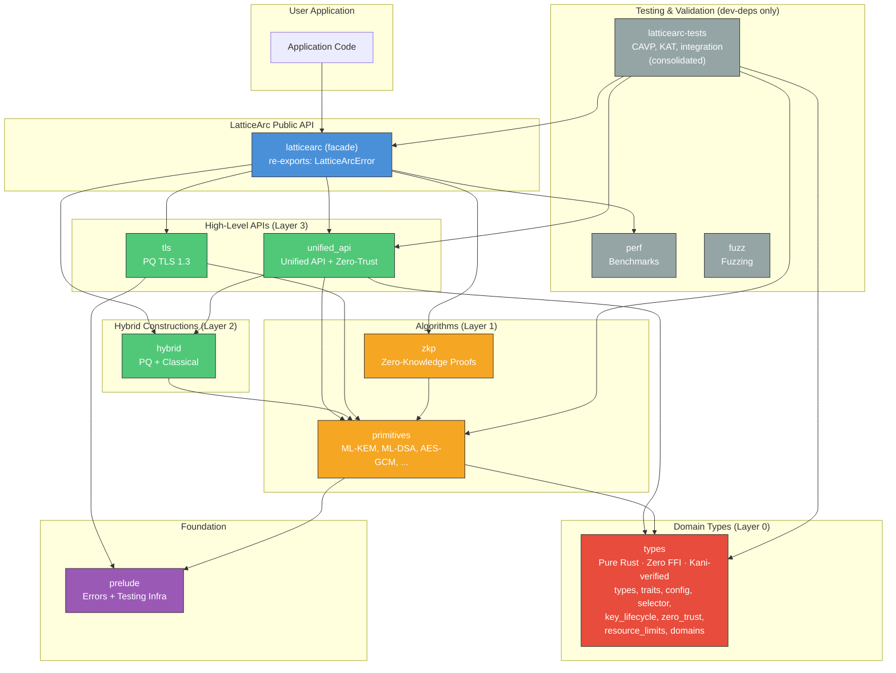
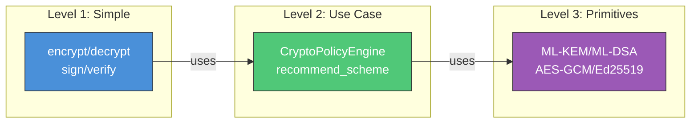
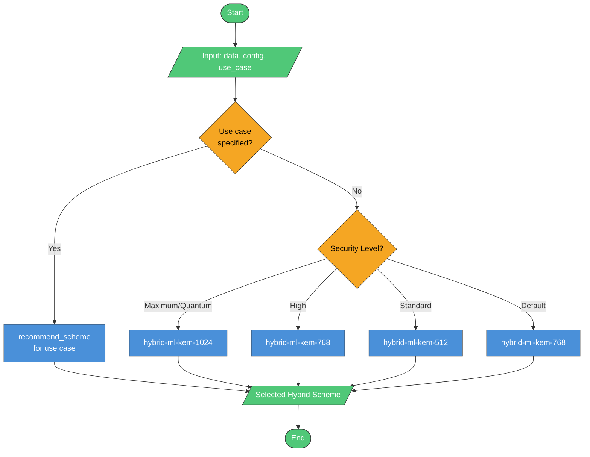
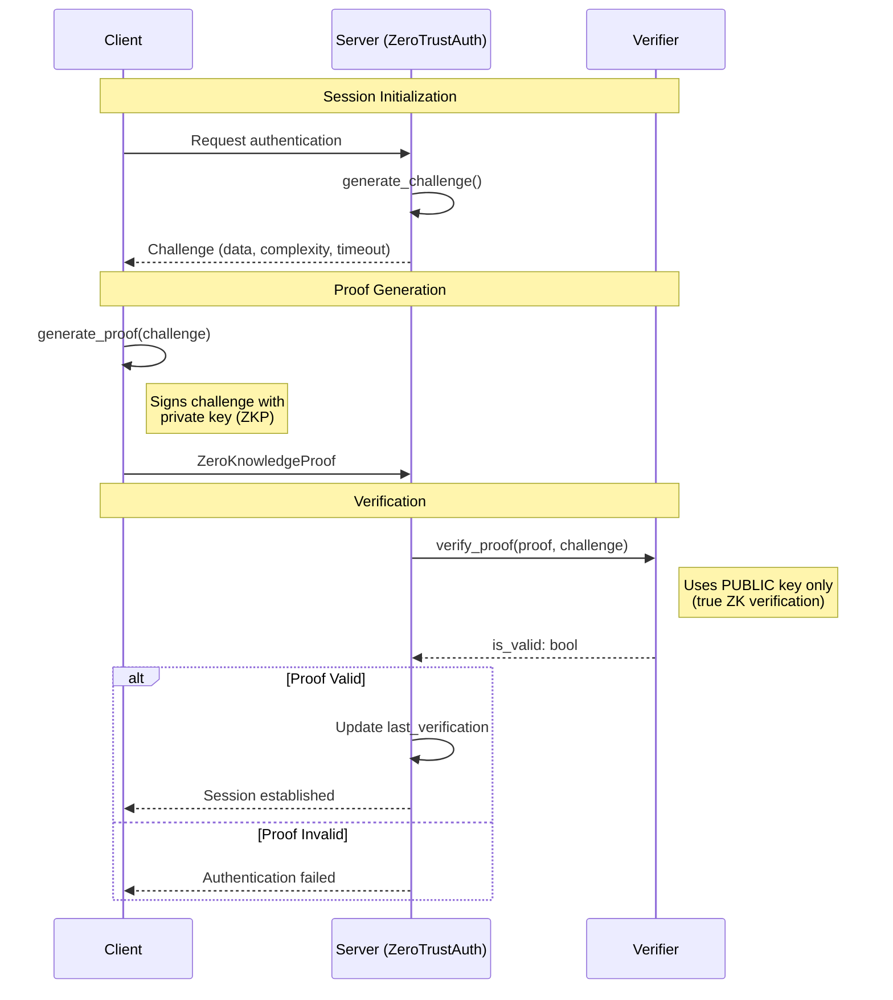
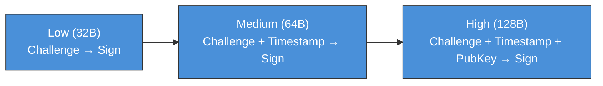
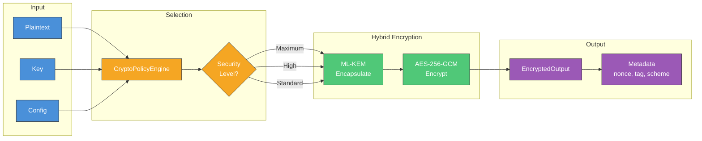
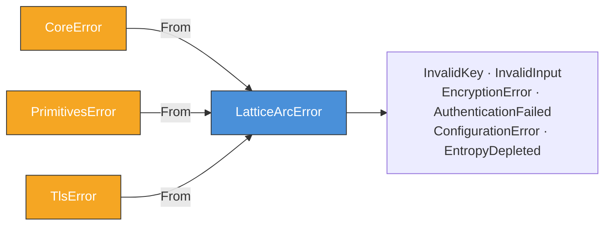
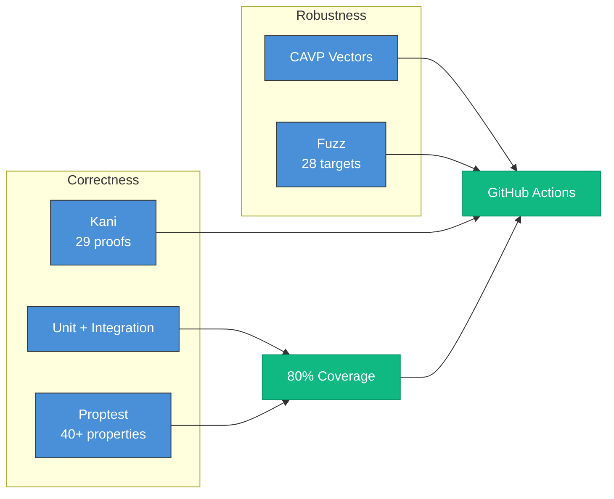

# LatticeArc Architecture

This document describes the architecture of LatticeArc, a post-quantum cryptography library with intelligent scheme selection and zero-trust authentication framework.

## Design Principles

1. **Security First**: Defense-in-depth with hybrid PQ+classical, constant-time operations, memory safety
2. **Hybrid by Default**: All encryption uses PQ + classical algorithms—no classical-only paths exposed
3. **Zero Trust Framework**: Challenge-response authentication with ZKP support
4. **Modularity**: Use only what you need, from high-level to low-level APIs
5. **FIPS Compliance**: NIST FIPS 203-206 compliant implementations with `ComplianceMode` (Default, Fips140_3, Cnsa2_0) and `fips` feature flag

## Architecture Overview



**Key architectural properties (v0.2.0):**
- **`latticearc::types`** is Layer 0: zero FFI dependencies, enabling Kani formal verification (29 proofs)
- All modules consolidated into single `latticearc` crate (was 8 separate crates)
- **`latticearc-tests`** consolidates all integration tests, CAVP validation, and NIST KAT vectors

## Key Design Decisions

### 1. No Unsafe Code

```rust
#![forbid(unsafe_code)]
```

All cryptographic operations use safe Rust, eliminating memory safety vulnerabilities.

### 2. No Panics in Library Code

```rust
#![deny(clippy::unwrap_used)]
#![deny(clippy::expect_used)]
#![deny(clippy::panic)]
```

All operations return `Result<T, E>`. Callers must handle errors explicitly.

### 3. Constant-Time by Default

```rust
use subtle::ConstantTimeEq;

// All secret comparisons use constant-time operations
fn verify_mac(computed: &[u8], received: &[u8]) -> bool {
    computed.ct_eq(received).into()
}
```

### 4. Automatic Zeroization

```rust
use zeroize::ZeroizeOnDrop;

#[derive(ZeroizeOnDrop)]
struct SecretKey {
    data: [u8; 32],
}
// Automatically zeroized when dropped
```

### 5. Hybrid by Default

All default schemes are hybrid (PQ + classical) for defense-in-depth:

```
DEFAULT_ENCRYPTION_SCHEME = "hybrid-ml-kem-768-aes-256-gcm"
DEFAULT_SIGNATURE_SCHEME  = "hybrid-ml-dsa-65-ed25519"
```

## API Abstraction Levels

LatticeArc provides multiple abstraction levels:



| Level | Functions |
|-------|----------|
| **Level 1: Simple** | `encrypt()`, `decrypt()`, `sign()`, `verify()` |
| **Level 2: Use Case** | `recommend_scheme()` by security level/use case |
| **Level 3: Primitives** | ML-KEM, ML-DSA, SLH-DSA, FN-DSA, AES-GCM |

## Scheme Selection Flow

The CryptoPolicyEngine analyzes configuration to select optimal hybrid schemes:



> **Note**: All schemes are hybrid (PQ + Classical). Classical-only encryption is not exposed in the public API.

## Zero-Trust Authentication Flow

Challenge-response authentication framework with zero-knowledge proofs:



LatticeArc provides the zero-trust authentication framework including challenge generation, proof creation, and verification. Applications integrate these primitives into their authentication flows.

## Proof Complexity Levels



## Hardware Acceleration

LatticeArc provides trait definitions for hardware-aware operations (`HardwareAccelerator`, `HardwareAware`, `HardwareCapabilities`, `HardwareInfo`, `HardwareType`). These define the interface contract for hardware integration.

The underlying cryptography library (`aws-lc-rs`) handles AES-NI, SHA extensions, and SIMD acceleration automatically at the C level — no application-level hardware detection is needed for optimal performance.

## Encryption Data Flow

All encryption in LatticeArc uses hybrid mode (PQ + Classical) for defense-in-depth:



> **Security Note**: LatticeArc does not expose classical-only encryption. All data is protected by both post-quantum (ML-KEM) and classical (AES-256-GCM) algorithms, ensuring security even if one algorithm is compromised.

## Crate Descriptions

### `latticearc` (Main Facade)

Re-exports public APIs from the workspace via explicit imports:

```rust
use latticearc::{encrypt, decrypt, CryptoConfig, SecurityLevel, EncryptKey, DecryptKey};
use latticearc::LatticeArcError; // From latticearc::prelude
```

> **Note**: As of v0.2.0, all modules are consolidated into a single `latticearc` crate.
> Use explicit imports from `latticearc` (e.g., `latticearc::primitives::*`, `latticearc::unified_api::*`).

### `latticearc::types` (Pure-Rust Domain Types)

Zero-FFI-dependency module containing all types, traits, and configuration that can be formally verified with Kani:

| Module | Purpose |
|--------|---------|
| `types` | `ZeroizedBytes`, `SecurityLevel`, `UseCase`, `CryptoScheme`, `CryptoContext`, `ComplianceMode`, `PerformancePreference` |
| `traits` | `Encryptable`, `Decryptable`, `Signable`, `Verifiable`, `SchemeSelector` |
| `config` | `CoreConfig`, `EncryptionConfig`, `SignatureConfig`, `ZeroTrustConfig` |
| `selector` | `CryptoPolicyEngine` and scheme constants |
| `key_lifecycle` | `KeyStateMachine`, `KeyLifecycleRecord` (with Kani proofs) |
| `zero_trust` | `TrustLevel` enum |
| `error` | `TypeError` for pure-Rust error conditions |

### `latticearc::unified_api`

The Unified API layer, re-exports types and adds cryptographic operations:

| Module | Purpose |
|--------|---------|
| `convenience` | Simple encrypt/decrypt/sign/verify functions |
| `selector` | Re-exports CryptoPolicyEngine from types |
| `zero_trust` | ZeroTrustAuth, Challenge, ZeroKnowledgeProof |
| `hardware` | Hardware trait re-exports (types only, no detection) |
| `config` | Re-exports CoreConfig from types, adds CryptoConfig |
| `types` | Re-exports from types, adds FFI-dependent types |

### `latticearc::primitives`

Low-level cryptographic primitives:

| Module | Algorithms |
|--------|-----------|
| `kem/` | ML-KEM-512/768/1024 (FIPS 203), X25519 (ECDH) |
| `sig/` | ML-DSA-44/65/87 (FIPS 204), SLH-DSA (FIPS 205), FN-DSA (FIPS 206) |
| `aead/` | AES-256-GCM, ChaCha20-Poly1305 |
| `kdf/` | HKDF-SHA256, PBKDF2, SP800-108 Counter KDF |
| `hash/` | SHA-2, SHA-3 |
| `mac/` | HMAC-SHA256, CMAC |
| `ec/` | Ed25519, secp256k1, BLS12-381, BN254 |

### `latticearc::hybrid`

Hybrid cryptography combining PQ + classical:

| Component | Combination |
|-----------|-------------|
| HybridKem | ML-KEM + X25519 |
| HybridSignature | ML-DSA + Ed25519 |
| HybridEncrypt | ML-KEM + AES-GCM |

### `latticearc::tls`

Post-quantum TLS 1.3 with rustls:

- PQ key exchange (ML-KEM)
- Hybrid mode support
- Session resumption
- Connection monitoring

### `latticearc::prelude`

Common types and error handling:

- `LatticeArcError` hierarchy
- Error recovery (circuit breaker, graceful degradation)
- Testing infrastructure (CAVP compliance, property-based testing)

### `latticearc-tests`

Consolidated test suite (CAVP, KAT, integration, FIPS validation):

- Convenience API tests (encryption, signing, KEM, hybrid)
- NIST Known Answer Tests (ML-KEM, ML-DSA, SLH-DSA, AES-GCM, ChaCha20)
- Zero-trust and session tests
- API stability and serialization tests
- End-to-end workflows and cross-validation tests

### `latticearc::zkp`

Zero-knowledge proof systems:

- Schnorr proofs
- Sigma protocols
- Pedersen commitments

## Error Handling



## Feature Flags

| Feature | Description | Default |
|---------|-------------|---------|
| `fips` | FIPS 140-3 validated aws-lc-rs backend (requires CMake + Go) | No |
| `fips-self-test` | Power-up KAT self-tests for FIPS-boundary algorithms | No |
| `zkp-serde` | ZKP serialization support (enables `serde_with`) | No |
| `formal-verification` | TLS formal verification features | No |
| `kani` | Kani bounded model checking proofs | No |
| `saw` | SAW formal verification integration | No |

## Testing Strategy



## Config Flow Invariants

Configuration flows through a defined pipeline. Every field on these structs must have a consumer in this pipeline.

### Encryption Config Pipeline

```
CryptoConfig (user-facing)
  ├── session: Option<&VerifiedSession>  →  zero_trust::verify_session()
  ├── selection: AlgorithmSelection      →  convenience::select_encryption_scheme()
  ├── compliance: ComplianceMode         →  convenience::select_encryption_scheme()
  └── compliance_explicit: bool          →  CryptoConfig::use_case() (internal flag)
        │
        ▼
AlgorithmSelection (enum)
  ├── UseCase(UseCase)                   →  CryptoPolicyEngine::recommend_scheme()
  ├── SecurityLevel(SecurityLevel)       →  CryptoPolicyEngine::select_encryption_scheme()
  └── ForcedScheme(SchemeType)           →  CryptoPolicyEngine::force_scheme()
        │
        ▼
CryptoPolicyEngine                       →  scheme string (e.g., "hybrid-ml-kem-768-aes-256-gcm")
        │
        ▼
Primitive dispatch (hybrid::encrypt, primitives::aead::encrypt, etc.)
```

### TLS Config Pipeline

```
TlsConfig (user-facing, 18 fields)
  │
  ├── From<&TlsConfig> for Tls13Config  →  maps: mode, alpn, fragment_size, early_data, protocol_version
  │                                         drops: tracing, retry, fallback, resumption, session_lifetime,
  │                                                key_logging, cipher_suites, client_auth, client_verification,
  │                                                client_ca_certs, session_persistence
  │
  └── TlsConnectionBuilder              →  consumes remaining fields for connection setup
        │
        ▼
rustls ServerConfig / ClientConfig
```

### Policy Engine Config

```
CoreConfig (internal to policy engine)
  ├── security_level: SecurityLevel      →  CryptoPolicyEngine::select_encryption_scheme()
  ├── performance_preference             →  CryptoPolicyEngine (stored in CryptoContext, not yet wired)
  └── hardware_acceleration: bool        →  CryptoPolicyEngine (stored in CryptoContext, not yet wired)
```

### Invariant

**Every field on these structs must have a consumer in this pipeline.** If a field has no consumer, it is either dead (remove it) or unwired (wire it). See [DESIGN_PATTERNS.md](DESIGN_PATTERNS.md) for the patterns that enforce this invariant.

## References

- [FIPS 203: ML-KEM](https://csrc.nist.gov/pubs/fips/203/final)
- [FIPS 204: ML-DSA](https://csrc.nist.gov/pubs/fips/204/final)
- [FIPS 205: SLH-DSA](https://csrc.nist.gov/pubs/fips/205/final)
- [FIPS 206: FN-DSA (Draft)](https://csrc.nist.gov/projects/post-quantum-cryptography/selected-algorithms-2022)
- [Rustls](https://github.com/rustls/rustls)
