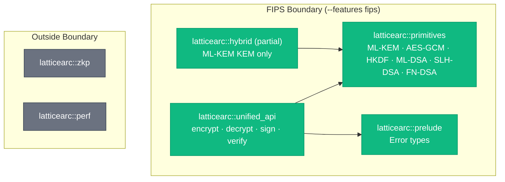

# FIPS 140-3 Security Policy

**Module Name**: LatticeArc Cryptographic Module
**Module Version**: 0.12.0

> CI gate `fips-policy-version` (`lint-extras.yml`) enforces that this
> stamp matches `[workspace.package].version` in `Cargo.toml` exactly.
> Re-sync at every tag-cut commit when the workspace version is bumped.
**Module Type**: Software (FIPS 140-3 Level 1)
**Date**: 2026-05-27
**Last Reviewed**: 2026-08-09
**Status**: Pre-submission draft — not yet CMVP validated

> **IMPORTANT**: LatticeArc is NOT FIPS 140-3 certified. Only the aws-lc-rs
> backend algorithms (ML-KEM, AES-GCM, HKDF, SHA-2) run through the AWS-LC
> FIPS module. As of aws-lc-rs 1.18 (LatticeArc 0.11.0), the `fips` build
> vendors the **AWS-LC-FIPS 4.x** module line: lab validation testing is
> complete and the module has been submitted to NIST — its certificate is
> pending on the CMVP Modules-In-Process list. The previous 3.x module line
> holds issued FIPS 140-3 certificates #5314 (static) / #5298 (dynamic) and
> ships with aws-lc-rs <1.18. ML-DSA (fips204), SLH-DSA (fips205), and
> FN-DSA (fn-dsa) implement NIST-standard algorithms but use non-validated
> crate implementations.

---

## 1. Module Identification

| Field | Value |
|-------|-------|
| Module Name | LatticeArc Cryptographic Module |
| Module Version | 0.12.0 |
| Module Type | Software library |
| Security Level | Level 1 (overall) |
| Language | Rust (edition 2024, MSRV 1.93) |
| Platforms | Linux x86_64, Linux aarch64, macOS x86_64, macOS aarch64, Windows x86_64 |
| Underlying Crypto | aws-lc-rs (AWS-LC-FIPS 4.x, certificate in process), fips204, fips205, fn-dsa |

---

## 2. Cryptographic Module Boundary

The FIPS cryptographic boundary is defined by the `fips` feature flag in `latticearc/Cargo.toml`. When `fips` is enabled:

- **Included**: All FIPS-approved algorithms (see Section 3)
- **Excluded**: Non-approved algorithms gated by `#[cfg(not(feature = "fips"))]`:
  - Ed25519 (not FIPS-approved)
  - Secp256k1 (not FIPS-approved)
  - ChaCha20-Poly1305 (not FIPS-approved)
  - X25519 ECDH (not FIPS-approved)
  - ZKP operations (not FIPS-approved)

### Boundary Modules

| Module | In Boundary | Role |
|--------|-------------|------|
| `latticearc::primitives` | Yes | Core cryptographic implementations |
| `latticearc::unified_api` | Yes | Unified API layer |
| `latticearc::prelude` | Yes | Error types, common utilities |
| `latticearc::hybrid` | Partial | Hybrid KEM (ML-KEM + X25519 gated) |
| `latticearc::zkp` | No | ZKP (non-FIPS) |
| `latticearc::perf` | No | Benchmarking (non-cryptographic) |
| `latticearc-tests` | Yes | FIPS validation and self-tests (dev-only) |

---

## 3. Approved Algorithms

| Algorithm | Standard | Implementation | Service |
|-----------|----------|----------------|---------|
| ML-KEM-512/768/1024 | FIPS 203 | aws-lc-rs | Key encapsulation |
| ML-DSA-44/65/87 | FIPS 204 | fips204 crate | Digital signatures |
| SLH-DSA-SHAKE-128s, 192s, 256s | FIPS 205 | fips205 crate | Hash-based signatures (small-signature variants only; fast `*f` variants are not wired through `primitives::sig::slh_dsa`) |
| FN-DSA-512/1024 | draft FIPS 206 | fn-dsa crate | Lattice signatures |
| AES-256-GCM | SP 800-38D | aws-lc-rs | Authenticated encryption |
| SHA-256 | FIPS 180-4 | RustCrypto `sha2` (NOT FIPS-routed) | Hashing — see note below |
| SHA3-256 | FIPS 202 | sha3 crate | Hashing |
| HMAC-SHA256 | FIPS 198-1 | hmac + sha2 crates (MAC module), aws-lc-rs (HKDF module) | Message authentication |
| HKDF-SHA256 | SP 800-56C | aws-lc-rs HMAC-based (`aws_lc_rs::hmac::HMAC_SHA256`) | Key derivation |

### Non-Approved Algorithms

The following algorithms are available in the default (non-FIPS) build but are not FIPS-approved:

| Algorithm | Implementation | Enforcement |
|-----------|----------------|-------------|
| Ed25519 | ed25519-dalek | Runtime: `ComplianceMode` rejects in `Fips140_3`/`Cnsa2_0` |
| Secp256k1 ECDSA | k256 | Runtime: `ComplianceMode` rejects in `Fips140_3`/`Cnsa2_0` |
| X25519 ECDH | aws-lc-rs | Runtime: `ComplianceMode` rejects in `Cnsa2_0` (allowed in hybrid for `Fips140_3`) |
| ChaCha20-Poly1305 | chacha20poly1305 | Runtime: `ComplianceMode` rejects in `Fips140_3`/`Cnsa2_0` |

> **Note:** Non-approved algorithms are currently enforced at runtime via `ComplianceMode`, not at compile time via `cfg` gates. When `ComplianceMode::Fips140_3` or `Cnsa2_0` is set, the `CryptoPolicyEngine` rejects non-approved algorithm selections. For future CMVP submission, compile-time `cfg(not(feature = "fips"))` gating should be implemented to fully exclude non-approved code paths from the FIPS binary.
>
> **SHA-2 routing — material disclosure:** SHA-2 implementations
> (SHA-256/384/512 in `latticearc/src/primitives/hash/sha2.rs`) are
> provided by the RustCrypto `sha2` crate **regardless of the `fips`
> feature flag**. The `--features fips` switch routes AES-GCM, ML-KEM,
> X25519, and HKDF to aws-lc-rs's CMVP-validated module, but SHA-2
> hashing is not currently swapped. Earlier revisions of this policy
> document and the README claimed otherwise — those claims were wrong
> and have been corrected. CMVP submitters relying on a CMVP-validated
> SHA-2 path must either route to aws-lc-rs's `digest::SHA256` directly
> or wait for a future revision that wires the SHA-2 backend behind
> the same feature flag.

---

## 4. Modes of Operation

### FIPS Mode (Approved)

Enabled via `--features fips` at compile time. In this mode:
- `fips_available()` returns `true`, enabling `ComplianceMode::Fips140_3` and `Cnsa2_0`
- aws-lc-rs compiles its FIPS-validated module (requires CMake + Go)
- **Power-up self-tests run before any crypto operation.** As of 0.8.x
  the `fips` feature transitively enables `fips-self-test`, so the
  §10.3.1 KAT self-tests are guaranteed to fire whenever `--features
  fips` is selected. Earlier 0.8 builds left these as independent
  features, which let `--features fips` produce a non-compliant
  build that skipped self-tests — those builds should be rebuilt and
  re-validated.
- Self-test failure calls `std::process::abort()` — no recovery
- Module integrity verification via HMAC-SHA256 of binary
- Pairwise Consistency Tests (PCT) run after every key generation
- Non-approved algorithms still compile but are rejected at runtime by `ComplianceMode`

### Non-FIPS Mode (Default)

Default build without `fips` feature. All algorithms available including non-approved. Self-tests can be optionally enabled standalone via `--features fips-self-test` (without the FIPS-validated backend) for KAT-coverage in non-FIPS builds.

### Runtime Compliance via `ComplianceMode`

The `ComplianceMode` enum (`latticearc::types::ComplianceMode`) provides runtime compliance enforcement on top of the compile-time `fips` feature:

| Mode | `requires_fips()` | `allows_hybrid()` | Description |
|------|--------------------|--------------------|-------------|
| `Default` | `false` | `true` | No compliance restrictions — all algorithms available |
| `Fips140_3` | `true` | `true` | Requires `fips` feature; only FIPS-validated backends |
| `Cnsa2_0` | `true` | `false` | Requires `fips` feature + `CryptoMode::PqOnly`; CNSA 2.0 mandates no classical fallback |

Both `requires_fips()` and `allows_hybrid()` are formally verified by Kani proofs to return correct values exhaustively over all variants.

---

## 5. Self-Tests

### 5.1 Power-Up Self-Tests

Executed automatically on first cryptographic operation (lazy initialization via `std::sync::Once`). Located in `latticearc/src/primitives/self_test.rs`.

| Test | Type | Algorithm | Requirement |
|------|------|-----------|-------------|
| Module Integrity | Integrity | HMAC-SHA256 | FIPS 140-3 §9.2.2 |
| SHA-256 KAT | Known Answer | SHA-256 | FIPS 140-3 §9.1 |
| SHA3-256 KAT | Known Answer | SHA3-256 | FIPS 140-3 §9.1 |
| HMAC-SHA256 KAT | Known Answer | HMAC-SHA256 | FIPS 140-3 §9.1 |
| HKDF-SHA256 KAT | Known Answer | HKDF-SHA256 | FIPS 140-3 §9.1 |
| AES-256-GCM KAT | Known Answer | AES-256-GCM | FIPS 140-3 §9.1 |
| ML-KEM-768 KAT | Known Answer | ML-KEM | FIPS 140-3 §9.1 |
| ML-DSA-44 KAT | Known Answer | ML-DSA | FIPS 140-3 §9.1 |
| SLH-DSA KAT | Known Answer | SLH-DSA | FIPS 140-3 §9.1 |
| FN-DSA-512 KAT | Known Answer | FN-DSA | FIPS 140-3 §9.1 |

### 5.2 Conditional Self-Tests

| Test | Trigger | Algorithm |
|------|---------|-----------|
| Pairwise Consistency Test | After keygen | ML-DSA, SLH-DSA, FN-DSA |
| Pairwise Consistency Test | After keygen | Ed25519, Secp256k1 (non-FIPS) |

PCT implementation: Sign fixed message `b"FIPS PCT test"` with generated private key, verify with corresponding public key. Failure enters error state.

### 5.3 Module Integrity Test

1. `build.rs` generates `integrity_hmac.rs` containing expected HMAC:
   - Production: reads from `PRODUCTION_HMAC.txt` (externally generated)
   - Development: sets expected HMAC to `None`
2. At runtime, `integrity_test()` resolves the module artifact via
   `current_exe()` and checks it is a recognizable LatticeArc artifact
   (the LatticeArc shared library / CLI names, or a cargo-generated
   `<crate>-<16-hex>` binary under `target/`). If the artifact is not
   recognizable — a dynamic-library host interpreter, or a production
   binary that statically links LatticeArc under its own name — the test
   **skips with a loud warning** (integrity cannot be verified from a
   file that cannot be attributed to the module; verify out-of-band)
3. For a recognized artifact, computes HMAC-SHA256 over it and compares
   against the expected value (constant-time)
4. No expected HMAC configured (development builds): warn and continue
5. Both cannot-verify conditions (unrecognized artifact, no configured
   HMAC) leave the module in "integrity unverified" state; under the
   `fips-strict-integrity` feature, `verify_operational` refuses to enter
   operational state until integrity is verified

### 5.4 Self-Test Failure Behavior

On any self-test **failure** (integrity HMAC mismatch — i.e. detected
tamper — or any KAT failure; a skipped integrity check is a
cannot-verify condition, not a failure):
- `std::process::abort()` is called immediately
- No crypto operations are permitted
- No recovery path (FIPS 140-3 compliant)
- Error state transitions: Power-up → Self-test → **Abort** (on failure) or Operational (on success)

---

## 6. Cryptographic Key Management

### 6.1 Key Types (Critical Security Parameters)

| CSP | Algorithm | Generation | Storage | Zeroization |
|-----|-----------|------------|---------|-------------|
| ML-KEM Decapsulation Key | ML-KEM | `aws-lc-rs` RNG | In-memory only | `ZeroizeOnDrop` |
| ML-KEM Shared Secret | ML-KEM | Encapsulation | In-memory only | `Zeroize` on drop |
| ML-DSA Signing Key | ML-DSA | `fips204` RNG | `Zeroizing<Vec<u8>>` | Auto-zeroized |
| SLH-DSA Signing Key | SLH-DSA | `fips205` RNG | `Zeroizing<Vec<u8>>` | Auto-zeroized |
| FN-DSA Signing Key | FN-DSA | `fn-dsa` RNG | `Zeroizing<Vec<u8>>` | Auto-zeroized |
| AES-256-GCM Key | AES-256-GCM | HKDF or user-provided | In-memory | `Zeroize` on drop |
| HMAC Key | HMAC-SHA256 | User-provided | In-memory | Caller responsibility |

### 6.2 Key Generation

- All key generation uses the operating-system CSPRNG (`rand::rngs::SysRng`)
- No `thread_rng()` in production code
- PCT runs automatically after PQC key generation

### 6.3 Key Zeroization

- Secret types derive `Zeroize` and `ZeroizeOnDrop`
- Secret types do NOT implement `Clone`, `Debug`, or `Serialize`
- `Zeroizing<Vec<u8>>` wrapper used for secret key byte vectors
- Memory zeroization occurs on `Drop`

### 6.4 Key Storage

- No persistent key storage in the module
- Keys exist only in volatile memory during process lifetime
- ML-KEM `DecapsulationKey` serialization supported via aws-lc-rs v1.16.3+ for migration scenarios
- Applications should implement key persistence using HSM/KMS for production deployments

---

## 7. Access Control

### Level 1 Software Module

As a Level 1 software module, access control is delegated to the operating system:
- Process isolation via OS memory protection
- No hardware security boundary
- File system permissions for module binary

### API Access Tiers

| Tier | API | FIPS Guard |
|------|-----|------------|
| Unified (recommended) | `encrypt()`, `decrypt()`, `sign_with_key()`, `verify()` | `fips_verify_operational()` enforced |
| Expert | `sign_pq_ml_dsa()`, `encrypt_aes_gcm()`, etc. | Caller responsibility |

---

## 8. Physical Security

Not applicable — software-only module (FIPS 140-3 Level 1).

---

## 9. Operational Environment

| Requirement | Implementation |
|-------------|----------------|
| Operating System | General-purpose OS (Linux, macOS, Windows) |
| Rust Version | 1.93+ (edition 2024) |
| Unsafe Code | Forbidden (`unsafe_code = "forbid"` workspace-wide) |
| Memory Safety | Guaranteed by Rust type system + `zeroize` |
| Side-Channel Mitigation | `subtle` crate for constant-time comparisons |

---

## 10. Mitigation of Other Attacks

| Attack | Mitigation |
|--------|------------|
| Timing side-channels | `subtle::ConstantTimeEq` for secret comparisons |
| Memory disclosure | `Zeroize`/`ZeroizeOnDrop` on all CSPs |
| Key oracle | Generic error messages (no upstream key validation details) |
| Binary tampering | HMAC-SHA256 integrity test at power-up |
| Algorithm downgrade | Feature flag gating, no runtime algorithm negotiation in FIPS mode |

---

## Revision History

| Version | Date | Changes |
|---------|------|---------|
| 0.12.0 | 2026-08-16 | **§9.6 error-state enforcement widened; two breaking API changes.** The operational latch was previously consulted by only 8 convenience entry points; the AEAD, hash/KDF/MAC, PQ-KEM, PQ-signature, Ed25519, hybrid-signature and ECDSA-P384 modules call `primitives::*` directly and so continued to provide cryptographic services after the module entered the error state — including the `fips-strict-integrity` case where no `PRODUCTION_HMAC.txt` is provisioned. Every such module now consults the latch at its internal chokepoint. Consequently `hash_data` returns `Result<[u8; 32]>` (SHA-3 is an approved algorithm inside the boundary, so §9.6 must be able to refuse the call), and `unified_api::self_tests_passed()` now reports the conjunction of the power-up flag and the operational latch rather than a stale `init()`-time flag — `init()` and every gated operation now share a single `Once`-guarded power-up run. Also: the configured-`SecurityLevel` minimum-strength gate no longer skips the `pq-`-prefixed and `-hybrid-ed25519`-suffixed scheme spellings on `decrypt`/`verify`, and `PortableKey` expiry is enforced by all twelve typed-key extractors rather than only the four hybrid ones. |
| 0.9.0 | 2026-05-31 | **Security-audit followup wave.** Wire-format breaks: every signature path binds a per-scheme domain-separation context into the signed transcript (H1 / M1 — `SigSchemeLabel` closed enum, FIPS 204 §5.2 ctx for ML-DSA, FIPS 205 §10.2 ctx for SLH-DSA, SHA-512 prefix-hash for Ed25519 and FN-DSA); `pq_only` ciphertexts now bind AAD into the HKDF info segment (M3). New library APIs: `verify_with_anchor(signed, expected_pk, expected_scheme, config)` for operator-pinned trust-anchor verification (H2), `PortableKey::validate_with_expiry(now)` for explicit "safe to use right now" gate (M4). New CLI flags: `verify --allow-embedded-key` (H2 opt-out), `decrypt --print-to-tty` / `kdf --print-to-tty` (L9 hard-fail otherwise). New CLI env-gate: `LATTICEARC_ALLOW_UNSAFE_CLI=1` required for `--allow-weak-iterations` / `--allow-argv-secret` (L8). Closed allowlist for signature scheme strings at deserialization (M5); `KeyType::Public` guards on `to_hybrid_public_key` / `to_hybrid_sig_public_key` (M2); `EncryptedOutput.version` validated against `=2` at parse (L7); secp256k1 keygen routed through crate `secure_rng()` with scalar-validity retry (L1); PBKDF2 salt all-zero check, P-256/P-384/P-521 zero-coord check, and P-curve agreement all-zero-shared-secret check use CT helpers (L2/L3/L4); `validate_composite_lengths` dispatches per-algorithm classical-leg length (L6); `ConstantTimeEq` impls added on X25519PublicKey / P-curve public keys alongside derived `PartialEq` (L5). Design-pattern cleanup: `#[non_exhaustive]` added to 16 remaining public enums, `HybridSignatureError::SigningFailed` opaque variant (Pattern 6), sp800_108 KDF labels moved into `types::domains` registry (Pattern 2), `#[must_use]` on random-bytes / FN-DSA keygen, P-curve agreement adds defense-in-depth all-zero-shared-secret check. M6 (k256 `SigningKey` zeroize) verified closed via source inspection of `ecdsa 0.16.9::Drop` impl. |
| 0.8.4 | 2026-05-27 | Additive: `KeyAlgorithm::Secp256k1` enum tag for downstream secp256k1 key material (`nist_security_level()` reports `Standard`, ~128-bit classical, quantum-vulnerable; no signing primitive in the `latticearc` crate). `PortableKey::not_after: Option<DateTime<Utc>>` informational lifecycle field with `not_after()` / `set_not_after()` / `is_expired_at()` / `is_expired()` accessors — `validate()` does NOT enforce expiry (callers must check `is_expired()` themselves; `not_after` is not in `encryption_aad`). `ConstantTimeEq` updated to distinguish keys differing only in `not_after`. Wire format unchanged when `not_after` is `None`. |
| 0.8.3 | 2026-05-22 | Patch: PoP replay-cache `pk_len` uniformity enforced at the type level (`PopReplayCache::new(pk_len)` + `debug_assert_eq!` on insert), preventing silent per-PK quota leak if a future PoP type with a different PK length is added without scoping the cache; entropy health-test thresholds Bonferroni-corrected (`frequency_test` 1024-byte band 3× → 4× expected, `longest_run_test` 1000–10000-bit band 20 → 22) — fixed a long-standing CI flake where per-attempt FPR was 7.2% vs the NIST SP 800-22 α = 0.01 budget; the entropy health-check test now panics with per-attempt diagnostics; CI secret-type-invariants gate (`scripts/ci/secret_type_audit.sh`) is now per-struct (file-wide-grep anti-pattern removed for I-1 and I-4) and wired into the `Security Scan` workflow with a `--self-test` regression guard; accumulated audit-round-5/6/7 follow-ups across formal-verification docs, CI gates, hooks, lifecycle tamper-checks, signing-pipeline hardening |
| 0.8.2 | 2026-05-18 | Patch: `generate_signing_keypair` returns the named-field `SigningKeypair` type (private fields, redacting Debug, `into_parts()`); `EncryptedOutput::new` shape errors mapped to `ConfigurationError` across all encrypt arms; MemorySanitizer CI wall-clock budget raised |
| 0.8.1 | 2026-05-16 | Patch: ChaCha20-Poly1305 decrypt error-mapping symmetry, `encrypt_pq_only` HKDF-info doc correction, non-FIPS CI clippy gating, release-workflow body overflow fix |
| 0.8.0 | 2026-05-13 | Normative Secret Type Invariants ratified (`docs/SECRET_TYPE_INVARIANTS.md`): sealed `expose_secret()` accessor on every secret-bearing type, `SecretBytes<N>`/`SecretVec` primitives, optional `secret-mlock` feature, compile-time barrier test. Multiple external audit rounds folded in (FIPS 203 §6.1 SK/PK cross-check, SP 800-57 §8.3.1 pre-activation destruction, CT-equality canonicalisation, length-leak hardening, Ed25519 stack-temporary zeroization). |
| 0.7.1 | 2026-04-22 | FN-DSA `SigningKey` zeroizes inner key material (fn-dsa 0.3.0 derives `Zeroize`); X25519 static-keypair docs corrected for aws-lc-rs 1.16+ raw-bytes import/export support; CMAC K1/K2 subkey derivation made constant-time via `subtle::ConditionallySelectable`. |
| 0.7.0 | 2026-04-16 | `SecurityLevel::Quantum` variant removed (use `CryptoMode::PqOnly`); Phase-2 verification hardening (DudeCT/ctgrind CT gates, cross-impl differential ML-KEM/ML-DSA/SLH-DSA, Wycheproof wrappers, allocation-bounded DoS fuzz, mutation testing). |
| 0.6.0 | 2026-04-09 | Restructured SecurityLevel/CryptoMode: added `CryptoMode` enum, deprecated `SecurityLevel::Quantum`, PQ-only encryption via unified API, CNSA 2.0 checks `CryptoMode::PqOnly` |
| 0.5.2 | 2026-04-09 | Feature-gate compilation fixes, error type mapping fix, pre-commit feature matrix, key persistence proof tests |
| 0.5.1 | 2026-04-09 | Security: AEAD error opacity, self-contained hybrid secret keys, real KAT vectors, CLI hybrid decrypt, Level 7 scenario tests |
| 0.5.0 | 2026-04-06 | Deep audit remediation: field privatization, sealed traits, non_exhaustive enums, primitives-only architecture enforcement, constant-time equality on all secret types |
| 0.4.4 | 2026-04-01 | ECDH shared secret zeroization, PCT feature-gate fix, version bump |
| 0.3.2 | 2026-02-24 | Improve docs.rs landing page: declutter re-exports, add comparison tables |
| 0.3.1 | 2026-02-24 | Documentation cleanup, CI fixes (macos-15-intel, idempotent publish) |
| 0.3.0 | 2026-02-22 | Security audit fixes (44 findings), CI hardening |
| 0.2.0 | 2026-02-20 | Updated for workspace consolidation, 29 Kani proofs |
| 0.1.0 | 2026-02-15 | Initial draft |
