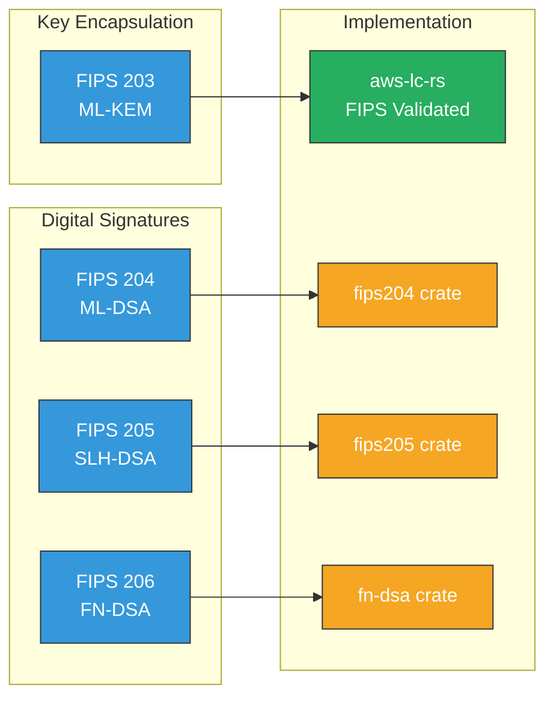
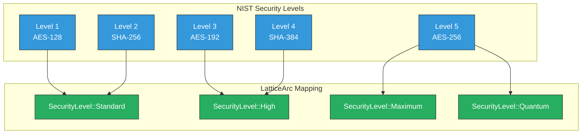
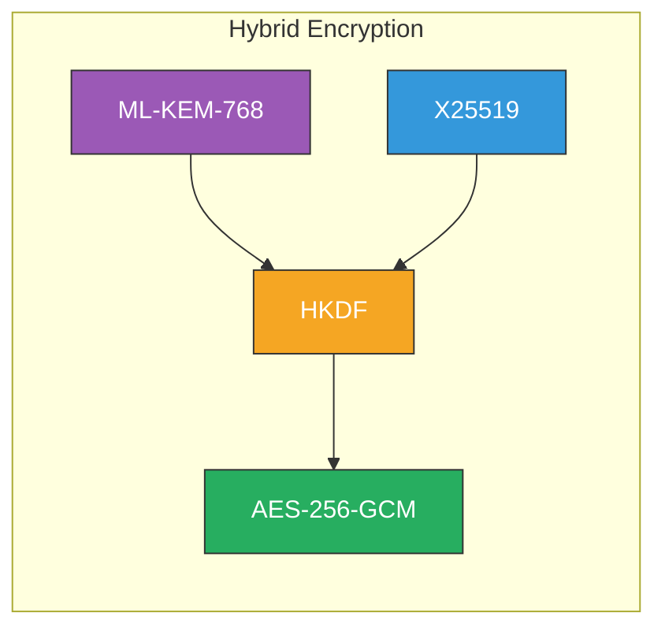

# NIST Post-Quantum Cryptography Compliance

LatticeArc's compliance with NIST FIPS 203-206 post-quantum cryptography standards.

## Standards Overview



| Standard | Algorithm | Implementation | FIPS Validated | Status |
|----------|-----------|----------------|----------------|--------|
| FIPS 203 | ML-KEM | `aws-lc-rs` | Yes (Cert #4631, #4759, #4816) | Complete |
| FIPS 204 | ML-DSA | `fips204` crate | No (awaiting aws-lc-rs) | Complete* |
| FIPS 205 | SLH-DSA | `fips205` crate | Audited | Complete |
| FIPS 206 | FN-DSA | `fn-dsa` crate | Partial | Complete |

*ML-DSA uses the `fips204` pure Rust crate. For FIPS 140-3 certification, migration to `aws-lc-rs` is required once the ML-DSA Rust API is stabilized (tracking: aws/aws-lc-rs#773). Our PRs #1029 and #1034 shipped in aws-lc-rs v1.16.0; ML-DSA FIPS API stabilization is still pending.

## FIPS 203: ML-KEM (Module-Lattice-Based Key Encapsulation)

### Algorithm Variants

| Parameter Set | Security Level | Public Key | Ciphertext | Shared Secret |
|--------------|----------------|------------|------------|---------------|
| ML-KEM-512 | NIST Level 1 | 800 bytes | 768 bytes | 32 bytes |
| ML-KEM-768 | NIST Level 3 | 1184 bytes | 1088 bytes | 32 bytes |
| ML-KEM-1024 | NIST Level 5 | 1568 bytes | 1568 bytes | 32 bytes |

### Usage with LatticeArc API

```rust
use arc_core::convenience::*;
use arc_primitives::kem::ml_kem::MlKemSecurityLevel;

// Key generation (FIPS 203 Section 7.1)
let (pk, sk) = generate_ml_kem_keypair(MlKemSecurityLevel::MlKem768)?;

// PQ encryption using ML-KEM + AES-GCM
let ciphertext = encrypt_pq_ml_kem(data, &pk, MlKemSecurityLevel::MlKem768)?;
let plaintext = decrypt_pq_ml_kem(&ciphertext, &sk, MlKemSecurityLevel::MlKem768)?;

// Hybrid encryption (ML-KEM + X25519 + HKDF + AES-256-GCM)
let (hybrid_pk, hybrid_sk) = generate_hybrid_keypair()?;
let encrypted = encrypt_hybrid(data, &hybrid_pk, SecurityMode::Unverified)?;
let decrypted = decrypt_hybrid(&encrypted, &hybrid_sk, SecurityMode::Unverified)?;
```

### CAVP Validation

- Test vectors from [NIST CAVP](https://csrc.nist.gov/projects/cryptographic-algorithm-validation-program)
- All parameter sets tested (512, 768, 1024)
- Positive and negative test cases included

## FIPS 204: ML-DSA (Module-Lattice-Based Digital Signature)

### Algorithm Variants

| Parameter Set | Security Level | Public Key | Secret Key | Signature |
|--------------|----------------|------------|------------|-----------|
| ML-DSA-44 | NIST Level 2 | 1312 bytes | 2560 bytes | 2420 bytes |
| ML-DSA-65 | NIST Level 3 | 1952 bytes | 4032 bytes | 3309 bytes |
| ML-DSA-87 | NIST Level 5 | 2592 bytes | 4896 bytes | 4627 bytes |

### Usage with LatticeArc API

```rust
use arc_core::convenience::*;
use arc_primitives::sig::ml_dsa::MlDsaParameterSet;

// Key generation (FIPS 204 Section 6.1)
let (pk, sk) = generate_ml_dsa_keypair(MlDsaParameterSet::MLDSA65)?;

// Sign (FIPS 204 Section 6.2)
let signature = sign_pq_ml_dsa(message, &sk, MlDsaParameterSet::MLDSA65, SecurityMode::Unverified)?;

// Verify (FIPS 204 Section 6.3)
let is_valid = verify_pq_ml_dsa(message, &signature, &pk, MlDsaParameterSet::MLDSA65, SecurityMode::Unverified)?;
```

### CAVP Validation

- Deterministic and randomized signing tested
- All parameter sets validated
- Edge cases for message lengths covered

## FIPS 205: SLH-DSA (Stateless Hash-Based Digital Signature)

### Algorithm Variants

| Parameter Set | Security | Signature Size | Performance |
|--------------|----------|----------------|-------------|
| SLH-DSA-SHAKE-128f | Level 1 | 17,088 bytes | Fast |
| SLH-DSA-SHAKE-128s | Level 1 | 7,856 bytes | Small |
| SLH-DSA-SHAKE-192f | Level 3 | 35,664 bytes | Fast |
| SLH-DSA-SHAKE-192s | Level 3 | 16,224 bytes | Small |
| SLH-DSA-SHAKE-256f | Level 5 | 49,856 bytes | Fast |
| SLH-DSA-SHAKE-256s | Level 5 | 29,792 bytes | Small |

### Usage with LatticeArc API

```rust
use arc_core::convenience::*;
use arc_primitives::sig::slh_dsa::SecurityLevel;

// Key generation (FIPS 205 Section 9.1)
let (pk, sk) = generate_slh_dsa_keypair(SecurityLevel::Shake128s)?;

// Sign (FIPS 205 Section 9.2)
let signature = sign_pq_slh_dsa(message, &sk, SecurityLevel::Shake128s)?;

// Verify (FIPS 205 Section 9.3)
let is_valid = verify_pq_slh_dsa(message, &signature, &pk, SecurityLevel::Shake128s)?;
```

## FIPS 206: FN-DSA (FFT over NTRU Lattice Digital Signature)

### Algorithm Variants

| Parameter Set | Security Level | Public Key | Signature |
|--------------|----------------|------------|-----------|
| FN-DSA-512 | NIST Level 1 | 897 bytes | ~666 bytes |
| FN-DSA-1024 | NIST Level 5 | 1793 bytes | ~1280 bytes |

### Usage with LatticeArc API

```rust
use arc_core::convenience::*;

// Key generation (FIPS 206 Section 6.1)
let (pk, sk) = generate_fn_dsa_keypair()?;

// Sign (FIPS 206 Section 6.2)
let signature = sign_pq_fn_dsa(message, &sk, SecurityMode::Unverified)?;

// Verify (FIPS 206 Section 6.3)
let is_valid = verify_pq_fn_dsa(message, &signature, &pk, SecurityMode::Unverified)?;
```

## Security Levels



| Level | Description | Classical Equivalent |
|-------|-------------|---------------------|
| 1 | At least as hard as AES-128 key recovery | AES-128 |
| 2 | At least as hard as SHA-256 collision finding | SHA-256 |
| 3 | At least as hard as AES-192 key recovery | AES-192 |
| 4 | At least as hard as SHA-384 collision finding | SHA-384 |
| 5 | At least as hard as AES-256 key recovery | AES-256 |

### Recommendations

| Use Case | Recommended Level | Algorithms |
|----------|-------------------|------------|
| General purpose | 3 | ML-KEM-768, ML-DSA-65 |
| Maximum security | 5 | ML-KEM-1024, ML-DSA-87 |
| Constrained environments | 1 | ML-KEM-512, SLH-DSA-SHAKE-128f |
| Long-term protection | 5 | ML-KEM-1024, ML-DSA-87 |

## Validation Testing

### CAVP Test Vectors

```bash
# Run CAVP validation suite
cargo test --package latticearc-tests --all-features
```

Test categories:
- **AFT** (Algorithm Functional Test): Basic correctness
- **VAL** (Validation): Decapsulation/verification with known values
- **MCT** (Monte Carlo Test): Extended iteration tests

### Test Vector Sources

| Algorithm | Source |
|-----------|--------|
| ML-KEM | [NIST ML-KEM](https://csrc.nist.gov/projects/post-quantum-cryptography/selected-algorithms-2022) |
| ML-DSA | [NIST ML-DSA](https://csrc.nist.gov/projects/post-quantum-cryptography/selected-algorithms-2022) |
| SLH-DSA | [NIST SLH-DSA](https://csrc.nist.gov/projects/post-quantum-cryptography/selected-algorithms-2022) |
| FN-DSA | [NIST FN-DSA](https://csrc.nist.gov/projects/post-quantum-cryptography/selected-algorithms-2022) |

## FIPS 140-3 Considerations

LatticeArc implements FIPS 203-206 algorithms but is **NOT** FIPS 140-3 validated.

For FIPS 140-3 compliance:

1. **Use validated modules**: Consider validated hardware or software modules
2. **Implement self-tests**: Power-up and conditional self-tests
3. **Approved RNG**: Use DRBG per SP 800-90A
4. **Key management**: Follow SP 800-57 guidelines
5. **Audit trail**: Log cryptographic operations

### Self-Tests

FIPS algorithm self-tests are implemented in `latticearc::primitives` (module `self_test`) and run automatically via the `fips-self-test` feature. Validation tests run through the `latticearc-tests` crate:

```bash
cargo test --package latticearc-tests --all-features
```

## Hybrid Mode (Recommended)



During the transition period, use hybrid encryption:

```rust
use arc_core::convenience::*;
use arc_core::selector::*;

// Default schemes are hybrid
DEFAULT_ENCRYPTION_SCHEME  // "hybrid-ml-kem-768-aes-256-gcm"
DEFAULT_SIGNATURE_SCHEME   // "hybrid-ml-dsa-65-ed25519"

// Hybrid encryption (ML-KEM + X25519 + HKDF + AES-256-GCM)
let (hybrid_pk, hybrid_sk) = generate_hybrid_keypair()?;
let encrypted = encrypt_hybrid(data, &hybrid_pk, SecurityMode::Unverified)?;
let decrypted = decrypt_hybrid(&encrypted, &hybrid_sk, SecurityMode::Unverified)?;
```

### Timeline Recommendations

| Year | Recommendation |
|------|----------------|
| 2024-2026 | Hybrid mode mandatory for new systems |
| 2027-2030 | Begin migrating existing systems |
| 2030+ | PQC-only for most applications |

## Interoperability

### Wire Formats

LatticeArc uses standard encodings per FIPS specifications:

- **Keys**: Raw byte encoding
- **Ciphertexts**: Raw byte encoding
- **Signatures**: Raw byte encoding

### X.509 Certificate OIDs

| Algorithm | OID |
|-----------|-----|
| ML-KEM-512 | 2.16.840.1.101.3.4.4.1 |
| ML-KEM-768 | 2.16.840.1.101.3.4.4.2 |
| ML-KEM-1024 | 2.16.840.1.101.3.4.4.3 |
| ML-DSA-44 | 2.16.840.1.101.3.4.3.17 |
| ML-DSA-65 | 2.16.840.1.101.3.4.3.18 |
| ML-DSA-87 | 2.16.840.1.101.3.4.3.19 |

## References

- [FIPS 203: ML-KEM](https://csrc.nist.gov/pubs/fips/203/final)
- [FIPS 204: ML-DSA](https://csrc.nist.gov/pubs/fips/204/final)
- [FIPS 205: SLH-DSA](https://csrc.nist.gov/pubs/fips/205/final)
- [FIPS 206: FN-DSA (Draft)](https://csrc.nist.gov/projects/post-quantum-cryptography/selected-algorithms-2022)
- [SP 800-208: Hash-Based Signatures](https://csrc.nist.gov/pubs/sp/800/208/final)
- [NIST PQC Project](https://csrc.nist.gov/projects/post-quantum-cryptography)
