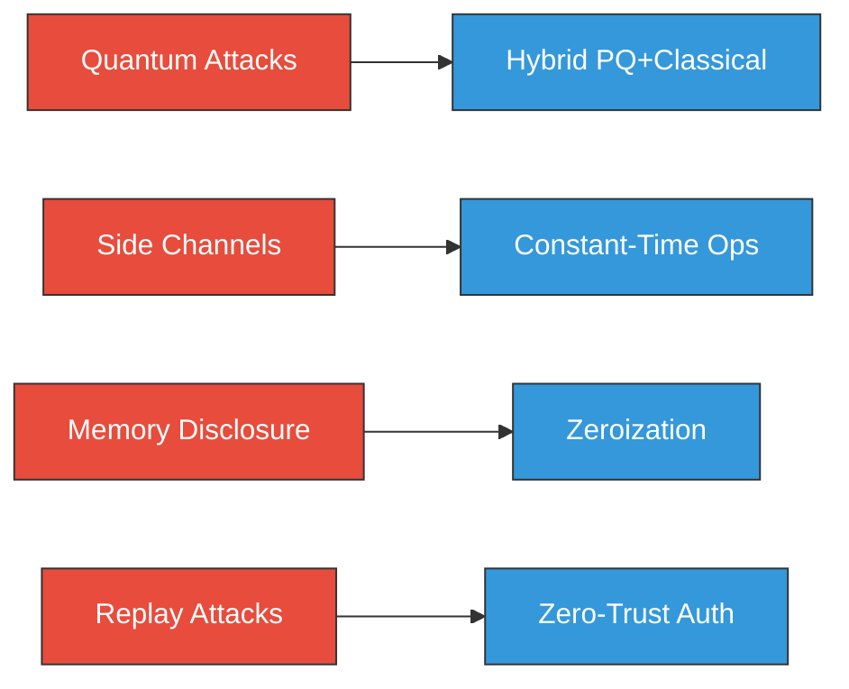
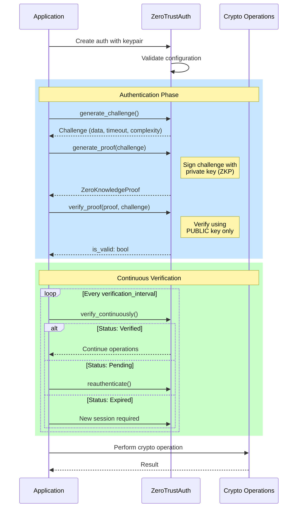
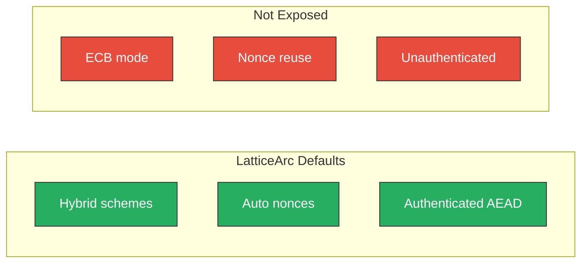
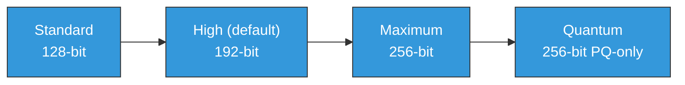
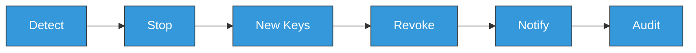

# Security Guide

Security best practices for using LatticeArc in production applications.

## Threat Model



### What LatticeArc Protects Against

| Threat | Protection | Mechanism |
|--------|------------|-----------|
| Quantum attacks | Full | FIPS 203-206 PQ algorithms |
| Classical cryptanalysis | Full | Hybrid PQ + classical |
| Timing side-channels | Best effort | `subtle` crate constant-time |
| Memory disclosure | Best effort | `zeroize` automatic clearing |
| Replay attacks | Full | ZeroTrustAuth + timestamps |
| Key compromise | Partial | Key rotation, continuous verification |

### What LatticeArc Does NOT Protect Against

- **Physical attacks**: Power analysis, EM emanations, fault injection
- **Compromised systems**: Malware, backdoored hardware
- **Implementation bugs**: Despite extensive testing, bugs may exist
- **Misuse**: Incorrect API usage voids security guarantees

## Security Checklist

Before deploying to production:

- [ ] Using recommended algorithm variants (Level 3+)
- [ ] Hybrid mode enabled for long-term security
- [ ] Zero-trust authentication configured
- [ ] Error handling verified (no unwrap/expect)
- [ ] Secrets not logged or exposed
- [ ] Memory zeroization verified
- [ ] Key rotation mechanism in place
- [ ] Incident response plan documented
- [ ] Dependencies audited (`cargo audit`)
- [ ] Fuzzing performed on custom integrations
- [ ] Continuous verification enabled for sessions

## Zero-Trust Authentication

LatticeArc implements zero-trust authentication at the cryptographic operation level.

### Authentication Flow



### Proof Complexity Levels


| Level | Signed Data | Protection |
|-------|-------------|------------|
| **Low** | Challenge only | Basic authentication |
| **Medium** | Challenge + Timestamp | Replay protection |
| **High** | Challenge + Timestamp + Public Key | Key binding |

### Zero-Trust Configuration

```rust
use latticearc::unified_api::config::{ZeroTrustConfig, ProofComplexity};
use latticearc::ZeroTrustAuth;

// High-security configuration using builder pattern
let config = ZeroTrustConfig::new()
    .with_timeout(30_000)                // 30s challenge timeout
    .with_complexity(ProofComplexity::High)
    .with_continuous_verification(true)
    .with_verification_interval(60_000); // Re-verify every 60s

let auth = ZeroTrustAuth::with_config(public_key, private_key, config)?;
```

**Recommendations:**
- Use `ProofComplexity::High` for sensitive operations
- Enable continuous verification for long-running sessions
- Set appropriate challenge timeouts (15-60 seconds)
- Log authentication failures for security monitoring

## Secure Usage Patterns

### Key Generation

```rust
use latticearc::*;

// Generate post-quantum keypairs
let (pk, sk) = generate_ml_kem_keypair(MlKemSecurityLevel::MlKem768)?;
let (vk, sk) = generate_ml_dsa_keypair(MlDsaParameterSet::MLDSA65)?;

// Generate classical keypairs
let (pk, sk) = generate_keypair()?;  // Ed25519
```

**NEVER:**
- Generate keys from predictable seeds
- Reuse nonces across encryptions
- Store private keys in plaintext
- Log or expose key material

### Salt and KDF Best Practices

When deriving keys from passwords or shared secrets, follow these guidelines:

- **Always use a unique salt** per key derivation. Generate at least 16 bytes from `OsRng`
- **Never reuse salts** across different keys or users
- **Store the salt alongside the ciphertext** — salts are not secret
- **Use HKDF-SHA256** (`derive_key()`) for key derivation from high-entropy input
- **Use Argon2/scrypt** for password-based key derivation (not currently provided — use external crate)
- **Use `derive_key_with_info()` for domain separation** — different info strings produce cryptographically independent keys from the same input keying material

```rust
use latticearc::*;

// Derive a key from a shared secret + unique salt
let salt = rand::random::<[u8; 16]>();
let derived_key = derive_key(shared_secret, &salt, 32)?;

// Domain-separated key derivation (different info → independent keys)
let enc_key = derive_key_with_info(shared_secret, &salt, 32, b"encryption", SecurityMode::Unverified)?;
let mac_key = derive_key_with_info(shared_secret, &salt, 32, b"mac", SecurityMode::Unverified)?;

// HMAC for message authentication
let tag = hmac(data, &key, SecurityMode::Unverified)?;
let valid = hmac_check(data, &key, &tag, SecurityMode::Unverified)?;
```

### AES-GCM with AAD

When encrypting data that must be bound to a specific context (protocol headers, session identifiers, sender/receiver metadata), use AAD:

```rust
use latticearc::*;

let key = [0u8; 32];
let header = b"version:1;sender:alice";

// AAD is authenticated but NOT encrypted — tampering causes decryption failure
let encrypted = encrypt_aes_gcm_with_aad(data, &key, header, SecurityMode::Unverified)?;
let decrypted = decrypt_aes_gcm_with_aad(&encrypted, &key, header, SecurityMode::Unverified)?;
```

**NEVER:**
- Use empty AAD when context binding is needed — use `encrypt_aes_gcm()` (no AAD) for context-free encryption
- Include secret data in AAD — AAD is authenticated, not encrypted

### Encryption



```rust
use latticearc::*;

// Symmetric encryption with AES-256-GCM (default hybrid scheme)
let encrypted = encrypt(data, &key, CryptoConfig::new())?;

// Use case selection for scheme recommendation
let config = CryptoConfig::new().use_case(UseCase::FileStorage);
let encrypted = encrypt(data, &key, config)?;

// Hybrid public-key encryption (ML-KEM + X25519 + HKDF + AES-256-GCM)
let (hybrid_pk, hybrid_sk) = generate_hybrid_keypair()?;
let encrypted = encrypt(data, EncryptKey::Hybrid(&hybrid_pk), CryptoConfig::new())?;
let decrypted = decrypt(&encrypted, DecryptKey::Hybrid(&hybrid_sk), CryptoConfig::new())?;
```

**Security constraints:**
- AES-GCM: Maximum 2^32 messages per key with random nonces
- ChaCha20-Poly1305: Maximum 2^64 messages per key
- Always verify decryption succeeded before using plaintext

### Signatures

```rust
use latticearc::*;
use latticearc::ZeroTrustAuth;

// Generate keypair + sign + verify
let config = CryptoConfig::new();
let (pk, sk, _scheme) = generate_signing_keypair(config.clone())?;
let signed = sign_with_key(message, &sk, &pk, config.clone())?;
let is_valid = verify(&signed, config)?;

// Post-quantum signatures (ML-DSA only, no classical)
let signature = sign_pq_ml_dsa(message, &sk, MlDsaParameterSet::MLDSA65, SecurityMode::Unverified)?;
let is_valid = verify_pq_ml_dsa(message, &signature, &pk, MlDsaParameterSet::MLDSA65, SecurityMode::Unverified)?;

// Zero-trust authenticated signing
let auth = ZeroTrustAuth::new(public_key, private_key)?;
let challenge = auth.generate_challenge()?;
let proof = auth.generate_proof(&challenge.data)?;
if auth.verify_proof(&proof, &challenge.data)? {
    // Proceed with signing
}
```

**NEVER:**
- Ignore verification failures
- Sign attacker-controlled data without validation
- Use the same key for signing and encryption

### Memory Safety

```rust
use zeroize::{Zeroize, ZeroizeOnDrop};
use latticearc::ZeroizedBytes;

// Automatic zeroization with ZeroizedBytes
let private_key = ZeroizedBytes::new(secret_bytes);
// Automatically zeroized when dropped

// Custom type with zeroization
#[derive(ZeroizeOnDrop)]
struct SecretData {
    key: [u8; 32],
    nonce: [u8; 12],
}

// Manual zeroization
let mut secret = [0u8; 32];
// ... use secret ...
secret.zeroize();
```

## Algorithm Selection

### Security Levels



| Level | Algorithms | Mode | NIST Level | Use Case |
|-------|-----------|------|------------|----------|
| `Standard` | ML-KEM-512, ML-DSA-44 | Hybrid | 1 | General purpose, IoT |
| `High` (default) | ML-KEM-768, ML-DSA-65 | Hybrid | 3 | Production, sensitive data |
| `Maximum` | ML-KEM-1024, ML-DSA-87 | Hybrid | 5 | Financial, regulated |
| `Quantum` | ML-KEM-1024, ML-DSA-87 | PQ-only | 5 | Government (CNSA 2.0) |

### Recommendations

| Use Case | Recommended | Why |
|----------|-------------|-----|
| General purpose | ML-KEM-768, ML-DSA-65 | Balance of security and performance |
| Long-term secrets | ML-KEM-1024, ML-DSA-87 | Maximum post-quantum security |
| Embedded/constrained | ML-KEM-512, SLH-DSA-SHAKE-128f | Smaller keys/signatures |
| Regulatory compliance | Check specific requirements | May mandate specific algorithms |

### Hybrid Mode

```rust
use latticearc::unified_api::selector::*;

// Default: Hybrid (recommended)
DEFAULT_ENCRYPTION_SCHEME  // hybrid-ml-kem-768-aes-256-gcm
DEFAULT_SIGNATURE_SCHEME   // hybrid-ml-dsa-65-ed25519

// Why hybrid?
// 1. If PQC has weaknesses → classical backup
// 2. If classical broken → PQC protection
// 3. Recommended during transition (2024-2035+)
```

## Error Handling

### Secure Error Handling

```rust
use latticearc::*;
use latticearc::CoreError;

fn process_data(ciphertext: &[u8], key: &[u8; 32]) -> Result<Vec<u8>, CoreError> {
    // Use ? to propagate errors - never ignore them
    let encrypted = EncryptedOutput::deserialize(ciphertext)?;
    let plaintext = decrypt(&encrypted, DecryptKey::Symmetric(key), CryptoConfig::new())?;

    // Validate before use
    if plaintext.is_empty() {
        return Err(CoreError::InvalidInput("Empty plaintext".to_string()));
    }

    Ok(plaintext)
}
```

### What NOT to Do

```rust
// DANGEROUS: Ignoring errors
let plaintext = decrypt(&encrypted, &key).unwrap(); // May panic

// DANGEROUS: Logging sensitive data
tracing::debug!("Decrypted: {:?}", plaintext); // Leaks secrets

// DANGEROUS: Non-constant-time comparison
if signature == expected { ... } // Timing leak

// SECURE alternative:
use subtle::ConstantTimeEq;
if signature.ct_eq(&expected).into() { ... }
```

## Deployment Considerations

### Environment Variables

```bash
# DANGEROUS - Never store secrets in env vars
export SECRET_KEY="..."

# SECURE - Use secrets manager or encrypted config
# - AWS Secrets Manager
# - HashiCorp Vault
# - Azure Key Vault
```

### Logging Configuration

```rust
use tracing_subscriber::EnvFilter;

// Disable debug logging for crypto modules in production
let filter = EnvFilter::new("warn")
    .add_directive("latticearc=warn".parse().unwrap());

tracing_subscriber::fmt()
    .with_env_filter(filter)
    .init();
```

### Resource Limits

```rust
use std::sync::Semaphore;

// Limit concurrent crypto operations
static CRYPTO_SEMAPHORE: Semaphore = Semaphore::new(100);

async fn encrypt_with_limit(data: &[u8], key: &[u8; 32]) -> Result<EncryptedOutput, CoreError> {
    let _permit = CRYPTO_SEMAPHORE.acquire().await?;
    encrypt(data, EncryptKey::Symmetric(key), CryptoConfig::new().force_scheme(CryptoScheme::Symmetric))
}
```

## Compliance Considerations

### FIPS 140-3

LatticeArc implements FIPS 203-206 algorithms but is **not** FIPS 140-3 validated.

For FIPS 140-3 compliance:
1. Use algorithms as specified (no modifications)
2. Implement power-up self-tests (see `latticearc-tests`)
3. Use approved random number generators
4. Consider validated modules for certification

### Common Criteria

For Common Criteria evaluations:
1. Document all cryptographic boundaries
2. Implement required self-tests
3. Maintain audit logging for cryptographic operations

## Incident Response

### Key Compromise



1. **Immediately**: Stop using the compromised key
2. **Generate**: Create new key pairs
3. **Revoke**: If using certificates, revoke the old certificate
4. **Notify**: Inform affected parties
5. **Rotate**: Update all systems using the old key
6. **Audit**: Review logs for unauthorized usage

### Vulnerability Reports

Report security vulnerabilities according to [SECURITY.md](../SECURITY.md):
- Do NOT open public issues for security vulnerabilities
- Expected response within 24 hours

## Further Reading

- [NIST Post-Quantum Cryptography](https://csrc.nist.gov/projects/post-quantum-cryptography)
- [FIPS 203: ML-KEM](https://csrc.nist.gov/pubs/fips/203/final)
- [FIPS 204: ML-DSA](https://csrc.nist.gov/pubs/fips/204/final)
- [FIPS 205: SLH-DSA](https://csrc.nist.gov/pubs/fips/205/final)
- [FIPS 206: FN-DSA (Draft)](https://csrc.nist.gov/projects/post-quantum-cryptography/selected-algorithms-2022)
