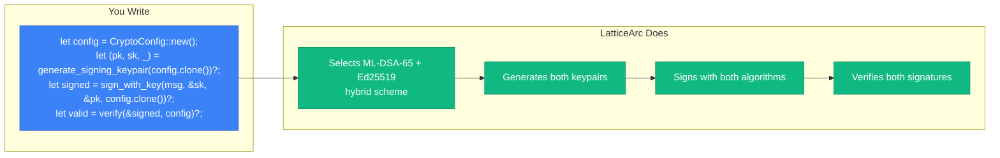
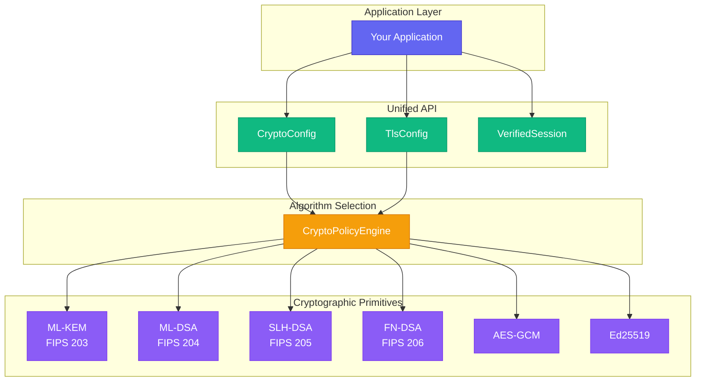
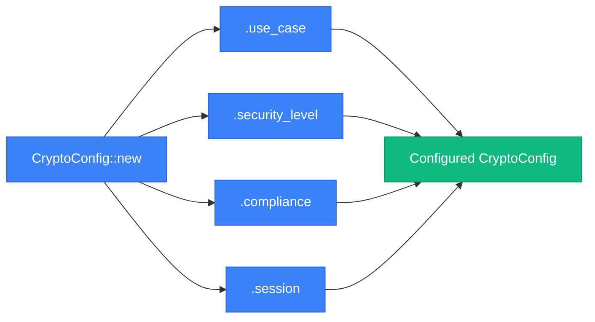
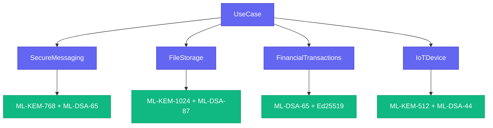
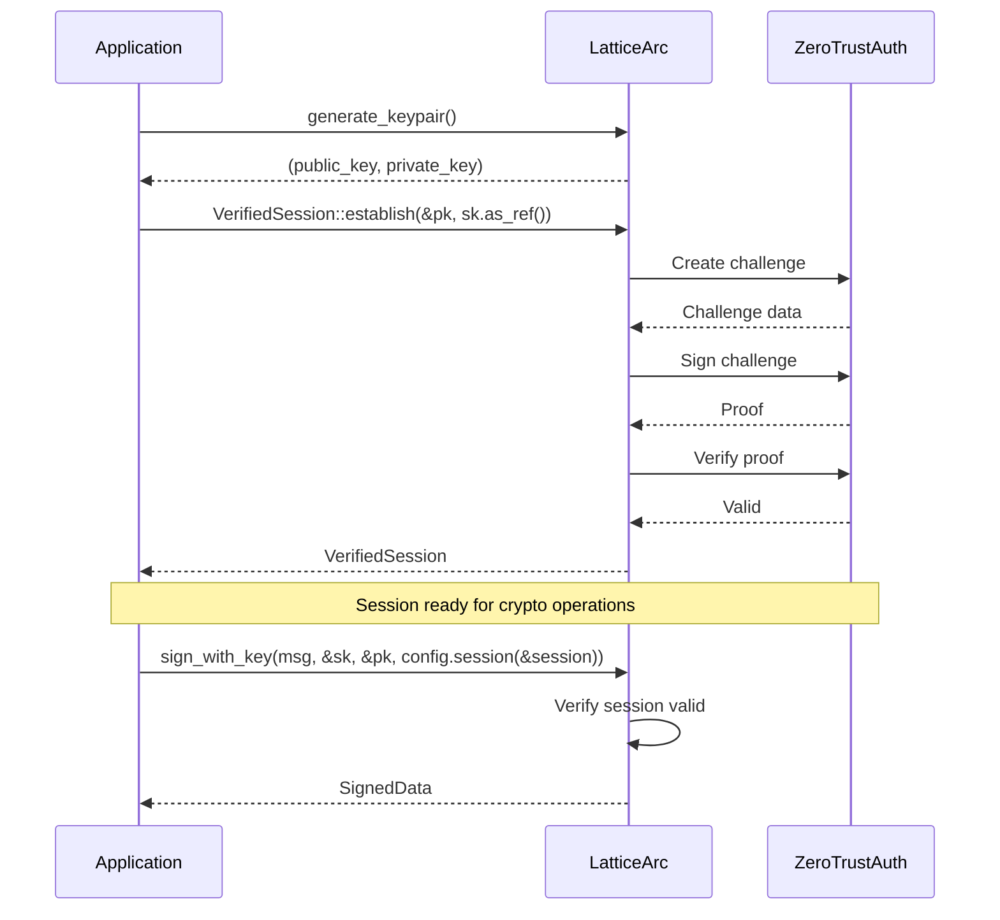
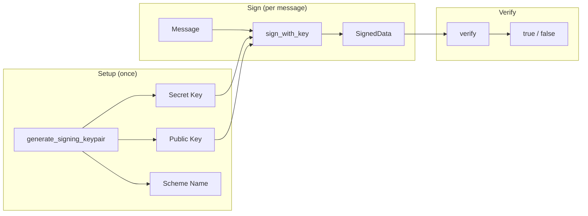

# LatticeArc Unified API Guide

A consistent, high-level cryptographic API with automatic algorithm selection and optional zero-trust authentication. 4 lines of code replace ~50 lines of manual PQ+classical crypto composition.

## At a Glance



| Problem | Without LatticeArc | With LatticeArc |
|---------|-------------------|-----------------|
| **Algorithm Selection** | Manually research NIST standards, parameter sizes, security levels | `CryptoConfig::new()` picks optimal defaults |
| **Quantum Migration** | Rewrite entire codebase for PQ algorithms | Change `use_case()` or `security_level()` |
| **Hybrid Crypto** | Implement complex multi-algorithm schemes | Built-in hybrid mode (PQ + classical) |
| **TLS Configuration** | Different APIs for rustls, certificate handling | `TlsConfig::new()` with same builder pattern |
| **Key Management** | Track multiple key types, parameter sets | Unified `generate_keypair()` functions |
| **Memory Safety** | Manual zeroization of sensitive data | Automatic `Zeroize` on drop |

## Manual vs LatticeArc

### Manual Hybrid Signing (~50 lines)

```rust
// Generate ML-DSA keypair
let (pq_pk, pq_sk) = ml_dsa_65::try_keygen()?;
// Generate Ed25519 keypair
let ed_sk = SigningKey::generate(&mut OsRng);
// Sign with both algorithms
let pq_sig = ml_dsa_65::try_sign(&pq_sk, message, &[])?;
let ed_sig = ed_sk.sign(message);
// Return 4 separate components...
```

### LatticeArc (4 lines)

```rust
let config = CryptoConfig::new();
let (pk, sk, _scheme) = generate_signing_keypair(config.clone())?;
let signed = sign_with_key(message, &sk, &pk, config.clone())?;
let is_valid = verify(&signed, config)?;
```

| Aspect | Manual | LatticeArc |
|--------|--------|------------|
| Lines of code | ~50 | 4 |
| Key management | 4 separate vectors | Single `SignedData` |
| Algorithm updates | Code changes | Config change |
| Memory safety | Manual | Automatic |

### Architecture



## Quick Start

### Digital Signatures

```rust
use latticearc::{generate_signing_keypair, sign_with_key, verify, CryptoConfig};

let message = b"Document to sign";

// Generate signing keypair and sign with defaults (ML-DSA-65 + Ed25519 hybrid)
let config = CryptoConfig::new();
let (pk, sk, _scheme) = generate_signing_keypair(config.clone())?;
let signed = sign_with_key(message, &sk, &pk, config.clone())?;

// Verify
let is_valid = verify(&signed, config)?;
```

### Encryption

```rust
use latticearc::{encrypt, decrypt, CryptoConfig, EncryptKey, DecryptKey};

// Hybrid encryption: ML-KEM-768 + X25519 + HKDF + AES-256-GCM
let (pk, sk) = latticearc::generate_hybrid_keypair()?;
let plaintext = b"Sensitive data";

let encrypted = encrypt(plaintext, EncryptKey::Hybrid(&pk), CryptoConfig::new())?;
let decrypted = decrypt(&encrypted, DecryptKey::Hybrid(&sk), CryptoConfig::new())?;
```

### Hybrid Encryption

For true hybrid key encapsulation (ML-KEM + X25519 + HKDF), use the unified API:

```rust
use latticearc::{generate_hybrid_keypair, encrypt, decrypt, CryptoConfig, EncryptKey, DecryptKey};

// Generate hybrid keypair (ML-KEM-768 + X25519)
let (pk, sk) = generate_hybrid_keypair()?;

// Encrypt using hybrid KEM (via unified API)
let encrypted = encrypt(b"sensitive data", EncryptKey::Hybrid(&pk), CryptoConfig::new())?;

// Decrypt
let plaintext = decrypt(&encrypted, DecryptKey::Hybrid(&sk), CryptoConfig::new())?;
```

Security holds if **either** ML-KEM or X25519 remains secure.

### Hybrid Signatures

For direct hybrid signature operations (ML-DSA-65 + Ed25519 AND-composition):

```rust
use latticearc::{generate_hybrid_signing_keypair, sign_hybrid, verify_hybrid_signature, SecurityMode};

// Generate hybrid signing keypair
let (pk, sk) = generate_hybrid_signing_keypair(SecurityMode::Unverified)?;

// Sign (both ML-DSA and Ed25519)
let signature = sign_hybrid(b"document", &sk, SecurityMode::Unverified)?;

// Verify (both must pass)
let valid = verify_hybrid_signature(b"document", &signature, &pk, SecurityMode::Unverified)?;
```

Both component signatures must verify — an attacker must break *both* algorithms to forge a signature.

#### Hybrid Encryption Flow

```mermaid
flowchart TB
    subgraph "Key Generation (once)"
        KG[generate_hybrid_keypair] --> X_SK[X25519 Static Key]
        KG --> ML_DK[ML-KEM-768 Decapsulation Key]
        KG --> PK["HybridPublicKey<br/>(X25519 PK + ML-KEM EK)"]
    end

    subgraph "Encryption"
        PT[Plaintext] --> AES[AES-256-GCM Encrypt]
        E_MLKEM[ML-KEM Encapsulate] --> SS1[Shared Secret 1]
        E_X25519[X25519 ECDH] --> SS2[Shared Secret 2]
        SS1 --> HKDF[HKDF-SHA256]
        SS2 --> HKDF
        HKDF --> DEK[Data Encryption Key]
        DEK --> AES
        AES --> CT["EncryptedOutput<br/>(KEM CT + ECDH PK + CT + nonce + tag)"]
    end

    subgraph "Decryption"
        CT2[EncryptedOutput] --> DAES[AES-256-GCM Decrypt]
        D_MLKEM[ML-KEM Decapsulate] --> DSS1[Shared Secret 1]
        D_X25519[X25519 Agree] --> DSS2[Shared Secret 2]
        DSS1 --> DHKDF[HKDF-SHA256]
        DSS2 --> DHKDF
        DHKDF --> DDEK[Data Encryption Key]
        DDEK --> DAES
        DAES --> DPT[Plaintext]
    end
```



### With Zero Trust Session

```rust
use latticearc::{generate_signing_keypair, sign_with_key, verify, generate_keypair,
                 CryptoConfig, VerifiedSession};

let (public_key, private_key) = generate_keypair()?;
let session = VerifiedSession::establish(&public_key, private_key.as_ref())?;

let config = CryptoConfig::new().session(&session);
let (pk, sk, _scheme) = generate_signing_keypair(config.clone())?;
let signed = sign_with_key(message, &sk, &pk, config.clone())?;
let is_valid = verify(&signed, config)?;
```

## CryptoConfig

The central configuration type for cryptographic operations.



```rust
use latticearc::{CryptoConfig, UseCase, SecurityLevel, ComplianceMode};

// Default: High security, hybrid mode
let config = CryptoConfig::new();

// By use case (library picks optimal algorithm)
let config = CryptoConfig::new()
    .use_case(UseCase::FileStorage);

// By security level
let config = CryptoConfig::new()
    .security_level(SecurityLevel::Maximum);

// With compliance mode (FIPS 140-3)
let config = CryptoConfig::new()
    .use_case(UseCase::HealthcareRecords)
    .compliance(ComplianceMode::Fips140_3);

// CNSA 2.0 (PQ-only, no hybrid)
let config = CryptoConfig::new()
    .compliance(ComplianceMode::Cnsa2_0);

// Full configuration with Zero Trust session
let config = CryptoConfig::new()
    .use_case(UseCase::FinancialTransactions)
    .compliance(ComplianceMode::Fips140_3)
    .session(&session);
```

### Builder Methods

| Method | Description |
|--------|-------------|
| `::new()` | Create with defaults (High security, hybrid mode) |
| `.use_case(UseCase)` | Select algorithm by use case |
| `.security_level(SecurityLevel)` | Select algorithm by security level |
| `.compliance(ComplianceMode)` | Set compliance mode (Default, Fips140_3, Cnsa2_0) |
| `.session(&VerifiedSession)` | Enable Zero Trust verification |

## TlsConfig

TLS configuration follows the same builder pattern.

```rust
use latticearc::tls::{TlsConfig, TlsUseCase};

// Default: Hybrid mode (X25519 + ML-KEM)
let config = TlsConfig::new();

// By use case
let config = TlsConfig::new()
    .use_case(TlsUseCase::WebServer);

// With options
let config = TlsConfig::new()
    .use_case(TlsUseCase::FinancialServices)
    .with_fallback(true)
    .with_client_auth(true);
```

| Use Case | Mode | Key Exchange |
|----------|------|--------------|
| `WebServer` | Hybrid | X25519 + ML-KEM-768 |
| `InternalService` | Hybrid | X25519 + ML-KEM-768 |
| `ApiGateway` | Hybrid | X25519 + ML-KEM-768 |
| `FinancialServices` | Hybrid | X25519 + ML-KEM-768 |
| `Healthcare` | Hybrid | X25519 + ML-KEM-768 |
| `DatabaseConnection` | Hybrid | X25519 + ML-KEM-768 |
| `Government` | PQ-only | ML-KEM-1024 |
| `IoT` | Classic | X25519 |
| `LegacyIntegration` | Classic | X25519 |
| `RealTimeStreaming` | Classic | X25519 |

## Algorithm Selection

### By Use Case



All 24 use cases with their algorithm mappings (all hybrid PQ + classical by default):

| Category | Use Case | Scheme |
|----------|----------|--------|
| **Communication** | `SecureMessaging` | ML-KEM-768 + AES-256-GCM |
| | `EmailEncryption` | ML-KEM-1024 + AES-256-GCM |
| | `VpnTunnel` | ML-KEM-768 + AES-256-GCM |
| | `ApiSecurity` | ML-KEM-768 + AES-256-GCM |
| **Storage** | `FileStorage` | ML-KEM-1024 + AES-256-GCM |
| | `DatabaseEncryption` | ML-KEM-768 + AES-256-GCM |
| | `CloudStorage` | ML-KEM-1024 + AES-256-GCM |
| | `BackupArchive` | ML-KEM-1024 + AES-256-GCM |
| | `ConfigSecrets` | ML-KEM-768 + AES-256-GCM |
| **Auth & Identity** | `Authentication` | ML-DSA-87 + Ed25519 |
| | `SessionToken` | ML-KEM-768 + AES-256-GCM |
| | `DigitalCertificate` | ML-DSA-87 + Ed25519 |
| | `KeyExchange` | ML-KEM-1024 + X25519 |
| **Financial & Legal** | `FinancialTransactions` | ML-DSA-65 + Ed25519 |
| | `LegalDocuments` | ML-DSA-87 + Ed25519 |
| | `BlockchainTransaction` | ML-DSA-65 + Ed25519 |
| **Regulated** | `HealthcareRecords` | ML-KEM-1024 + AES-256-GCM |
| | `GovernmentClassified` | ML-KEM-1024 + AES-256-GCM |
| | `PaymentCard` | ML-KEM-1024 + AES-256-GCM |
| **IoT & Embedded** | `IoTDevice` | ML-KEM-512 + AES-256-GCM |
| | `FirmwareSigning` | ML-DSA-65 + Ed25519 |
| **General Purpose** | `AuditLog` | ML-KEM-768 + AES-256-GCM |

### By Security Level

| Level | Mode | Encryption | Signature | NIST Level |
|-------|------|------------|-----------|------------|
| `Quantum` | PQ-only | ML-KEM-1024 + AES-256-GCM | ML-DSA-87 | 5 |
| `Maximum` | Hybrid | ML-KEM-1024 + AES-256-GCM | ML-DSA-87 + Ed25519 | 5 |
| `High` (default) | Hybrid | ML-KEM-768 + AES-256-GCM | ML-DSA-65 + Ed25519 | 3 |
| `Standard` | Hybrid | ML-KEM-512 + AES-256-GCM | ML-DSA-44 + Ed25519 | 1 |

### Security Level Details

- **Standard**: NIST Level 1 (128-bit equivalent). Hybrid mode using ML-KEM-512 + X25519, ML-DSA-44 + Ed25519. Suitable for resource-constrained devices and general use.
- **High**: NIST Level 3 (192-bit equivalent). Hybrid mode using ML-KEM-768 + X25519, ML-DSA-65 + Ed25519. Recommended for most production applications. **(Default)**
- **Maximum**: NIST Level 5 (256-bit equivalent). Hybrid mode using ML-KEM-1024 + X25519, ML-DSA-87 + Ed25519. For high-value assets and long-term security.
- **Quantum**: NIST Level 5 (256-bit equivalent). PQ-only mode using ML-KEM-1024, ML-DSA-87 (no classical algorithms). For CNSA 2.0 compliance and government use cases. Must be explicitly selected.

## Zero Trust Authentication

### Session Establishment



### Using Sessions

```rust
use latticearc::{VerifiedSession, generate_keypair};

// Establish session
let (pk, sk) = generate_keypair()?;
let session = VerifiedSession::establish(&pk, sk.as_ref())?;

// Check session state
assert!(session.is_valid());
println!("Trust level: {:?}", session.trust_level());
println!("Expires at: {:?}", session.expires_at());

// Validate before critical operations
session.verify_valid()?;  // Returns Err if expired
```

## API Reference

### Signature Functions



```rust
use latticearc::{generate_signing_keypair, sign_with_key, verify, CryptoConfig};

let config = CryptoConfig::new();
let (pk, sk, _scheme) = generate_signing_keypair(config.clone())?;
let signed = sign_with_key(message, &sk, &pk, config.clone())?;
let is_valid = verify(&signed, config)?;
```

### Encryption

```rust
use latticearc::{encrypt, decrypt, CryptoConfig, EncryptKey, DecryptKey, CryptoScheme};

let key = [0u8; 32];
let config = CryptoConfig::new().force_scheme(CryptoScheme::Symmetric);
let encrypted = encrypt(data, EncryptKey::Symmetric(&key), config)?;
let plaintext = decrypt(&encrypted, DecryptKey::Symmetric(&key), CryptoConfig::new())?;
```

### Key Generation

```rust
use latticearc::generate_keypair;
use latticearc::{generate_ml_kem_keypair, generate_ml_dsa_keypair};
use latticearc::primitives::kem::ml_kem::MlKemSecurityLevel;
use latticearc::primitives::sig::ml_dsa::MlDsaParameterSet;

// Ed25519
let (pk, sk) = generate_keypair()?;

// ML-KEM (FIPS 203)
let (pk, sk) = generate_ml_kem_keypair(MlKemSecurityLevel::MlKem768)?;

// ML-DSA (FIPS 204)
let (pk, sk) = generate_ml_dsa_keypair(MlDsaParameterSet::MLDSA65)?;
```

### Hashing and KDF

```rust
use latticearc::{hash_data, derive_key, hmac, SecurityMode};

let hash = hash_data(data);
let derived = derive_key(password, salt, 32, SecurityMode::default())?;
let mac = hmac(data, &key, SecurityMode::default())?;
```

#### HKDF with Custom Info String

For domain-specific key derivation where different contexts need cryptographically independent keys:

```rust
use latticearc::{derive_key_with_info, derive_key_with_info_unverified, SecurityMode};

let ikm = b"shared-secret-material";
let salt = b"unique-random-salt";

// Derive keys for different domains — same IKM, different info -> different keys
let encryption_key = derive_key_with_info_unverified(ikm, salt, 32, b"encryption")?;
let auth_key = derive_key_with_info_unverified(ikm, salt, 32, b"authentication")?;
assert_ne!(encryption_key, auth_key);

// With Zero Trust session
let key = derive_key_with_info(ikm, salt, 32, b"my-domain", SecurityMode::Verified(&session))?;
```

## Error Handling

```rust
use latticearc::{generate_signing_keypair, sign_with_key, CoreError, CryptoConfig};

let config = CryptoConfig::new().session(&session);
let (pk, sk, _scheme) = generate_signing_keypair(config.clone())?;

match sign_with_key(message, &sk, &pk, config) {
    Ok(signed) => { /* success */ }
    Err(CoreError::SessionExpired) => {
        // Re-authenticate
    }
    Err(CoreError::AuthenticationFailed(msg)) => {
        // Handle auth failure
    }
    Err(e) => {
        // Other errors
    }
}
```

## Security Considerations

1. **Quantum Safety** — All defaults use hybrid schemes (PQ + classical)
2. **Key Zeroization** — Automatic memory clearing via `Zeroize`
3. **Constant-Time** — Timing-safe comparisons via `subtle` crate
4. **Nonce Uniqueness** — Auto-generated secure random nonces
5. **Input Validation** — All inputs validated against resource limits
